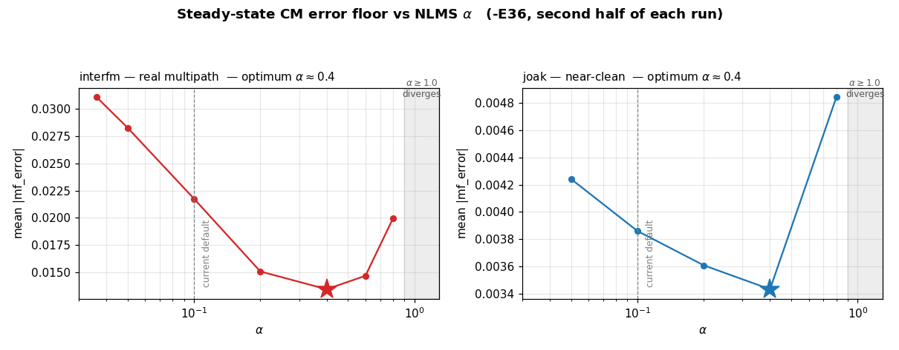

# FM Multipath Filter — Design Notes and Improvement Candidates

Working notes on `include/MultipathFilter.h` / `sfmbase/MultipathFilter.cpp`.

**Status:** design discussion only. Nothing here has been validated against
recorded IQ or on-air reception. Items are tagged **[established]** (follows
from theory or from the existing code/docs) or **[hypothesis]** (plausible,
needs testing before acting on).

**Provenance:** derived from a design discussion in July 2026. The reviewer
read `include/MultipathFilter.h` on `main` plus the README and CHANGES
descriptions of the filter; `MultipathFilter.cpp` was **not** read. Any claim
below about the update equation is inferred from the documented behaviour, not
from the source.

---

## 1. Current implementation, as understood

| Property | Value |
| --- | --- |
| IF sample rate | 384 kHz (Airspy HF+ native rate) |
| Sample period | 2.604 µs |
| Filter order | `4 * stages + 1` |
| Tap allocation | 3:1, weighted toward pre-reference taps (`-E36` → 108 / 36) |
| Coefficient type | `std::complex<float>` |
| Step size | `alpha = 0.1`, fixed |
| Reference level | 1.0 (IF AGC target), reference tap forced to `1 + 0j` since 20230430-0 |
| Coefficient update rate | every 4 samples (96 kHz) |
| Practical `-E` ceiling | ~50 on Raspberry Pi 4, ~100 on a modern CPU |

Spans at 384 kHz:

- `-E36` → 145 taps: 281 µs pre-reference, 94 µs post, 378 µs total
- `-E100` → 401 taps: 1.04 ms total

---

## 2. Why the tap count is large — and why that is correct

**[established]** The tap count is not set by the delay spread. It is set by
how deep the echo is.

For a two-ray channel `H(z) = 1 + a·z^-D`, the inverse is

```
1 - a·z^-D + a²·z^-2D - a³·z^-3D + ...
```

The tail decays as `a^n`, so the number of terms needed is
`n ≈ ln(ε) / ln(a)`, and the required span is `n · D` samples — proportional
to echo *depth*, with delay entering only as a multiplier.

| Echo amplitude `a` | Terms to reach −54 dB | Span for D = 2 samples (5.2 µs) |
| --- | --- | --- |
| 0.5 | ~9 | ~18 taps |
| 0.7 | ~18 | ~36 taps |
| 0.9 | ~59 | ~118 taps |
| 0.95 | ~121 | ~242 taps |

This is why sizing the filter from delay-spread coverage alone
(~30–60 taps for typical urban echoes) badly underestimates what is needed.
The existing `-E36`–`-E100` range is the right order of magnitude for echoes
in the 0.8–0.95 range.

**Practical consequence:** the useful `-E` value tracks reception conditions,
not geography. A deep, short-delay echo needs more taps than a shallow,
long-delay one.

---

## 3. Sample rate: keep 384 kHz

**[established]** 384 kHz is already the "fractionally spaced" rate for this
signal, and raising it is counterproductive.

FM broadcast occupies roughly 200 kHz (Carson's rule with full stereo
composite gives 2 × (75 + 53) ≈ 256 kHz; real program material sits closer to
180–200 kHz). For complex baseband, critical sampling is `fs = B`, so 384 kHz
is about 1.9× oversampled. "T/2-spaced" means twice the *signal's* Nyquist
rate, not twice whatever rate the receiver currently runs at.

Arguments against moving to 768 kHz:

1. **No gain in echo resolution.** An FIR at any rate above the signal's
   Nyquist rate synthesises *exact* fractional delays within the band, because
   sinc interpolation of a band-limited signal is exact. Sub-sample echo
   alignment already works at 384 kHz.
2. **Conditioning gets worse.** At 384 kHz the signal fills most of the
   Nyquist span. At 768 kHz it fills a quarter, leaving three-quarters of the
   band with no signal energy to constrain the taps — larger eigenvalue
   spread, slower convergence, more tap drift.
3. **Adjacent channels move in-band.** At 768 kHz the ±200 kHz first adjacents
   fall inside the Nyquist span, and the filter will attempt to equalise
   interference. At 384 kHz they are outside, needing only adequate channel
   filter rejection beyond ±192 kHz.
4. **4× the cost for identical coverage.** Tap counts are set by inverse-tail
   length in *samples*, so doubling the rate doubles every tap count for the
   same time span — 2× rate × 2× taps, on the component that is already the
   CPU bottleneck.
5. It would require a resampler ahead of a filter that currently runs at the
   front end's native rate.

---

## 4. Design decisions that are sound (rationale recorded)

**[established]** Recording the reasoning so these are not "simplified" later
by someone who does not know why they are there.

- **Reference tap forced to `1 + 0j`.** The CM cost function is blind to global
  gain and global phase — those are flat directions in which the tap vector
  would otherwise drift indefinitely. Pinning the reference tap is a linear
  constraint that removes both. This is a real stability mechanism, not
  cosmetic.
- **3:1 asymmetric tap allocation.** Physical echoes arrive *after* the direct
  path, so for the common minimum-phase case (direct path stronger than the
  echo) the inverse filter's tail is predominantly one-sided. Allocating the
  majority of taps to that side is correct. The minority allocation on the
  other side provides margin for non-minimum-phase conditions.
- **IF AGC to unity ahead of the filter.** Makes the dispersion constant
  R₂ = 1 consistent with the reference level, sidestepping modulus estimation
  entirely.
- **Why CMA works on FM at all.** Multipath on a constant-envelope carrier
  produces both AM and PM. The discriminator ignores AM and is corrupted by
  PM. Minimising only the envelope error nevertheless forces the phase
  correction, because for a constant-envelope source through a linear channel,
  restoring the envelope determines the channel inverse up to global phase,
  global delay, and carrier frequency offset — all three harmless for FM (a
  frequency offset lands as DC on the discriminator output). This is
  Treichler & Agee's original 1983 result.

---

## 5. Improvement candidates, ranked by expected payoff

### 5.1 Frequency-domain overlap-save adaptation — **[hypothesis]**, highest value

Two independent benefits:

**CPU.** Time domain costs `2N` complex MACs per output sample (filter +
update). At N = 401 and 384 kHz that is roughly 300 M complex MAC/s, order
2.5 GFLOP/s — which is what sets the current `-E` ceiling.

An overlap-save block implementation with FFT length 1024 (hop 624 for a
401-tap filter) costs roughly 5 complex FFTs of length 1024 per block, plus a
handful of length-1024 pointwise vector multiplies. That works out to roughly
an order of magnitude less arithmetic per sample. Dropping the gradient
constraint saves 2 of the 5 FFTs at the cost of some filter-length leakage.

These are order-of-magnitude estimates, not measurements — benchmark before
committing.

**Conditioning.** Per-bin power normalisation approximately whitens the input,
which directly cancels the eigenvalue-spread penalty that a band-limited,
spectrally peaked FM signal otherwise imposes on gradient descent. Excluding
out-of-band bins from adaptation (and forcing their response to zero) removes
the unconstrained tap directions and prevents out-of-band noise amplification.

Sketch, in-band bins only:

```
Y[k]  = W[k] * X[k]
P[k] += α * (|X[k]|² - P[k])            # per-bin power estimate
E[k]  = FFT( y[n] * (R2 - |y[n]|²) )    # CM error, R2 = 1
W[k] += mu * conj(X[k]) * E[k] / (P[k] + eps)
W[k] *= (1 - mu * leak)
W[k]  = 0   for k outside the passband
```

Gradient-constrain each block (zero the tail of the IFFT of `W`) or the
effective filter will smear beyond its intended span.

**Expected outcome if it works:** `-E200` becomes feasible on hardware that
currently tops out around `-E50`.

**Cost:** block latency, and a substantially more complex implementation than
the current sample-by-sample loop. Keep the time-domain path as a fallback.

### 5.2 Double-precision coefficient accumulation — **[hypothesis]**

`std::complex<float>` gives ~1e-7 relative resolution. With coefficients of
order 1 and near-converged updates that are small, `mu * gradient` can fall
below the ULP and quantise to zero — the classic LMS stalling floor. This gets
worse as tap count rises, since each individual tap's share of the update
shrinks.

Suggested split: hold `m_coeff` as `std::complex<double>` for accumulation,
maintain a `std::complex<float>` shadow copy for the VOLK convolution,
refreshed on each coefficient update. Since updates already happen only every
4 samples, the conversion cost is amortised and SIMD throughput on the
convolution is preserved.

**How to test:** run a fixed recorded IQ file through both, compare the
steady-state `m_error` floor. If float32 quantisation is the limiter, the
double-accumulation version should settle measurably lower.

### 5.3 Coefficient leakage — **[hypothesis]**

No leakage term appears in the header. With 145–401 taps and a signal that
fills only part of the Nyquist band, out-of-band tap directions are
unconstrained and can grow slowly without affecting the cost function.

```
w ← (1 - mu*lambda) * w + update      # lambda ~ 1e-4
```

Divergence in LMS-family filters is usually preceded by slow tap-norm growth
rather than a sudden event, so this may reduce how often the NaN/inf guard in
`process()` fires. Monitoring `‖w‖` over time would confirm whether drift is
actually occurring before adding the term.

### 5.4 Softening the reference-tap constraint — **[hypothesis]**

Possible explanation for the README's *"For stable reception only: turn off if
reception becomes unstable."*

Forcing `w[ref] = 1 + 0j` fixes both the magnitude and the phase of the
reference tap. This is fine while the direct path dominates. But in a deep
fade where the echo becomes *stronger* than the direct path, the channel is
non-minimum-phase and the correct solution wants `|w[ref]| < 1` with the
energy concentrated elsewhere — which the hard constraint forbids. The filter
then has no reachable solution and thrashes.

If this is the mechanism, a softer constraint — normalising the whole tap
vector, or fixing output power, rather than pinning one tap — would let the
filter ride through fades.

**How to test:** find or record an IQ file containing a deep fade, confirm the
instability reproduces, then check whether `|w[ref]|` is being clamped against
what the unconstrained solution wants. Do not change the constraint before
reproducing the failure.

### 5.5 Step-size gear shifting — **[hypothesis]**

`alpha = 0.1` fixed is a single compromise between acquisition speed and
steady-state misadjustment. Since `m_error` is already exposed via
`get_error()`, gear shifting is cheap: larger alpha while error is high, drop
it once settled. Expected to help most on re-acquisition after fades, which at
driving speeds is the dominant case — at 100 MHz and 30 m/s, Doppler is ~10 Hz
(coherence ~40 ms) with fades recurring roughly every 50 ms.

---

## 6. Validation approach

Simulation before field testing:

1. Two-ray channel: `y = x + a·e^{jθ}·x(t-τ)`, with `a` swept 0.3–0.95 and
   `τ` 2–30 µs. Fractional-delay interpolation is required for `τ` values that
   are not integer sample multiples.
2. Sweep `a` specifically — it is the parameter that drives tap count, and it
   is the axis along which the current implementation is most likely to run
   out of taps.
3. Include at least one case with `a > 1` (echo stronger than direct path) to
   exercise the non-minimum-phase condition in §5.4.

Measure **post-discriminator** THD and stereo separation, not just the CM cost.
The CM error can look converged while the audio is still degraded, because the
cost function is blind to the flat directions listed in §4.

Also worth plotting: tap magnitude versus index. Energy accumulating at the
ends of the delay line indicates the span is too short; diffuse spreading
indicates missing leakage or excessive tap count.

---

## 7. References

- J. R. Treichler and B. G. Agee, "A New Approach to Multipath Correction of
  Constant Modulus Signals," *IEEE Trans. ASSP*, vol. 31, no. 2, pp. 459–472,
  Apr. 1983. The original CMA paper, written for FM multipath rather than QAM.
- C. R. Johnson, Jr. et al., "Blind Equalization Using the Constant Modulus
  Criterion: A Review," *Proc. IEEE*, vol. 86, no. 10, pp. 1927–1950,
  Oct. 1998. <http://bard.ece.cornell.edu/publications/johnson/proc98_cma.pdf>
- Y. Li and Z. Ding, "Global convergence of fractionally spaced Godard (CMA)
  adaptive equalizers," *IEEE Trans. Signal Processing*, vol. 44, no. 4,
  pp. 818–826, Apr. 1996. DOI 10.1109/78.492535
- B. G. Agee, "The least-squares CMA: A new technique for rapid correction of
  constant modulus signals," *Proc. ICASSP-86*, pp. 953–956, Tokyo, Apr. 1986.
  Block least-squares CMA (Gauss-Newton on the CM cost); an alternative to
  §5.1 if block processing is acceptable.
- K. Rikitake, "SDR Implementation of Analog FM Broadcast Multipath Filter,"
  *IEICE Technical Report*, vol. 121, no. 227, SR2021-43, pp. 17–24,
  Nov. 2021.

**Caveat on the convergence theory.** The global-convergence results in Li &
Ding and in the Johnson review assume an i.i.d., sub-Gaussian, symbol-rate
source and a polyphase subchannel decomposition. Analog FM satisfies none of
these. They justify the oversampled architecture as an engineering choice;
they do not provide a convergence guarantee for this application. Treat any
citation of them here as motivation, not proof.

---
---

# Part II — Source review and measured results

**Added 2026-07-24; revised the same day, first after a third recording
containing real multipath became available, then again after §15.1 was
adopted in code and measured — it recovered a quarter of what it promised and
demoted itself from the top of the ranking.** Part I was written without
reading
`sfmbase/MultipathFilter.cpp`. This part closes that gap: the implementation
was read line by line, the numeric claims in §5 were recomputed against what
the code actually does, and every candidate that could be tested was tested.

Same tagging convention as Part I, with one addition: **[measured]** means a
number came out of an actual run, not an estimate.

**Method.** Static review of `include/MultipathFilter.h`,
`sfmbase/MultipathFilter.cpp`, `sfmbase/FmDecode.cpp` and the `COEFF_MONITOR`
block in `main.cpp`, followed by instrumented runs. Code experiments were done
on branch `dev-multipath-exp`; `main` and `dev` are untouched.

**Measurement environment**

| Item | Value |
| --- | --- |
| Machine | Apple M2 Pro, macOS 25.5.0 |
| Compiler | Homebrew clang 22.1.8, `-O3 -ftree-vectorize`, C++20 |
| VOLK | 3.3.0 |
| Baseline commit | `8f1354b` |
| Instrumentation | `cmake -S . -B build-mf -DEXTRA_FLAGS="-DCOEFF_MONITOR"` |

**Recordings** — all 384 kHz float IQ, 2 channels:

| Tag | File | Length | Character |
| --- | --- | --- | --- |
| piano | `test-files/piano_iqtest.wav` | 20.0 s | clean |
| joak | `test-files/joakfm-20260715045930z-iq.wav` | 60.0 s | off-air NHK JOAK FM, near-clean |
| interfm | `test-files/interfm-20260724102822z-iq.wav` | 100.0 s | off-air InterFM, **real multipath** |

The interfm recording changes several conclusions and is what most of the
re-prioritisation in §16 rests on. Where a result predates it, that is stated.

---

## 8. Corrections to Part I

### 8.1 The step size is not fixed — this is normalised CMA, not fixed-α LMS

**[established]** Part I §1 lists "Step size `alpha = 0.1`, fixed". `alpha`
(`MultipathFilter.h:44`) is indeed a fixed `constexpr double`, but it is *not*
the step size. It is the numerator of an NLMS step recomputed on every
coefficient update:

```cpp
// MultipathFilter.cpp:130 (before this session's changes)
m_mu = alpha / (state_mag_sq_sum + 1e-10);
```

where `state_mag_sq_sum = Σ|state[i]|²` over the whole delay line, recomputed
from scratch each time (`MultipathFilter.cpp:123-126`). The effective step
therefore already tracks instantaneous input power. What the algorithm
actually is:

```
x[n]     : complex<float>          input sample
state[]  : N-element delay line, oldest → newest
y[n]     : complex<float>  = Σ_i state[i]·coeff[i]        (volk dot product)
env      : double = std::norm(y[n])       <- computed in float, then widened
e[n]     : double = R₂ - env,  R₂ = if_target_level = 1.0
‖x‖²     : float  = Σ_i |state[i]|²
mu       : float  = alpha / (‖x‖² + 1e-10)
factor   : float  = e[n]·mu
w[i]    ← w[i] + factor·y[n]·conj(state[i])    for all i
w[ref]  ← 1 + 0j                                hard overwrite
```

This is **Godard/CMA(2,2)** — gradient `e(n)·y(n)·conj(x(n))` with
`e(n) = R₂ − |y(n)|²` — with NLMS power normalisation of the step. It is not
decision-directed LMS. The header's citation of Treichler & Agee is correct;
only Part I's description of the step size was wrong.

Because `|x[n]| ≈ 1` under IF AGC to unity, `‖x‖² ≈ N`, so in practice
**`mu ≈ alpha / N`**. This single relation drives most of §15: raising `-E`
silently divides the per-tap adaptation rate.

### 8.2 The header's stability comment is wrong in its expression but right in spirit

**[established]** `MultipathFilter.h:40-44` says *"maximum amplitude must be
less than sqrt(2 / alpha)"*. That is the bound for **unnormalised** LMS, and
the code is normalised, so the expression does not apply as written.

**[measured]** However, the obvious replacement — NLMS's amplitude-independent
`0 < alpha < 2` — is also wrong here, and an earlier draft of this document
asserted it. Measured on interfm at `-E36`, `alpha = 0.6` is stable and
`alpha = 1.0` **diverges** (§15.2). NLMS's `0 < alpha < 2` result is for a
*linear* error `d − y`; CMA's error `R₂ − |y|²` is quadratic in the output, so
the effective loop gain depends on the output amplitude and the clean
normalised bound does not carry over. The header comment is therefore right
that the bound is amplitude-dependent, and wrong only about the formula.
The measured safe region on these recordings is `alpha ≲ 0.6`.

### 8.3 The per-sample MAC count in §5.1 is overstated by 1.6×

**[established]** §5.1 costs the time-domain path at "`2N` complex MACs per
output sample (filter + update)". The update runs only every 4th sample
(`MultipathFilter.cpp:176-193`), so the true figure is `N + N/4 = 1.25N`. At
N = 401 and 384 kHz that is **192 M complex MAC/s**, not the ~300 M quoted.
The FFT method's advantage is correspondingly 1.6× smaller than §5.1 claims.

### 8.4 `get_reference_level()` is structurally dead

**[established]** `MultipathFilter.h:69-71` returns
`m_coeff[m_index_reference_point].real()`. That tap is unconditionally
overwritten with `(1,0)` at the end of every update
(`MultipathFilter.cpp:158`), so the getter returns exactly `1.0f` for the
entire life of the process. It has no callers. It becomes meaningful only if
§5.4's soft constraint is ever adopted.

---

## 9. What the three recordings contain

**[measured]** This governs which candidates can be tested at all.
Converged tap statistics, from the last `COEFF_MONITOR` dump of each run:

| File | `-E` | N | largest non-reference tap | off-reference energy Σ\|w\|²−1 |
| --- | --- | --- | --- | --- |
| piano | 36 | 145 | 0.0472 | 0.008 |
| piano | 100 | 401 | 0.0362 | 0.006 |
| joak | 36 | 145 | 0.0485 | 0.008 |
| joak | 100 | 401 | 0.0388 | 0.006 |
| **interfm** | **36** | **145** | **0.3296** | **0.367** |
| **interfm** | **100** | **401** | **0.3010** | **0.352** |
| **interfm** | **200** | **801** | **0.2820** | **0.349** |

piano and joak are effectively multipath-free — the equaliser settles with
under 1 % of its energy off the reference tap, implying echoes of order 5 %.
**interfm is a genuine multipath channel**: 33 % peak echo and 35 % of the tap
energy off the reference, 40× more than the other two. It is also
*time-varying* — ‖w‖ wanders between 1.19 and 1.25 for the whole 100 s rather
than settling.


The figure is Part I §6's own suggested diagnostic ("tap magnitude versus
index"), and it works. Two things it shows:

- **`-E36` truncates on all three recordings.** The trace turns *upward* at the
  left edge of the span, the signature of energy piling against a truncated
  delay line. At `-E100` and beyond the profiles decay smoothly into a floor
  and agree with each other.
- **The channel is short-delay and deep**, exactly Part I §2's case. On
  interfm at `-E100`, 0.435 of the 0.442 off-reference energy lies within
  ±50 µs of the reference; the peak echo tap is at **−2.6 µs, one sample**.
  Beyond 200 µs there is 1e-4 of energy — nothing.

| File | `-E` | max \|w\| in outer 5 taps | as fraction of largest non-ref tap |
| --- | --- | --- | --- |
| interfm | 36 | 9.06e-3 | 2.7 % |
| interfm | 100 | 9.2e-4 | 0.31 % |
| interfm | 200 | 5.3e-4 | 0.19 % |
| joak | 36 | 5.06e-3 | 10.4 % |
| joak | 100 | 1.0e-4 | 0.26 % |

So on span grounds `-E100` is better than `-E36` on interfm. §15 shows that on
*error* grounds it is nevertheless worse — and that tension is the single most
important result in this document.

---

## 10. Measured baseline cost

**[measured]** `piano_iqtest.wav`, 20.0 s = 7 680 000 IQ samples, `-q`, WAV
output, `user` CPU seconds, minimum of ≥3 interleaved runs. "Filter only"
subtracts the `-E`-disabled run (1.28 s).

| `-E` | N | total (s) | filter only (s) | ns/sample | ns/sample/tap | % of one core |
| --- | --- | --- | --- | --- | --- | --- |
| off | — | 1.28 | — | — | — | 6.4 % |
| 36 | 145 | 2.74 | 1.46 | 190 | 1.31 | 7.3 % |
| 100 | 401 | 4.80 | 3.52 | 458 | 1.14 | 17.6 % |
| 200 | 801 | 7.86 | 6.58 | 857 | 1.07 | 32.9 % |
| 400 | 1601 | 11.50 | 10.22 | 1331 | 0.83 | 51.1 % |

Cost is close to linear in N, as expected. On this machine `-E400` still runs
at half of one core — Part I's "~100 on a modern CPU" ceiling is conservative
for Apple silicon, though it will bind much harder on Raspberry Pi-class
hardware.

---

## 11. §5.2 double-precision coefficients — **rejected by measurement**

**[measured]** The hypothesis is that `mu·gradient` falls below the float32 ULP
and quantises to zero. With the real NLMS step `mu ≈ alpha/N` the per-update
tap increment is `|Δw| ≈ (alpha/N)·|e|`, and stalling needs
`|Δw| < ULP(w) = |w|·2⁻²³`. Both `|e|` and `|w|` are measured, not assumed:

| File | `-E` | mu = α/N | mean \|e\| | \|Δw\| | largest non-ref \|w\| | ULP(\|w\|) | margin |
| --- | --- | --- | --- | --- | --- | --- | --- |
| interfm | 36 | 6.90e-4 | 1.9e-2 | 1.3e-5 | 0.330 | 3.9e-8 | **335×** |
| interfm | 100 | 2.49e-4 | 3.1e-2 | 7.7e-6 | 0.301 | 3.6e-8 | **215×** |
| joak | 36 | 6.90e-4 | 3.8e-3 | 2.6e-6 | 0.0485 | 5.8e-9 | **450×** |
| joak | 100 | 2.49e-4 | 2.7e-3 | 6.7e-7 | 0.0388 | 4.6e-9 | **145×** |
| piano | 400 | 6.25e-5 | 3.8e-3 | 2.4e-7 | 0.0234 | 2.8e-9 | **86×** |

Measured steady-state error floors, for the record:

| File | `-E` | mean \|mf_error\| | 2nd-half mean | max |
| --- | --- | --- | --- | --- |
| interfm | 36 | 1.89e-2 | 2.18e-2 | 9.39e-2 |
| interfm | 100 | 3.10e-2 | 3.14e-2 | 2.72e-1 |
| interfm | 200 | 3.15e-2 | 3.20e-2 | 2.37e-1 |
| joak | 36 | 3.76e-3 | 3.86e-3 | 1.37e-2 |
| joak | 100 | 2.72e-3 | 2.55e-3 | 9.27e-3 |
| piano | 36 | 3.85e-3 | 4.33e-3 | 1.44e-2 |
| piano | 100 | 5.12e-3 | 5.89e-3 | 2.31e-2 |
| piano | 400 | 5.55e-3 | 3.76e-3 | 1.61e-2 |

The margin is smallest on the *cleanest* signal at the *highest* tap count —
and it is still 86 ULP. On the recording that actually has multipath, where
the filter is doing real work, the error floor is an order of magnitude higher
and the margin correspondingly larger. The floor is set by CMA misadjustment
and tracking lag, not by coefficient precision.

Two further points against §5.2 as written:

- **[established]** Widening only `m_coeff` would not help even if stalling
  were real, because `env = std::norm(result)` (`MultipathFilter.cpp:115`)
  evaluates in float32 — `std::norm` on a `complex<float>` returns `float` —
  and only the already-rounded result is widened to `double`. Fixing that
  needs `complex<double>` through the whole forward path, i.e. a
  double-precision replacement for `volk_32fc_x2_dot_prod_32fc`.
- **[established]** `COEFF_MONITOR` prints coefficients with `{:.9f}`
  (`main.cpp:1125`); float32 carries ~7 significant decimal digits, so the last
  two printed digits are formatting artefacts.

**Verdict: do not implement.**

---

## 12. Remove the redundant O(N) work — **implemented and measured**

**[established]** Per 4 input samples the baseline makes **11 O(N) passes** over
the delay line, of which only 5 are intrinsic:

| Pass | Where | Per 4 samples | Necessary? |
| --- | --- | --- | --- |
| `volk_32fc_x2_dot_prod_32fc` | `MultipathFilter.cpp:102` | 4 | yes |
| `m_state.erase(m_state.begin())` | `MultipathFilter.cpp:96` | 4 | **no** |
| `volk::vector<float>` construct + `resize` | `MultipathFilter.cpp:110-111` | 1 (heap alloc/free) | **no** |
| `volk_32fc_magnitude_squared_32f` | `MultipathFilter.cpp:123` | 1 | **no** |
| `volk_32f_accumulator_s32f` | `MultipathFilter.cpp:125` | 1 | **no** |
| `..._multiply_conjugate_add2_32fc` | `MultipathFilter.cpp:153` | 1 | yes |

`erase(begin())` is the worst: a full O(N) element shift on *every* input
sample, 384 000 times per second, to move a window that never needed moving.
At `-E400` that is a 12.8 kB `memmove` per sample, ≈4.9 GB/s of pure
bookkeeping traffic.

Two changes remove six of the eleven passes:

1. **Ring buffer with duplicated tail.** Allocate `2N`, write each new sample
   at both `pos` and `pos+N`, hand VOLK the contiguous span
   `[pos+1, pos+1+N)`. O(1) per sample.
2. **Incremental window power.** Maintain `m_state_power` in `double`, updated
   as `+= |x_new|² − |x_leaving|²` — the leaving sample is exactly the one
   about to be overwritten at `pos`. This deletes the `magnitude_squared`
   pass, the `accumulator` pass, *and* the scratch vector that existed only to
   hold their intermediate result. An exact recomputation every 65 536 updates
   bounds the rounding drift.

**Alignment check.** The ring buffer hands VOLK a pointer that is 16-byte
aligned only half the time. `volk_32fc_x2_dot_prod_32fc` was run at all 8
byte-offsets against a double-precision reference at N = 401: relative error
≤ 4.6e-7 in every case **[measured]**. The unsuffixed entry points do dispatch
on runtime alignment, so the technique is safe.

**Result** — same protocol as §10:

| `-E` | N | base | optimised | filter only, base → opt | speedup |
| --- | --- | --- | --- | --- | --- |
| off | — | 1.28 | 1.28 | — | — |
| 36 | 145 | 2.74 | 2.23 | 1.46 → 0.95 | **1.54×** |
| 100 | 401 | 4.80 | 3.47 | 3.52 → 2.19 | **1.61×** |
| 200 | 801 | 7.86 | 5.38 | 6.58 → 4.10 | **1.60×** |
| 400 | 1601 | 11.50 | 10.90 | 10.22 → 9.62 | 1.06× |

**[measured]** A consistent ~1.6× across `-E36` to `-E200`. The gain collapses
at `-E400`: the ring buffer doubles the delay-line footprint (25.6 kB at
N = 1601), and past some point that costs more in cache traffic than the
eliminated `memmove` saves. Optimised ns/sample/tap runs 0.85, 0.71, 0.67,
0.78 across `-E36/100/200/400` — improving, then turning around — whereas the
baseline improves monotonically (1.31, 1.14, 1.07, 0.83). **[hypothesis]** If
very large `-E` ever matters, replace the tail duplication with a two-segment
dot product.

**Numerical equivalence.** Decoded audio, baseline vs optimised:

| File | `-E` | difference / signal |
| --- | --- | --- |
| piano | 36 | −106.4 dB |
| piano | 100 | −106.9 dB |
| joak | 36 | −104.3 dB |
| joak | 100 | −104.2 dB |

**[measured]** Below the 16-bit output floor. Convergence is unchanged too:
re-running `joak -E100` under `COEFF_MONITOR` reproduces the baseline
statistics (mean 2.719e-3, ‖w‖ 1.00000 → 1.00393) to five significant figures.
The only difference is that the power sum accumulates in `double` rather than
through VOLK's float accumulator.

This is the same CPU budget §5.1 targets, obtained without block latency,
without an FFT dependency, and without changing the arithmetic performed.

---

## 13. §5.3 leakage — no evidence of drift

**[measured]** ‖w‖ over the full runs:

| File | `-E` | ‖w‖ start → end | max | run length |
| --- | --- | --- | --- | --- |
| piano | 36 | 1.00000 → 1.00523 | 1.00523 | 20 s |
| piano | 400 | 1.00000 → 1.00178 | 1.00178 | 20 s |
| joak | 36 | 1.00000 → 1.00538 | 1.00540 | 60 s |
| joak | 100 | 1.00000 → 1.00393 | 1.00394 | 60 s |
| interfm | 36 | 1.00000 → 1.21478 | 1.25095 | 100 s |
| interfm | 100 | 1.00000 → 1.20097 | 1.23483 | 100 s |
| interfm | 200 | 1.00000 → 1.19502 | 1.22493 | 100 s |

On piano and joak the rise is convergence, not drift: monotone, saturating,
and *smaller* as N grows — the opposite of what unconstrained tap directions
would produce. On interfm ‖w‖ reaches ~1.20 within the first few seconds and
then oscillates in a band without trending; the far-field taps (>200 µs from
the reference) hold 1e-4 of the energy at every stage count, i.e. the
unconstrained directions are *not* filling up. **No leakage is indicated on
any of the three recordings.**

One caveat **[measured]**: at `alpha = 0.6` on interfm the off-reference energy
jumps from 1.37 to 1.70 and the edge taps grow to 0.017. If `alpha` is raised
(§15.3), leakage should be re-examined at the new operating point.

**[established]** If leakage is eventually wanted, the cheapest correct place is
one extra O(N) VOLK pass immediately before the existing gradient add:
`volk_32fc_s32fc_multiply_32fc(m_coeff.data(), m_coeff.data(), 1-mu*lambda, N)`.
No special case is needed for the reference tap — the existing hard pin runs
after it and restores `1+0j` anyway.

---

## 14. §5.4 reference-tap constraint — mechanism confirmed, failure still not reproducible

**[established]** Confirming the mechanism from source: the VOLK update at
`MultipathFilter.cpp:146-156` is applied to *all* N taps including the
reference, and `MultipathFilter.cpp:158` then overwrites that tap. This is a
project-after-the-fact constraint — the gradient component along the reference
tap is computed and thrown away, not projected out beforehand. The same pin is
applied at construction (`:85`) and on every divergence reset.

**[measured]** interfm gives a real dispersive channel at last, but its echo is
33 % — the direct path still dominates, so the channel is minimum-phase and the
hard pin is the correct constraint there. The README's *"turn off if reception
becomes unstable"* failure mode needs `a > 1`, which none of the three
recordings provides. See §17. Part I's instruction — do not change the
constraint before reproducing the failure — stands.

---

## 15. New: the `-E` knob silently detunes the loop

This section did not exist before the interfm recording. It is the main
re-prioritisation driver.

### 15.1 More taps make the error floor worse, not better

**[measured]** On interfm, second-half mean `|mf_error|` at the default
`alpha = 0.1`:

| `-E` | N | mu = α/N | 2nd-half mean \|mf_error\| |
| --- | --- | --- | --- |
| 36 | 145 | 6.90e-4 | **2.18e-2** |
| 100 | 401 | 2.49e-4 | 3.14e-2 |
| 200 | 801 | 1.25e-4 | 3.20e-2 |

Raising `-E` from 36 to 100 makes the CM error floor **44 % worse**, even
though §9 shows `-E36` is the one truncating its span. The extra taps are not
holding anything: far-field energy is 1e-4 at every stage count.

**The mechanism is the per-tap adaptation rate, not the tap count.** Because
`mu ≈ alpha/N` with `alpha` fixed, raising `-E` divides the adaptation rate by
the same factor. A cross-over test isolates this — `alpha` was made overridable
at compile time (`-DMF_ALPHA=...`) and set so that `mu` matches the other
stage count:

| Configuration | N | α | mu | 2nd-half mean \|mf_error\| |
| --- | --- | --- | --- | --- |
| `-E36` default | 145 | 0.1 | 6.90e-4 | 2.18e-2 |
| `-E100` default | 401 | 0.1 | 2.49e-4 | 3.14e-2 |
| `-E36` at `-E100`'s mu | 145 | 0.0362 | 2.49e-4 | **3.11e-2** |
| `-E100` at `-E36`'s mu | 401 | 0.2766 | 6.90e-4 | 2.75e-2 |

**[measured]** Dropping `mu` at N = 145 reproduces N = 401's floor almost
exactly (3.11e-2 vs 3.14e-2). The reverse direction recovers only part of the
gap (3.14e-2 → 2.75e-2, still short of 2.18e-2), so adaptation rate explains
most but not all of the penalty; the remainder is presumably gradient noise
from taps that carry no signal.

**Consequence:** `-E` is documented and used as a "how much multipath to
correct" knob, but it is simultaneously an *inverse adaptation-rate* knob, and
nothing in the code or the help text says so. On a time-varying channel that
side effect dominates. This is a defect in the knob, not a tuning preference —
though §15.4 shows that compensating the step size fixes only part of it, and
that the rest is intrinsic to carrying taps that hold no signal.

**Fix — implemented on `dev-multipath-exp`, see §15.4 for the result.** Make
the effective `mu` independent of `-E` by scaling `alpha` with N. §15.2 shows
the scaling cannot be unbounded, so it is clamped:

```cpp
// MultipathFilter.h
static constexpr unsigned int alpha_reference_order = 145;  // -E36
static constexpr double alpha_maximum = 0.5;
// MultipathFilter.cpp, constructor
m_alpha(std::min(alpha * double(m_filter_order) / alpha_reference_order,
                 alpha_maximum))
```

| `-E` | N | α effective | mu |
| --- | --- | --- | --- |
| 36 | 145 | 0.1000 | 6.90e-4 |
| 100 | 401 | 0.2766 | 6.90e-4 |
| 200 | 801 | 0.5000 (clamped) | 6.24e-4 |
| 400 | 1601 | 0.5000 (clamped) | 3.12e-4 |

`-E36` is unchanged by construction, so the default configuration cannot
regress.

### 15.2 The stability limit is on α, not on mu

**[measured]** interfm, testing where divergence sets in:

| N | α | mu | Result |
| --- | --- | --- | --- |
| 145 | 0.4 | 2.76e-3 | stable |
| 145 | 0.6 | 4.14e-3 | stable |
| 145 | 1.0 | 6.90e-3 | **diverges** |
| 401 | 0.2766 | 6.90e-4 | stable |
| 401 | 0.4 | 1.00e-3 | stable |
| 401 | 1.106 | 2.76e-3 | **diverges** |
| 801 | 2.209 | 2.76e-3 | **diverges** |

N = 145 at α = 0.4 and N = 401 at α = 1.106 have *identical* `mu` = 2.76e-3,
yet one is stable and the other diverges. The binding constraint is `alpha`,
somewhere in 0.6 < α_max < 1.0 on this channel. This is what refutes the
`0 < alpha < 2` claim corrected in §8.2.

The practical consequence for §15.1's fix: `alpha` cannot be scaled up
indefinitely to hold `mu` constant as `-E` rises. Past roughly `-E150`
(α = 0.4 × 401/145 ≈ 1.1 at N = 401 already diverges) there is no `alpha` that
recovers `-E36`'s adaptation rate. **Raising `-E` on a time-varying channel
costs error floor that cannot be bought back.**

Divergence, when it happens, is not graceful: `|mf_error|` reaches 1e36–1e38
and the coefficient vector is repeatedly reset to identity. Note that these
values are *finite*, so the `isfinite` guard in `process()`
(`MultipathFilter.cpp:182`) does not catch the blow-up until it overflows —
a magnitude-based sanity check would catch it far earlier.

### 15.3 The default α = 0.1 is below optimum on all three recordings

**[measured]** Sweeping α at `-E36`, second-half mean `|mf_error|`:

| α | interfm | joak |
| --- | --- | --- |
| 0.0362 | 3.11e-2 | — |
| 0.05 | 2.83e-2 | 4.24e-3 |
| **0.1 (current default)** | **2.18e-2** | **3.86e-3** |
| 0.2 | 1.51e-2 | 3.61e-3 |
| 0.4 | **1.35e-2** | **3.44e-3** |
| 0.6 | 1.47e-2 | — |
| 0.8 | 1.99e-2 | 4.84e-3 |
| 1.0 | diverges | — |



(The shaded divergence region was measured on interfm only; α = 1.0 was not
tried on joak, and the boundary is not assumed to be channel-independent.)

The optimum is α ≈ 0.4 on both, giving a **38 % lower error floor on interfm**
and 11 % on joak. The curve is shallow on the near-clean signal and steep on
the dispersive one, which is the expected shape: α matters when there is
something to track.

Notably the two optima **coincide**, which weakens Part I §5.5's case: if a
single α is near-optimal for both a static and a time-varying channel, gear
shifting has less to gain than a plain re-tune. What the sweep does not settle
is the safety margin — α = 0.4 sits within a factor of 2.5 of measured
divergence, on one channel, with no margin analysis behind it. α = 0.2 gets
most of the benefit (1.51e-2 vs 1.35e-2) at half the risk.

**This must not be adopted on CM error alone.** Part I §6 is explicit that the
CM cost is blind to the flat directions of the cost function, and §11 above is
a worked example of how far it can be from the question actually being asked.
What is known about the audio **[measured]**, interfm at `-E36`:

| Comparison | difference / signal |
| --- | --- |
| filter off vs α = 0.1 | −4.1 dB |
| filter off vs α = 0.4 | −4.1 dB |
| α = 0.1 vs α = 0.4 | −43.5 dB |

The filter is doing substantial work on this recording (−4.1 dB), and the α
change is a real but much smaller perturbation on top. Stereo difference (L−R)
RMS rises from 0.1098 with the filter off to 0.1306 with it on, consistent
with multipath suppression restoring separation — but without ground truth
that is equally consistent with added noise. **A post-discriminator THD and
separation measurement on the synthesised channel of §17 is required before
changing the default.**

---

### 15.4 Result of adopting §15.1 — a real but partial win, and the scaling law is wrong

**[measured]** Second-half mean `|mf_error|`, default (fixed α = 0.1) versus
the α-scaled build:

| File | `-E` | N | default | α-scaled | change |
| --- | --- | --- | --- | --- | --- |
| interfm | 36 | 145 | 2.175e-2 | 2.175e-2 | 0 (by construction) |
| interfm | 100 | 401 | 3.142e-2 | **2.751e-2** | **−12.4 %** |
| interfm | 200 | 801 | 3.200e-2 | 3.113e-2 | −2.7 % |
| interfm | 400 | 1601 | 4.249e-2 | 4.391e-2 | **+3.3 %** |
| joak | 36 | 145 | 3.861e-3 | 3.861e-3 | 0 |
| joak | 100 | 401 | 2.545e-3 | **2.269e-3** | **−10.8 %** |
| piano | 100 | 401 | 5.887e-3 | **4.923e-3** | **−16.4 %** |

CPU cost is unchanged — the scaling is computed once in the constructor
(piano `-E100`, min of 3 interleaved runs: 3.56 s vs 3.59 s, within noise).
Stability is confirmed at the clamp: α = 0.5 runs without divergence at both
N = 801 and N = 1601, extending §15.2's stability data, which previously only
covered N = 145.

So the change is worth keeping: a consistent 11–16 % improvement at `-E100`
across all three recordings, zero CPU cost, and `-E36` untouched. **But it
does not do what §15.1 hoped.** The `-E36` → `-E100` penalty on interfm was
2.18e-2 → 3.14e-2; holding `mu` constant recovers it only to 2.75e-2, about a
quarter of the gap. Beyond `-E200` the clamp binds and the benefit vanishes.

**And the constant-`mu` law is not the right law.** Sweeping α at N = 1601 on
interfm:

| N | α | mu | 2nd-half mean \|mf_error\| |
| --- | --- | --- | --- |
| 1601 | 0.1 | 6.25e-5 | 4.249e-2 |
| 1601 | 0.2 | 1.25e-4 | **3.909e-2** |
| 1601 | 0.5 | 3.12e-4 | 4.391e-2 |
| 145 | 0.4 | 2.76e-3 | **1.345e-2** |

**[measured]** The optimum at N = 1601 is α ≈ 0.2, against α ≈ 0.4 at N = 145.
Over an 11× change in filter order the optimal **α** moves by 2×, while the
optimal **mu** moves by 22×. In other words the data says the truth is much
closer to *constant α* — which is what the code did before this change — than
to *constant mu*, which is what §15.1 proposed. The cross-over test in §15.1 is
still valid (dropping `mu` at fixed N does reproduce the larger-N floor), but
it does not license the inverse conclusion that holding `mu` fixed restores
the smaller-N floor. It mostly does not.

**[hypothesis]** A better-fitting rule would be a mild decrease of α with N
rather than a proportional increase. That is not implemented: two α points at
N = 1601 and one channel are not enough to fit a law, and `-E400` is outside
the range anyone uses.

**What survives is the sizing advice, not the compensation.** The extra taps
carry no signal (§9: far-field energy is 1e-4 at every stage count) and they
cost error floor through gradient noise that no step-size choice removes.
`-E` should be sized to the measured delay spread — for interfm, ±50 µs, which
`-E36` already more than covers — and not raised "for safety". The help text
at `main.cpp:130` presents `-E` as a pure capability knob and should say
otherwise.

---

## 16. Bugs and code-level findings

### 16.1 The delay line is not cleared on a divergence reset — **fixed on the branch**

**[established]** When `process()` returns false, `FmDecode.cpp:119-125`
recovers by calling `initialize_coefficients()`, which touches only `m_coeff`
(`MultipathFilter.cpp:77-89`). Nothing resets `m_state`, and before this
session `MultipathFilter` exposed no way to do so.

But the non-finite sample that triggered the reset is *already in the delay
line*: `single_process()` inserts it (`:95-96`) before `process()` performs the
`isfinite` check (`:182`). Since the dot product reads the entire N-sample
window every sample, one poisoned entry makes every subsequent output
non-finite until it ages out — up to N samples, ≈1 ms at `-E400`. Freshly
reset identity coefficients are convolved against a still-poisoned delay line,
so the expected behaviour is a *burst* of resets rather than one.

Fixed on `dev-multipath-exp` by adding `MultipathFilter::reset_state()` and
calling it alongside `initialize_coefficients()` in the recovery path.
**[measured]** The divergence runs in §15.2 exercise exactly this path, which
is why they show the coefficient vector pinned at identity
(off-reference energy exactly 1.00000) while `|mf_error|` stays at 1e35.

### 16.2 The `isfinite` guard fires far too late

**[measured]** §15.2 shows `|mf_error|` reaching 1e36–1e38 while the guard at
`MultipathFilter.cpp:182,190` stays satisfied, because those magnitudes are
finite. A diverging CMA loop passes through six orders of magnitude of
obviously-wrong output before anything notices. A cheap magnitude bound — the
CM error cannot legitimately exceed a few units when `R₂ = 1` — would catch it
immediately and make recovery far less disruptive. **[hypothesis]** not
implemented.

### 16.3 The 100-block warm-up is a hard bypass

**[established]** While `m_wait_multipath_blocks > 0` (`FmDecode.cpp:109-112`)
`process()` is never called at all, so the delay line stays empty and the
coefficients stay at construction values. At block 101 the filter switches on
abruptly against a cold delay line, with no crossfade. Probably benign, but it
is current behaviour rather than a documented design choice.

### 16.4 `assert()` is live in the standard build

**[established]** `CMakeLists.txt:230` sets `CMAKE_CXX_FLAGS` directly and the
documented build never sets `CMAKE_BUILD_TYPE`, so CMake never injects
`-DNDEBUG`. The constructor guards (`MultipathFilter.cpp:67,70`) and the
postcondition at `:195` are compiled in. Fragile rather than wrong: building
with `-DCMAKE_BUILD_TYPE=Release` adds `-O3 -DNDEBUG` and silently loses all
three.

### 16.5 In-place VOLK aliasing

`MultipathFilter.cpp:148-156` passes `m_coeff.data()` as both destination and
first source, with a comment saying the overlap "seems to be OK".
**[established]** For a strictly element-wise kernel `dst[i] = src0[i] +
f(src1[i])` this is safe by construction, and the same call has been run across
every measurement in this part with stable results. The comment could be
upgraded from a hedge to a statement of why.

### 16.6 Minor

**[established]** `get_error()` and `get_reference_level()`
(`MultipathFilter.h:62,69`) return `const` fundamental types by value, which
clang flags under `-Wignored-qualifiers`; `get_coefficients()` and
`get_reference_level()` are not `const`-qualified members despite not mutating
anything, so neither is callable through a `const MultipathFilter&`.

---

## 17. What still needs a synthesised channel

**[established]** interfm removed the biggest gap — there is now a real
dispersive, time-varying channel to test against. What remains:

| Question | Needs |
| --- | --- |
| §5.4 — does the pinned reference tap thrash in a deep fade? | two-ray channel with `a > 1` (non-minimum-phase) |
| §15.3 — is α = 0.2–0.4 actually better *for the audio*? | known ground truth to measure THD and separation against |
| Part I §2 — is the tap count right for deep echoes? | `a` swept 0.3–0.95 |

`piano_iqtest.wav` is clean 384 kHz complex baseband, so all three can be
generated from it: apply `y[n] = x[n] + a·e^{jθ}·x[n−τ]` with fractional-delay
interpolation for non-integer `τ`, write back as a 384 kHz float WAV, and feed
it through `-t filesource` exactly as the originals are. This is Part I §6's
own validation plan. Its insistence on measuring **post-discriminator** THD and
stereo separation rather than the CM cost applies unchanged, and §15.3 is now
blocked on it.

---

## 18. Reproduction recipe

```sh
# instrumented build (never put -D... in CMAKE_CXX_FLAGS; use EXTRA_FLAGS)
cmake -S . -B build-mf -DEXTRA_FLAGS="-DCOEFF_MONITOR"
cmake --build build-mf --target all

# alpha override, for the sweeps in §15 (branch dev-multipath-exp only)
cmake -S . -B build-mf -DEXTRA_FLAGS="-DCOEFF_MONITOR -DMF_ALPHA=0.4"

# coefficient / error dump (CSV on stderr, every stat_rate*10 blocks)
./build-mf/airspy-fmradion -t filesource \
    -c filename=test-files/interfm-20260724102822z-iq.wav,srate=384000,freq=89700000 \
    -E36 -W /tmp/out.wav 2> /tmp/coeff.log

# CPU cost (-q suppresses the status line and the COEFF_MONITOR dump)
/usr/bin/time -p ./build-mf/airspy-fmradion -q -t filesource \
    -c filename=test-files/piano_iqtest.wav,srate=384000,freq=100000000 \
    -E100 -W /tmp/out.wav
```

Dump lines are `block,<n>,mf_error,<e>,mf_coeff,<i>,<re>,<im>,...`, emitted
without a leading newline, so they are not anchored to the start of a line in
the captured log. Timing must use `user` CPU time: the file source paces itself
to real time, so wall clock is pinned at the recording's duration regardless of
load.

---

## 19. Revised ranking

Two revisions are marked: **(i)** the interfm recording, after which raising
`-E` is no longer assumed to be good; **(ii)** adopting §15.1 in code, which
delivered a quarter of what it promised (§15.4) and demoted itself.

| Rank | Item | Status | Basis | Change |
| --- | --- | --- | --- | --- |
| 1 | §12 remove redundant O(N) passes | implemented on `dev-multipath-exp`, 1.6× measured | [measured] | back to 1 |
| 2 | §15.4 size `-E` to the delay spread; say so in the help text | not done | [measured] | **new — the surviving lesson of §15** |
| 3 | §15.3 re-tune α (0.1 → 0.2–0.4), gated on §17 | not done — 38 % at `-E36`, the largest single win measured | [measured] | was 3 |
| 4 | §16.1 clear the delay line on divergence reset | implemented on `dev-multipath-exp` | [established] | was 4 |
| 5 | §15.1 scale α with the filter order | **implemented on `dev-multipath-exp`** — 11–16 % at `-E100`, ~0 beyond `-E200` | [measured] | **was 1, demoted** |
| 6 | §16.2 magnitude bound on the divergence guard | not done | [measured] | was 5 |
| 7 | §17 build the synthesised two-ray channel | not done — gates 3 and 10 | [established] | was 6 |
| 8 | §8.2 / §16.6 fix the stale header comment and dead getter | not done | [established] | was 7 |
| 9 | §5.1 frequency-domain adaptation | open | [hypothesis] | was 8 |
| 10 | §5.4 soften the reference-tap constraint | open; failure not reproduced | [hypothesis] | was 9 |
| — | §5.5 gear shifting | **deferred** — optima coincide across static and dispersive channels, so a fixed re-tune captures most of it | [measured] | unchanged |
| — | §5.2 double-precision coefficients | **rejected** — ≥86 ULP of margin | [measured] | unchanged |
| — | §5.3 coefficient leakage | **deferred** — no drift on any of the three recordings | [measured] | unchanged |

**Why §15.1 demoted itself.** It was ranked first on the strength of the
cross-over test in §15.1, which showed the `-E` penalty tracks `mu`. Adopting
it recovered only a quarter of the penalty at `-E100` and none at `-E200`, and
the follow-up sweep at N = 1601 showed the optimal α moves 2× where the optimal
`mu` moves 22× — i.e. constant-α, the pre-existing behaviour, is closer to
right than the constant-`mu` law that replaced it (§15.4). The change is kept
because it is free and helps in the range people use, but the *lesson* of §15
is the sizing advice now at rank 2, not the compensation.

**Why §5.1 is demoted.** Its case rested on making `-E200`-class filters
affordable. Three measurements undercut that: the time-domain cost it must beat
is 1.6× lower than Part I computed (§8.3) and another 1.6× lower after §12; the
useful span on the one genuinely dispersive recording is ±50 µs, which `-E36`
already more than covers (§9); and raising `-E` past that *degrades* the error
floor by 44 %, of which the α scaling of §15.4 recovers only a quarter and no
α at all recovers the rest. Frequency-domain adaptation
remains the right answer if a channel is ever found that genuinely needs
hundreds of taps — its per-bin normalisation argument is untested and may still
be its strongest feature — but "the current `-E` ceiling is the problem" is no
longer supported by evidence.
