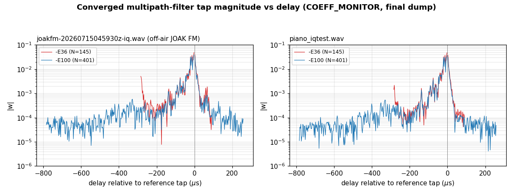

# FM Multipath Filter — Design Notes and Improvement Candidates

Working notes on `include/MultipathFilter.h` / `sfmbase/MultipathFilter.cpp`.

**Status:** design discussion only. Nothing here has been validated against
recorded IQ or on-air reception. Items are tagged **[established]** (follows
from theory or from the existing code/docs) or **[hypothesis]** (plausible,
needs testing before acting on).

**Provenance:** derived from a design discussion in July 2026. The reviewer
read `include/MultipathFilter.h` on `main` plus the README and CHANGES
descriptions of the filter; `MultipathFilter.cpp` was **not** read. Any claim
below about the update equation is inferred from the documented behaviour, not
from the source.

---

## 1. Current implementation, as understood

| Property | Value |
| --- | --- |
| IF sample rate | 384 kHz (Airspy HF+ native rate) |
| Sample period | 2.604 µs |
| Filter order | `4 * stages + 1` |
| Tap allocation | 3:1, weighted toward pre-reference taps (`-E36` → 108 / 36) |
| Coefficient type | `std::complex<float>` |
| Step size | `alpha = 0.1`, fixed |
| Reference level | 1.0 (IF AGC target), reference tap forced to `1 + 0j` since 20230430-0 |
| Coefficient update rate | every 4 samples (96 kHz) |
| Practical `-E` ceiling | ~50 on Raspberry Pi 4, ~100 on a modern CPU |

Spans at 384 kHz:

- `-E36` → 145 taps: 281 µs pre-reference, 94 µs post, 378 µs total
- `-E100` → 401 taps: 1.04 ms total

---

## 2. Why the tap count is large — and why that is correct

**[established]** The tap count is not set by the delay spread. It is set by
how deep the echo is.

For a two-ray channel `H(z) = 1 + a·z^-D`, the inverse is

```
1 - a·z^-D + a²·z^-2D - a³·z^-3D + ...
```

The tail decays as `a^n`, so the number of terms needed is
`n ≈ ln(ε) / ln(a)`, and the required span is `n · D` samples — proportional
to echo *depth*, with delay entering only as a multiplier.

| Echo amplitude `a` | Terms to reach −54 dB | Span for D = 2 samples (5.2 µs) |
| --- | --- | --- |
| 0.5 | ~9 | ~18 taps |
| 0.7 | ~18 | ~36 taps |
| 0.9 | ~59 | ~118 taps |
| 0.95 | ~121 | ~242 taps |

This is why sizing the filter from delay-spread coverage alone
(~30–60 taps for typical urban echoes) badly underestimates what is needed.
The existing `-E36`–`-E100` range is the right order of magnitude for echoes
in the 0.8–0.95 range.

**Practical consequence:** the useful `-E` value tracks reception conditions,
not geography. A deep, short-delay echo needs more taps than a shallow,
long-delay one.

---

## 3. Sample rate: keep 384 kHz

**[established]** 384 kHz is already the "fractionally spaced" rate for this
signal, and raising it is counterproductive.

FM broadcast occupies roughly 200 kHz (Carson's rule with full stereo
composite gives 2 × (75 + 53) ≈ 256 kHz; real program material sits closer to
180–200 kHz). For complex baseband, critical sampling is `fs = B`, so 384 kHz
is about 1.9× oversampled. "T/2-spaced" means twice the *signal's* Nyquist
rate, not twice whatever rate the receiver currently runs at.

Arguments against moving to 768 kHz:

1. **No gain in echo resolution.** An FIR at any rate above the signal's
   Nyquist rate synthesises *exact* fractional delays within the band, because
   sinc interpolation of a band-limited signal is exact. Sub-sample echo
   alignment already works at 384 kHz.
2. **Conditioning gets worse.** At 384 kHz the signal fills most of the
   Nyquist span. At 768 kHz it fills a quarter, leaving three-quarters of the
   band with no signal energy to constrain the taps — larger eigenvalue
   spread, slower convergence, more tap drift.
3. **Adjacent channels move in-band.** At 768 kHz the ±200 kHz first adjacents
   fall inside the Nyquist span, and the filter will attempt to equalise
   interference. At 384 kHz they are outside, needing only adequate channel
   filter rejection beyond ±192 kHz.
4. **4× the cost for identical coverage.** Tap counts are set by inverse-tail
   length in *samples*, so doubling the rate doubles every tap count for the
   same time span — 2× rate × 2× taps, on the component that is already the
   CPU bottleneck.
5. It would require a resampler ahead of a filter that currently runs at the
   front end's native rate.

---

## 4. Design decisions that are sound (rationale recorded)

**[established]** Recording the reasoning so these are not "simplified" later
by someone who does not know why they are there.

- **Reference tap forced to `1 + 0j`.** The CM cost function is blind to global
  gain and global phase — those are flat directions in which the tap vector
  would otherwise drift indefinitely. Pinning the reference tap is a linear
  constraint that removes both. This is a real stability mechanism, not
  cosmetic.
- **3:1 asymmetric tap allocation.** Physical echoes arrive *after* the direct
  path, so for the common minimum-phase case (direct path stronger than the
  echo) the inverse filter's tail is predominantly one-sided. Allocating the
  majority of taps to that side is correct. The minority allocation on the
  other side provides margin for non-minimum-phase conditions.
- **IF AGC to unity ahead of the filter.** Makes the dispersion constant
  R₂ = 1 consistent with the reference level, sidestepping modulus estimation
  entirely.
- **Why CMA works on FM at all.** Multipath on a constant-envelope carrier
  produces both AM and PM. The discriminator ignores AM and is corrupted by
  PM. Minimising only the envelope error nevertheless forces the phase
  correction, because for a constant-envelope source through a linear channel,
  restoring the envelope determines the channel inverse up to global phase,
  global delay, and carrier frequency offset — all three harmless for FM (a
  frequency offset lands as DC on the discriminator output). This is
  Treichler & Agee's original 1983 result.

---

## 5. Improvement candidates, ranked by expected payoff

### 5.1 Frequency-domain overlap-save adaptation — **[hypothesis]**, highest value

Two independent benefits:

**CPU.** Time domain costs `2N` complex MACs per output sample (filter +
update). At N = 401 and 384 kHz that is roughly 300 M complex MAC/s, order
2.5 GFLOP/s — which is what sets the current `-E` ceiling.

An overlap-save block implementation with FFT length 1024 (hop 624 for a
401-tap filter) costs roughly 5 complex FFTs of length 1024 per block, plus a
handful of length-1024 pointwise vector multiplies. That works out to roughly
an order of magnitude less arithmetic per sample. Dropping the gradient
constraint saves 2 of the 5 FFTs at the cost of some filter-length leakage.

These are order-of-magnitude estimates, not measurements — benchmark before
committing.

**Conditioning.** Per-bin power normalisation approximately whitens the input,
which directly cancels the eigenvalue-spread penalty that a band-limited,
spectrally peaked FM signal otherwise imposes on gradient descent. Excluding
out-of-band bins from adaptation (and forcing their response to zero) removes
the unconstrained tap directions and prevents out-of-band noise amplification.

Sketch, in-band bins only:

```
Y[k]  = W[k] * X[k]
P[k] += α * (|X[k]|² - P[k])            # per-bin power estimate
E[k]  = FFT( y[n] * (R2 - |y[n]|²) )    # CM error, R2 = 1
W[k] += mu * conj(X[k]) * E[k] / (P[k] + eps)
W[k] *= (1 - mu * leak)
W[k]  = 0   for k outside the passband
```

Gradient-constrain each block (zero the tail of the IFFT of `W`) or the
effective filter will smear beyond its intended span.

**Expected outcome if it works:** `-E200` becomes feasible on hardware that
currently tops out around `-E50`.

**Cost:** block latency, and a substantially more complex implementation than
the current sample-by-sample loop. Keep the time-domain path as a fallback.

### 5.2 Double-precision coefficient accumulation — **[hypothesis]**

`std::complex<float>` gives ~1e-7 relative resolution. With coefficients of
order 1 and near-converged updates that are small, `mu * gradient` can fall
below the ULP and quantise to zero — the classic LMS stalling floor. This gets
worse as tap count rises, since each individual tap's share of the update
shrinks.

Suggested split: hold `m_coeff` as `std::complex<double>` for accumulation,
maintain a `std::complex<float>` shadow copy for the VOLK convolution,
refreshed on each coefficient update. Since updates already happen only every
4 samples, the conversion cost is amortised and SIMD throughput on the
convolution is preserved.

**How to test:** run a fixed recorded IQ file through both, compare the
steady-state `m_error` floor. If float32 quantisation is the limiter, the
double-accumulation version should settle measurably lower.

### 5.3 Coefficient leakage — **[hypothesis]**

No leakage term appears in the header. With 145–401 taps and a signal that
fills only part of the Nyquist band, out-of-band tap directions are
unconstrained and can grow slowly without affecting the cost function.

```
w ← (1 - mu*lambda) * w + update      # lambda ~ 1e-4
```

Divergence in LMS-family filters is usually preceded by slow tap-norm growth
rather than a sudden event, so this may reduce how often the NaN/inf guard in
`process()` fires. Monitoring `‖w‖` over time would confirm whether drift is
actually occurring before adding the term.

### 5.4 Softening the reference-tap constraint — **[hypothesis]**

Possible explanation for the README's *"For stable reception only: turn off if
reception becomes unstable."*

Forcing `w[ref] = 1 + 0j` fixes both the magnitude and the phase of the
reference tap. This is fine while the direct path dominates. But in a deep
fade where the echo becomes *stronger* than the direct path, the channel is
non-minimum-phase and the correct solution wants `|w[ref]| < 1` with the
energy concentrated elsewhere — which the hard constraint forbids. The filter
then has no reachable solution and thrashes.

If this is the mechanism, a softer constraint — normalising the whole tap
vector, or fixing output power, rather than pinning one tap — would let the
filter ride through fades.

**How to test:** find or record an IQ file containing a deep fade, confirm the
instability reproduces, then check whether `|w[ref]|` is being clamped against
what the unconstrained solution wants. Do not change the constraint before
reproducing the failure.

### 5.5 Step-size gear shifting — **[hypothesis]**

`alpha = 0.1` fixed is a single compromise between acquisition speed and
steady-state misadjustment. Since `m_error` is already exposed via
`get_error()`, gear shifting is cheap: larger alpha while error is high, drop
it once settled. Expected to help most on re-acquisition after fades, which at
driving speeds is the dominant case — at 100 MHz and 30 m/s, Doppler is ~10 Hz
(coherence ~40 ms) with fades recurring roughly every 50 ms.

---

## 6. Validation approach

Simulation before field testing:

1. Two-ray channel: `y = x + a·e^{jθ}·x(t-τ)`, with `a` swept 0.3–0.95 and
   `τ` 2–30 µs. Fractional-delay interpolation is required for `τ` values that
   are not integer sample multiples.
2. Sweep `a` specifically — it is the parameter that drives tap count, and it
   is the axis along which the current implementation is most likely to run
   out of taps.
3. Include at least one case with `a > 1` (echo stronger than direct path) to
   exercise the non-minimum-phase condition in §5.4.

Measure **post-discriminator** THD and stereo separation, not just the CM cost.
The CM error can look converged while the audio is still degraded, because the
cost function is blind to the flat directions listed in §4.

Also worth plotting: tap magnitude versus index. Energy accumulating at the
ends of the delay line indicates the span is too short; diffuse spreading
indicates missing leakage or excessive tap count.

---

## 7. References

- J. R. Treichler and B. G. Agee, "A New Approach to Multipath Correction of
  Constant Modulus Signals," *IEEE Trans. ASSP*, vol. 31, no. 2, pp. 459–472,
  Apr. 1983. The original CMA paper, written for FM multipath rather than QAM.
- C. R. Johnson, Jr. et al., "Blind Equalization Using the Constant Modulus
  Criterion: A Review," *Proc. IEEE*, vol. 86, no. 10, pp. 1927–1950,
  Oct. 1998. <http://bard.ece.cornell.edu/publications/johnson/proc98_cma.pdf>
- Y. Li and Z. Ding, "Global convergence of fractionally spaced Godard (CMA)
  adaptive equalizers," *IEEE Trans. Signal Processing*, vol. 44, no. 4,
  pp. 818–826, Apr. 1996. DOI 10.1109/78.492535
- B. G. Agee, "The least-squares CMA: A new technique for rapid correction of
  constant modulus signals," *Proc. ICASSP-86*, pp. 953–956, Tokyo, Apr. 1986.
  Block least-squares CMA (Gauss-Newton on the CM cost); an alternative to
  §5.1 if block processing is acceptable.
- K. Rikitake, "SDR Implementation of Analog FM Broadcast Multipath Filter,"
  *IEICE Technical Report*, vol. 121, no. 227, SR2021-43, pp. 17–24,
  Nov. 2021.

**Caveat on the convergence theory.** The global-convergence results in Li &
Ding and in the Johnson review assume an i.i.d., sub-Gaussian, symbol-rate
source and a polyphase subchannel decomposition. Analog FM satisfies none of
these. They justify the oversampled architecture as an engineering choice;
they do not provide a convergence guarantee for this application. Treat any
citation of them here as motivation, not proof.

---
---

# Part II — Source review and measured results

**Added 2026-07-24.** Part I above was written without reading
`sfmbase/MultipathFilter.cpp`. This part closes that gap: the implementation
was read line by line, the numeric claims in §5 were recomputed against what
the code actually does, and the candidates that could be tested were tested on
the two IQ recordings held in `test-files/`.

Same tagging convention as Part I, with one addition: **[measured]** means a
number in this part came out of an actual run, not out of an estimate.

**Method.** Static review by a C++/DSP reviewer pass over
`include/MultipathFilter.h`, `sfmbase/MultipathFilter.cpp`,
`sfmbase/FmDecode.cpp` and the `COEFF_MONITOR` block in `main.cpp`, followed by
instrumented runs. Code experiments were done on branch `dev-multipath-exp`;
`main` and `dev` are untouched.

**Measurement environment**

| Item | Value |
| --- | --- |
| Machine | Apple M2 Pro, macOS 25.5.0 |
| Compiler | Homebrew clang 22.1.8, `-O3 -ftree-vectorize`, C++20 |
| VOLK | 3.3.0 |
| Baseline commit | `8f1354b` |
| Instrumentation | `cmake -S . -B build-mf -DEXTRA_FLAGS="-DCOEFF_MONITOR"` |
| Recording A | `test-files/piano_iqtest.wav` — 384 kHz float IQ, 2 ch, 20.0 s |
| Recording B | `test-files/joakfm-20260715045930z-iq.wav` — 384 kHz float IQ, 2 ch, 60.0 s |

---

## 8. Corrections to Part I

### 8.1 The step size is not fixed — this is normalised CMA, not fixed-α LMS

**[established]** Part I §1 lists "Step size `alpha = 0.1`, fixed". `alpha`
(`MultipathFilter.h:44`) is indeed a fixed `constexpr double`, but it is *not*
the step size. It is the numerator of an NLMS step recomputed on every
coefficient update:

```cpp
// MultipathFilter.cpp:130 (before this session's changes)
m_mu = alpha / (state_mag_sq_sum + 1e-10);
```

where `state_mag_sq_sum = Σ|state[i]|²` over the whole delay line, recomputed
from scratch each time (`MultipathFilter.cpp:123-126`). The effective step
therefore already tracks instantaneous input power. What the algorithm
actually is:

```
x[n]     : complex<float>          input sample
state[]  : N-element delay line, oldest → newest
y[n]     : complex<float>  = Σ_i state[i]·coeff[i]        (volk dot product)
env      : double = std::norm(y[n])       <- computed in float, then widened
e[n]     : double = R₂ - env,  R₂ = if_target_level = 1.0
‖x‖²     : float  = Σ_i |state[i]|²
mu       : float  = alpha / (‖x‖² + 1e-10)
factor   : float  = e[n]·mu
w[i]    ← w[i] + factor·y[n]·conj(state[i])    for all i
w[ref]  ← 1 + 0j                                hard overwrite
```

This is **Godard/CMA(2,2)** — gradient `e(n)·y(n)·conj(x(n))` with
`e(n) = R₂ − |y(n)|²` — with NLMS power normalisation of the step. It is not
decision-directed LMS. The header's own citation of Treichler & Agee is
correct; only Part I's description of the step size was wrong.

**Consequences.**

- §5.5 proposes gear-shifting "the step size". The step size is already
  renormalised every update. What would have to be gear-shifted is `alpha`,
  the dimensionless numerator. See §12.5.
- §5.2's ULP argument has to use the real NLMS `mu ≈ alpha/N`, not an assumed
  fixed LMS step. This changes the numbers by orders of magnitude. See §11.

### 8.2 The header documents a stability bound for a different algorithm

**[established]** `MultipathFilter.h:40-44` says *"maximum amplitude must be
less than sqrt(2 / alpha) to maintain the filter convergence"*. That is the
bound for **unnormalised** LMS. For NLMS the convergence condition is
amplitude-independent, `0 < alpha < 2` — which is the entire reason the
normalisation is there. The comment describes a criterion that does not apply
to the code below it, and will mislead the next person who tunes `alpha`.

### 8.3 The per-sample MAC count in §5.1 is overstated by 1.6×

**[established]** §5.1 costs the time-domain path at "`2N` complex MACs per
output sample (filter + update)". The update runs only every 4th sample
(`MultipathFilter.cpp:176-193`), so the true figure is `N + N/4 = 1.25N`. At
N = 401 and 384 kHz that is **192 M complex MAC/s**, not the ~300 M quoted.
The FFT method's advantage is correspondingly 1.6× smaller than §5.1 claims —
which matters, because §5.1 is ranked highest partly on that arithmetic.

### 8.4 `get_reference_level()` is structurally dead

**[established]** `MultipathFilter.h:69-71` returns
`m_coeff[m_index_reference_point].real()`. That tap is unconditionally
overwritten with `(1,0)` at the end of every update
(`MultipathFilter.cpp:158`), so the getter returns exactly `1.0f` for the
entire life of the process. It has no callers. It becomes meaningful only if
§5.4's soft constraint is ever adopted.

---

## 9. What the two recordings actually contain

**[measured]** This governs which candidates could be tested at all.

Converged tap profile, from the last `COEFF_MONITOR` dump of each run:

| File | `-E` | N | largest non-reference tap | off-reference energy Σ\|w\|²−1 |
| --- | --- | --- | --- | --- |
| piano | 36 | 145 | 0.0472 | 0.0083 |
| piano | 100 | 401 | 0.0362 | 0.0057 |
| piano | 400 | 1601 | 0.0234 | 0.0030 |
| joak | 36 | 145 | 0.0485 | 0.0085 |
| joak | 100 | 401 | 0.0388 | 0.0064 |

**Neither recording contains significant multipath.** The equaliser settles
with under 1 % of its energy off the reference tap; the deepest echo either
file implies is of order 5 % amplitude. Part I §2 is concerned with echoes of
`a = 0.5–0.95`; nothing remotely that deep is present here. Any candidate whose
payoff depends on deep echoes (§5.1's conditioning argument, §5.4 entirely)
**cannot be accepted or rejected on these files**, and a synthesised channel is
required — see §13.



The figure is Part I §6's own suggested diagnostic ("tap magnitude versus
index"), and it works: at `-E36` the trace turns *upward* at the left edge of
the span, the signature of energy piling against a truncated delay line, while
at `-E100` it decays smoothly into a ~1e-4 floor with ~500 µs of margin to
spare.

| File | `-E` | max \|w\| in outer 5 taps | as fraction of largest non-ref tap |
| --- | --- | --- | --- |
| joak | 36 | 5.06e-3 | 10.4 % |
| joak | 100 | 1.0e-4 | 0.26 % |
| piano | 36 | 2.17e-3 | 4.6 % |
| piano | 100 | 7e-5 | 0.19 % |

**[measured]** So `-E36` is span-limited even on a near-clean off-air signal,
and `-E100` is comfortably not. This is a concrete argument for the value of
raising the practical `-E` ceiling, independent of which method is used to
raise it.

---

## 10. Measured baseline cost

**[measured]** `piano_iqtest.wav`, 20.0 s = 7 680 000 IQ samples, `-q`, WAV
output, `user` CPU seconds, minimum of ≥3 interleaved runs. "Filter only"
subtracts the `-E`-disabled run (1.28 s).

| `-E` | N | total (s) | filter only (s) | ns/sample | ns/sample/tap | % of one core |
| --- | --- | --- | --- | --- | --- | --- |
| off | — | 1.28 | — | — | — | 6.4 % |
| 36 | 145 | 2.74 | 1.46 | 190 | 1.31 | 7.3 % |
| 100 | 401 | 4.80 | 3.52 | 458 | 1.14 | 17.6 % |
| 200 | 801 | 7.86 | 6.58 | 857 | 1.07 | 32.9 % |
| 400 | 1601 | 11.50 | 10.22 | 1331 | 0.83 | 51.1 % |

Cost is very close to linear in N, as expected for an O(N)-per-sample
algorithm. Note that on this machine `-E400` still runs at half of one core —
the doc's "~100 on a modern CPU" ceiling is conservative for Apple silicon, and
the binding constraint on Raspberry Pi-class hardware will be much tighter.

---

## 11. §5.2 double-precision coefficients — **rejected by measurement**

**[measured]** The hypothesis is that `mu·gradient` falls below the float32 ULP
and quantises to zero. With the real NLMS step `mu ≈ alpha/N` (since
`|x[n]| ≈ 1` under IF AGC to unity) the per-update tap increment is

```
|Δw| = mu·|e|·|y|·|x_i| ≈ (alpha/N)·|e|
```

and stalling needs `|Δw| < ULP(w) = |w|·2⁻²³`. Both `|e|` and `|w|` are now
measured rather than assumed:

| `-E` | N | mu = α/N | measured mean \|e\| | \|Δw\| | largest non-ref \|w\| | ULP(\|w\|) | margin |
| --- | --- | --- | --- | --- | --- | --- | --- |
| 36 | 145 | 6.90e-4 | 3.8e-3 | 2.6e-6 | 0.0485 | 5.8e-9 | **450×** |
| 100 | 401 | 2.49e-4 | 2.7e-3 | 6.7e-7 | 0.0388 | 4.6e-9 | **145×** |
| 400 | 1601 | 6.25e-5 | 3.8e-3 | 2.4e-7 | 0.0234 | 2.8e-9 | **86×** |

Equivalently, stalling at `-E100` would require the steady-state CM error to
fall to `|e| ≈ 1.9e-5`; it measures 2.7e-3, two orders of magnitude above.

Measured steady-state error floors, for the record:

| File | `-E` | mean \|mf_error\| | 2nd-half mean | max |
| --- | --- | --- | --- | --- |
| piano | 36 | 3.85e-3 | 4.33e-3 | 1.44e-2 |
| piano | 100 | 5.12e-3 | 5.89e-3 | 2.31e-2 |
| piano | 400 | 5.55e-3 | 3.76e-3 | 1.61e-2 |
| joak | 36 | 3.76e-3 | 3.86e-3 | 1.37e-2 |
| joak | 100 | 2.72e-3 | 2.55e-3 | 9.27e-3 |

**Conclusion.** The error floor is set by CMA misadjustment — a function of
`alpha` — not by coefficient precision. The margin does shrink with N, so Part
I's *direction* is right, but even at `-E400` there are ~86 ULP of headroom.
Note also that Part I's picture has the risk backwards: `ULP` scales with a
tap's own magnitude, so small taps are no worse off than large ones; the only
tap of magnitude 1 is the reference tap, and it is overwritten every update
anyway.

Two further points against §5.2 as written:

- **[established]** Widening only `m_coeff` would not help even if stalling
  were real, because `env = std::norm(result)` (`MultipathFilter.cpp:115`)
  evaluates in float32 — `std::norm` on a `complex<float>` returns `float` —
  and only the already-rounded result is widened to `double`. Recovering
  precision there would require `complex<double>` all the way through the
  forward path, i.e. a double-precision replacement for
  `volk_32fc_x2_dot_prod_32fc`. That is a much larger change than §5.2
  describes.
- **[established]** `COEFF_MONITOR` prints coefficients with `{:.9f}`
  (`main.cpp:1125`). float32 carries ~7 significant decimal digits, so the last
  two printed digits are formatting artefacts. Do not read them as evidence of
  resolution.

**Verdict: do not implement.** Revisit only if a future recording shows
`|mf_error|` settling below ~1e-4 at high `-E`.

---

## 12. Revised improvement ranking

### 12.1 Remove the redundant O(N) work — **implemented and measured, highest payoff/risk ratio**

**[established]** Per 4 input samples the baseline makes **11 O(N) passes** over
the delay line, of which only 5 are intrinsic to the algorithm:

| Pass | Where | Per 4 samples | Necessary? |
| --- | --- | --- | --- |
| `volk_32fc_x2_dot_prod_32fc` | `MultipathFilter.cpp:102` | 4 | yes |
| `m_state.erase(m_state.begin())` | `MultipathFilter.cpp:96` | 4 | **no** |
| `volk::vector<float>` construct + `resize` | `MultipathFilter.cpp:110-111` | 1 (heap alloc/free) | **no** |
| `volk_32fc_magnitude_squared_32f` | `MultipathFilter.cpp:123` | 1 | **no** |
| `volk_32f_accumulator_s32f` | `MultipathFilter.cpp:125` | 1 | **no** |
| `..._multiply_conjugate_add2_32fc` | `MultipathFilter.cpp:153` | 1 | yes |

The `erase(begin())` is the worst of these: a full O(N) element shift on
*every* input sample, 384 000 times per second, purely to move a window that
never needed moving. At `-E400` that is a 12.8 kB `memmove` per sample,
≈4.9 GB/s of pure bookkeeping traffic.

Two changes remove six of the eleven passes:

1. **Ring buffer with duplicated tail.** Allocate `2N`, write each new sample
   at both `pos` and `pos+N`, and hand VOLK the contiguous span
   `[pos+1, pos+1+N)`. O(1) per sample instead of O(N).
2. **Incremental window power.** Maintain `m_state_power` in `double`,
   updated as `+= |x_new|² − |x_leaving|²` — the leaving sample is exactly the
   one about to be overwritten at `pos`. This deletes the `magnitude_squared`
   pass, the `accumulator` pass, *and* the scratch vector that only existed to
   hold their intermediate result. An exact recomputation every 65 536 updates
   bounds the rounding drift.

**Alignment check.** The ring buffer hands VOLK a pointer that is 16-byte
aligned only half the time. VOLK's unsuffixed dispatchers were verified to
handle this: `volk_32fc_x2_dot_prod_32fc` was run at all 8 byte-offsets against
a double-precision reference at N = 401, relative error ≤ 4.6e-7 in every case.
**[measured]** So the unsuffixed entry points do dispatch on runtime alignment
and the technique is safe.

**Result** — same file, same protocol as §10, `user` seconds, min of ≥3
interleaved runs:

| `-E` | N | base | optimised | filter only, base → opt | speedup |
| --- | --- | --- | --- | --- | --- |
| off | — | 1.28 | 1.28 | — | — |
| 36 | 145 | 2.74 | 2.23 | 1.46 → 0.95 | **1.54×** |
| 100 | 401 | 4.80 | 3.47 | 3.52 → 2.19 | **1.61×** |
| 200 | 801 | 7.86 | 5.38 | 6.58 → 4.10 | **1.60×** |
| 400 | 1601 | 11.50 | 10.90 | 10.22 → 9.62 | 1.06× |

**[measured]** A consistent ~1.6× across the whole practical range, `-E36`
through `-E200`. The gain collapses at `-E400`: the ring buffer doubles the
delay-line footprint (25.6 kB instead of 12.8 kB at N = 1601), and past some
point that costs more in cache traffic than the eliminated `memmove` saves.
Per-tap cost bears this out — optimised ns/sample/tap runs 0.85, 0.71, 0.67,
0.78 across `-E36/100/200/400`, i.e. it improves monotonically and then turns
around, whereas the baseline improves monotonically throughout (1.31, 1.14,
1.07, 0.83). **[hypothesis]** If very large `-E` ever matters, the tail
duplication should be replaced by a two-segment dot product.

**Numerical equivalence.** Decoded audio, baseline vs optimised, same input:

| File | `-E` | difference / signal |
| --- | --- | --- |
| piano | 36 | −106.4 dB |
| piano | 100 | −106.9 dB |
| joak | 36 | −104.3 dB |
| joak | 100 | −104.2 dB |

**[measured]** Below the 16-bit output floor. Convergence is unchanged as well:
re-running `joak -E100` under `COEFF_MONITOR` reproduces the baseline's
`|mf_error|` statistics (mean 2.719e-3, ‖w‖ 1.00000 → 1.00393) to five
significant figures. The residual difference comes only from the power sum
being accumulated in `double` rather than through VOLK's float accumulator.

**Relation to §5.1.** This is the same CPU budget §5.1 targets, obtained
without block latency, without an FFT dependency, and without changing the
algorithm — the arithmetic performed is identical, only the bookkeeping around
it changed. It should be done first regardless of whether §5.1 is ever
attempted, and it moves §5.1's break-even point: combined with the 1.6×
correction in §8.3, the frequency-domain method now has to beat a
2.6×-cheaper time-domain baseline than §5.1 assumed.

### 12.2 §5.3 leakage — no evidence of drift yet, do not add blind

**[measured]** ‖w‖ over the full runs:

| File | `-E` | ‖w‖ start → end | run length |
| --- | --- | --- | --- |
| piano | 36 | 1.00000 → 1.00523 | 20 s |
| piano | 100 | 1.00000 → 1.00351 | 20 s |
| piano | 400 | 1.00000 → 1.00178 | 20 s |
| joak | 36 | 1.00000 → 1.00538 | 60 s |
| joak | 100 | 1.00000 → 1.00393 | 60 s |

The rise is convergence, not drift — it is monotone, it saturates, and it gets
*smaller* as N grows, which is the opposite of what unconstrained tap
directions would produce. On `joak -E36`, ‖w‖ reaches 1.0047 by t ≈ 25 s and
then creeps to 1.0054 over the remaining 35 s. **[hypothesis]** That residual
creep cannot be distinguished from continued slow convergence in 60 s; a
recording of several minutes is needed to settle it.

**[established]** If leakage is eventually wanted, the cheapest correct place is
one extra O(N) VOLK pass immediately before the existing gradient add:
`volk_32fc_s32fc_multiply_32fc(m_coeff.data(), m_coeff.data(), 1-mu*lambda, N)`.
No special case is needed for the reference tap, because the existing hard pin
runs after it and restores `1+0j` anyway.

### 12.3 §5.1 frequency-domain adaptation — still the big win, but the case is weaker

**[hypothesis]** Unchanged in principle. Two adjustments from Part I: the
time-domain baseline it must beat is 1.6× cheaper than stated (§8.3) and now a
further 1.6× cheaper again (§12.1), for a combined 2.6×; and its second
argument — that per-bin normalisation fixes eigenvalue spread — is
**untestable on the recordings available**, because neither contains a channel
with enough dispersion to stress conditioning (§9). Do §12.1 first, then
re-derive the break-even.

### 12.4 §5.4 reference-tap constraint — cannot be tested with what exists

**[established]** Confirming the mechanism from the source: the VOLK update at
`MultipathFilter.cpp:146-156` is applied to *all* N taps including the
reference, and `MultipathFilter.cpp:158` then overwrites that tap. So this is
a project-after-the-fact constraint — the gradient component along the
reference tap is computed and thrown away, not projected out beforehand. The
same pin is applied at construction (`:85`) and on every divergence reset.

Neither recording contains a deep fade or a non-minimum-phase channel (§9), so
the failure mode behind the README's *"turn off if reception becomes
unstable"* cannot be reproduced here. See §13 for the synthesis route. Part
I's instruction — do not change the constraint before reproducing the failure —
stands.

### 12.5 §5.5 step-size gear shifting — needs a smoothed statistic first

**[established]** `m_error` (`MultipathFilter.cpp:160`) is the raw, signed,
single-sample CM residual of whichever sample happened to land on an update
boundary. The measured spread confirms it is unusable as a direct control
input: on `joak -E100` the mean of `|mf_error|` is 2.7e-3 while the max is
9.3e-3, a 3.4× swing in steady state with no channel change at all
**[measured]**. Driving `alpha` off that would schedule gain on noise.

What would be needed:

1. An EMA of `|e|` or `e²`, with a time constant between the update interval
   (10.4 µs) and the fade coherence time (~40 ms) — the codebase already uses
   this pattern at `FmDecode.cpp:151`.
2. A mapping from that statistic to an `alpha` multiplier, with hysteresis and
   hard bounds keeping the effective `alpha` inside `0 < alpha < 2`.
3. `alpha` becomes a mutable member instead of `static constexpr`; the cost is
   O(1) inside an already-O(N) function.
4. **[hypothesis]** A fresh stability argument. NLMS's `0 < alpha < 2`
   guarantee assumes fixed `alpha`. During a real fade `‖x‖²` also moves, so
   numerator and denominator of `mu` can swing the same way at the same
   moment — precisely when gear shifting would be raising `alpha`. Part I does
   not flag this interaction.

Also **[measured]**: neither recording contains a channel change, so the only
gear-shift-relevant transient available is the initial acquisition after the
100-block warm-up. That gives a legitimate before/after baseline but says
nothing about re-acquisition after a fade, which is where §5.5 claims its
payoff.

---

## 13. Bugs and code-level findings

### 13.1 The delay line is not cleared on a divergence reset — **fixed on the branch**

**[established]** When `process()` returns false, `FmDecode.cpp:119-125`
recovers by calling `initialize_coefficients()`, which touches only `m_coeff`
(`MultipathFilter.cpp:77-89`). Nothing resets `m_state`, and before this
session `MultipathFilter` exposed no way to do so.

But the non-finite sample that triggered the reset is *already in the delay
line*: `single_process()` inserts it (`:95-96`) before `process()` performs the
`isfinite` check (`:182`). Since the dot product reads the entire N-sample
window every sample, one poisoned entry makes every subsequent output
non-finite until it ages out — up to N samples, ≈1 ms at `-E400`. The recovery
therefore is not clean: freshly reset identity coefficients are convolved
against a still-poisoned delay line, and the expected behaviour is a *burst* of
resets rather than one.

Fixed on `dev-multipath-exp` by adding `MultipathFilter::reset_state()` and
calling it alongside `initialize_coefficients()` in the recovery path.
**[hypothesis]** Not observed firing on either recording — neither diverges —
so the fix is reasoned, not demonstrated.

### 13.2 The 100-block warm-up is a hard bypass

**[established]** While `m_wait_multipath_blocks > 0` (`FmDecode.cpp:109-112`)
`process()` is never called at all, so the delay line stays empty and the
coefficients stay at construction values. At block 101 the filter switches on
abruptly against a cold delay line, with no crossfade. Probably benign, but it
is current behaviour rather than a documented design choice, and it is the one
transient in these recordings usable as a convergence-speed baseline (§12.5).

### 13.3 `assert()` is live in the standard build

**[established]** `CMakeLists.txt:230` sets `CMAKE_CXX_FLAGS` directly and the
documented build never sets `CMAKE_BUILD_TYPE`, so CMake never injects
`-DNDEBUG`. The constructor guards (`MultipathFilter.cpp:67,70`) and the
postcondition at `:195` are compiled in. This is fragile rather than wrong:
anyone building with `-DCMAKE_BUILD_TYPE=Release` picks up
`CMAKE_CXX_FLAGS_RELEASE` = `-O3 -DNDEBUG` *in addition to* the project flags
and silently loses all three.

### 13.4 In-place VOLK aliasing

`MultipathFilter.cpp:148-156` passes `m_coeff.data()` as both destination and
first source, with an existing comment saying the overlap "seems to be OK".
**[established]** For a strictly element-wise kernel `dst[i] = src0[i] +
f(src1[i])` this is safe by construction, and the same call has now been run
across all the measurements in this part with bit-stable results. The comment
could be upgraded from a hedge to a statement of why.

### 13.5 Minor

**[established]** `get_error()` and `get_reference_level()`
(`MultipathFilter.h:62,69`) return `const` fundamental types by value, which
clang flags under `-Wignored-qualifiers`; `get_coefficients()` and
`get_reference_level()` are not `const`-qualified members despite not mutating
anything, so neither is callable through a `const MultipathFilter&`.

---

## 14. What still needs a synthesised channel

**[established]** §9 shows both recordings are essentially multipath-free. The
following cannot be settled without a channel that is not in `test-files/`:

| Question | Needs |
| --- | --- |
| §5.4 — does the pinned reference tap thrash in a deep fade? | two-ray channel with `a > 1` (non-minimum-phase) |
| §5.1 — does per-bin normalisation actually help conditioning? | a dispersive channel, `a` in 0.7–0.95 |
| Part I §2 — is the tap count right for deep echoes? | `a` swept 0.3–0.95 |
| §5.5 — does gear shifting shorten re-acquisition? | a time-varying channel with recurring fades |

`piano_iqtest.wav` is clean 384 kHz complex baseband, so all four can be
generated offline from it: read the WAV, apply
`y[n] = x[n] + a·e^{jθ}·x[n−τ]` with fractional-delay interpolation for
non-integer `τ`, write back as a 384 kHz float WAV, and feed the result through
`-t filesource` exactly as the originals are fed. This is Part I §6's own
validation plan, and it is the only route to those four answers with what is in
this repository today. Part I §6's insistence on measuring **post-discriminator**
THD and stereo separation rather than the CM cost applies unchanged — §11 is a
worked example of how far the CM error alone can be from the question actually
being asked.

---

## 15. Reproduction recipe

```sh
# instrumented build (never put -D... in CMAKE_CXX_FLAGS; use EXTRA_FLAGS)
cmake -S . -B build-mf -DEXTRA_FLAGS="-DCOEFF_MONITOR"
cmake --build build-mf --target all

# coefficient / error dump (CSV on stderr, every stat_rate*10 blocks)
./build-mf/airspy-fmradion -t filesource \
    -c filename=test-files/joakfm-20260715045930z-iq.wav,srate=384000,freq=82500000 \
    -E100 -W /tmp/out.wav 2> /tmp/coeff.log

# CPU cost (-q suppresses the status line and the COEFF_MONITOR dump)
/usr/bin/time -p ./build-mf/airspy-fmradion -q -t filesource \
    -c filename=test-files/piano_iqtest.wav,srate=384000,freq=100000000 \
    -E100 -W /tmp/out.wav
```

The dump lines are `block,<n>,mf_error,<e>,mf_coeff,<i>,<re>,<im>,...`; note
they are emitted without a leading newline, so they are not anchored to the
start of a line in the captured log. Timing must use `user` CPU time, not wall
clock: the file source paces itself to real time, so wall clock is pinned at
the recording's duration regardless of load.

---

## 16. Revised ranking

| Rank | Item | Status | Basis |
| --- | --- | --- | --- |
| 1 | §12.1 remove redundant O(N) passes | implemented on `dev-multipath-exp`, 1.6× measured | [measured] |
| 2 | §13.1 clear the delay line on divergence reset | implemented on `dev-multipath-exp` | [established] |
| 3 | §8.2 / §13.5 fix the stale header comment and the dead getter | not done | [established] |
| 4 | §14 build the synthesised two-ray channel | not done — gates items 5–7 | [established] |
| 5 | §5.1 frequency-domain adaptation | open; break-even moved 2.6× against it | [hypothesis] |
| 6 | §5.5 gear shifting, with a smoothed error statistic | open; needs a time-varying channel to evaluate | [hypothesis] |
| 7 | §5.4 soften the reference-tap constraint | open; failure not yet reproduced | [hypothesis] |
| — | §5.2 double-precision coefficients | **rejected**, ≥86 ULP of margin measured | [measured] |
| — | §5.3 coefficient leakage | **deferred**, no drift observed in 60 s | [measured] |
