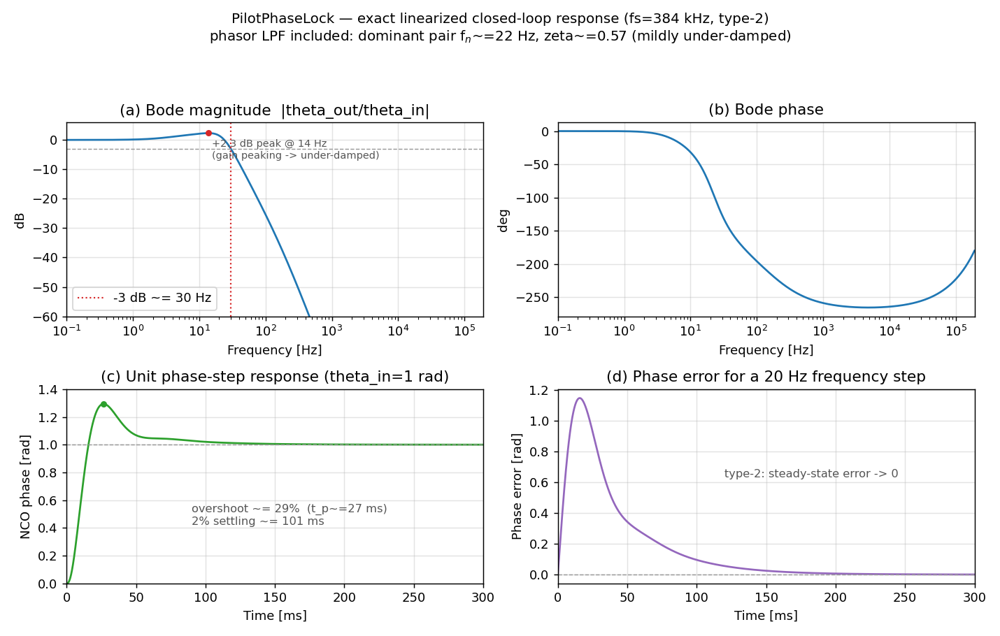

# Analysis of the FM Stereo Pilot PLL (`class PilotPhaseLock`)

Date: 2026-07-22
Scope: `include/PilotPhaseLock.h`, `sfmbase/PilotPhaseLock.cpp`,
supporting filters in `include/Filter.h` / `sfmbase/Filter.cpp`.
This is a read-only analysis; no source code was changed.

---

## 1. Purpose

FM broadcast stereo multiplexes a 19 kHz *pilot* tone into the baseband.
The stereo subcarrier (L−R) sits on a 38 kHz suppressed carrier that is
exactly twice the pilot and phase-coherent with it. To demodulate L−R the
receiver must regenerate a clean 38 kHz reference that is phase-locked to the
transmitted 19 kHz pilot. `PilotPhaseLock` is the digital phase-locked loop
that does this.

It runs at the IF/baseband sample rate `sample_rate_if = 384000` Hz. Given a
noisy, multipath-corrupted baseband stream it:

- tracks the 19 kHz pilot with a numerically-controlled oscillator (NCO);
- emits `sin(2·phase)` (or `cos(2·phase)` in "shifted" mode) — the locked
  38 kHz subcarrier used to demodulate L−R;
- reports a lock flag, the measured pilot amplitude, and the instantaneous
  frequency error;
- generates one PPS (pulse-per-second) event every 19000 pilot cycles for
  timestamping.

---

## 2. Block diagram

```
             +---------------------------------------------------------------+
             |                        PilotPhaseLock                         |
             |                                                               |
  x[n] ------+--+--> (×) sin(phase) --> BiquadLPF --> I --+                  |
 baseband    |  |        (product / mixer)                |                  |
             |  |                                          v                  |
             |  |                                    +------------+           |
             |  |                                    | fast_atan2 |-> e[n]    |
             |  |                                    |  (Q, I)    | phase err  |
             |  |                                    +------------+     |      |
             |  |                                          ^            |      |
             |  +--> (×) cos(phase) --> BiquadLPF --> Q ---+            |      |
             |           (product / mixer)                              v      |
             |                                             +---------------------+
             |                                             | loop filter F(z)    | PI
             |                                             | (FIR) + freq accum  | ctrl
             |                                             +---------------------+
             |                                                       |           |
             |                                                 m_freq (ω[n])      |
             |                                                       v           |
             |                                         m_phase += m_freq  <- NCO/VCO
             |                                                       |           |
             |   +---------------------------------------------------+ feedback  |
             |   |  (m_phase drives the sin/cos generators above)                |
             |   v                                                               |
             | sin(phase),cos(phase)      sin(2·phase)/cos(2·phase) -> samples_out (38 kHz)
             +---------------------------------------------------------------+
```

Three functional blocks, exactly as in a textbook PLL: **phase detector**,
**loop filter**, **oscillator**.

---

## 3. Phase detector

Per input sample `x = samples_in[i]`:

```
phasor_i = sin(m_phase) * x
phasor_q = cos(m_phase) * x
I = biquad_i.process(phasor_i)   // ~30 Hz low-pass
Q = biquad_q.process(phasor_q)
phase_err = fast_atan2f(Q, I)
```

### 3.1 Product (mixer) stage

Multiplying the input by the NCO's `sin`/`cos` is a quadrature product
detector. If the pilot component is `x = A·sin(θ_in)` and the NCO phase is
`θ = m_phase`, then

```
I = A·sinθ·sinθ_in = (A/2)[cos(θ_in−θ) − cos(θ_in+θ)]
Q = A·cosθ·sinθ_in = (A/2)[sin(θ_in+θ) + sin(θ_in−θ)]
```

The `θ_in+θ` terms sit near 2·19 kHz = 38 kHz; the `θ_in−θ` terms are the
wanted DC/baseband phase-error terms.

### 3.2 Biquad low-pass (removes the 2f₀ image, band-limits noise)

`m_biquad_phasor_i1` / `m_biquad_phasor_q1` are 2nd-order all-pole IIR
low-pass filters, Direct-Form-2:

```
H_bq(z) = b0 / (1 + a1·z⁻¹ + a2·z⁻²)
b0 = 1.46974784e-06,  a1 = −1.99682419,  a2 = 0.996825659
```

Properties (verified numerically):

| Quantity            | Value                                  |
|---------------------|----------------------------------------|
| DC gain             | 1.0005 (≈ unity)                       |
| Poles               | real, z ≈ 0.99944 and z ≈ 0.99739      |
| Pole radius √a2     | 0.99841                                |
| −3 dB cutoff        | ≈ 30–33 Hz                             |

After the LPF, `I → (A/2)cos(θ_in−θ)` and `Q → (A/2)sin(θ_in−θ)`; the 38 kHz
image and out-of-band noise are suppressed. The filter is applied **once**
(the header also declares `m_biquad_phasor_i2/q2`, but they are unused; the
source comment "use only once for stable PLL locking" documents the choice —
a second cascaded stage would add two more poles and erode loop phase margin).

### 3.3 Arctangent — the linearizing phase detector

```
phase_err = fast_atan2f(Q, I) = θ_in − θ   (the true phase error, in radians)
```

Because `atan2` normalizes out the amplitude, the phase-detector gain is
**Kd ≈ 1 rad/rad**, independent of pilot level, over the full ±π range. This
is a key advantage over a bare multiplier PD (whose gain is `A·cos(error)` and
which is only linear near quadrature). The pilot amplitude is recovered
separately as `m_pilot_level = √(I²+Q²) = A/2`; `get_pilot_level()` returns
`2·m_pilot_level = A`.

Locked-state phase error is small (the source notes ±0.02 rad), so the
small-angle linearization used below is valid.

---

## 4. Loop filter and oscillator — the transfer functions

The three lines that close the loop:

```cpp
new_phase_err = m_first_phase_err.process(phase_err); // FIR F(z)
m_freq += new_phase_err;                              // accumulator A (integrator)
...
m_phase += m_freq;                                    // accumulator B (NCO integrator)
```

### 4.1 The FIR shaping filter F(z)

`m_first_phase_err` is a `FirstOrderIirFilter(b0, b1, a1)` with `a1 = 0`, so it
is actually a first-order **FIR**:

```
F(z) = b0 + b1·z⁻¹
b0 =  0.000304341788
b1 = −0.000304324564
```

- Zero at `z = −b1/b0 = 0.99994341` — just inside the unit circle, very close
  to z = 1.
- DC gain `F(1) = b0 + b1 = 1.7224e-08` — nearly zero.

By itself this looks like a "leaky differentiator" (the source comment calls
it a "differentiator-like 1st-order inverse LPF"): near-zero response at DC,
rising response toward higher frequency. Its real role only becomes clear once
it is combined with the following frequency accumulator.

### 4.2 F(z) + frequency accumulator = a discrete PI controller

The frequency accumulator `m_freq += new_phase_err` is a pure discrete
integrator `1/(1 − z⁻¹)`. Cascading it with F(z):

```
              freq(z)     b0 + b1·z⁻¹
F_PI(z)  =   --------- = -------------
              e(z)         1 − z⁻¹
```

This is exactly the canonical form of a **proportional-plus-integral (PI)
controller**. Matching to `[(Kp + Ki) − Kp·z⁻¹] / (1 − z⁻¹)`:

```
Proportional gain  Kp = −b1      = 3.04325e-04
Integral gain      Ki = b0 + b1  = 1.72240e-08   (per sample)
```

So the "differentiator" FIR is not really differentiating the loop — it is
supplying the **proportional term** (and the small residual DC = the integral
term) of a PI loop filter whose integrator is the `m_freq` accumulator. The
zero of F(z) is the PI zero that stabilizes the loop.

### 4.3 The NCO/VCO integrator

```
              phase(z)      1
H_nco(z) =   ---------- = --------
              freq(z)      1 − z⁻¹
```

`m_phase += m_freq` integrates frequency into phase — the digital equivalent
of a VCO (phase = ∫ω dt). The NCO output is phase-doubled to 38 kHz:

```
samples_out = 2·sinθ·cosθ = sin(2θ)      (normal)
samples_out = 2·cosθ·cosθ − 1 = cos(2θ)  (pilot_shift, +90° at 38 kHz, for
                                          multipath-distortion detection)
```

### 4.4 Open-loop transfer function — a **type-2** loop

Combining PD (Kd≈1), PI loop filter, and NCO (ignoring the ~30 Hz biquad for
now, since it is well above the loop bandwidth):

```
              (b0 + b1·z⁻¹)        1
G(z) = Kd · --------------- · ----------
                1 − z⁻¹         1 − z⁻¹

         Kd·(b0 + b1·z⁻¹)
     = -------------------
           (1 − z⁻¹)²
```

**Two poles at z = 1** (two cascaded integrators) → this is a **type-2** PLL.
The single zero at z ≈ 0.99994 provides the phase lead that keeps the double
integrator stable.

---

## 5. Continuous-domain equivalent, natural frequency and damping

Because the loop bandwidth (a few Hz) is minuscule compared with
fs = 384 kHz, the substitution `z = e^{sT} ≈ 1 + sT` (T = 1/fs = 2.604 µs) is
extremely accurate (ωn·T ≈ 1.3e-4). The PI filter maps to

```
              Ki + Kp·T·s
F_PI(s) ≈ -----------------
                 T·s
```

and the open loop becomes the classic second-order type-2 form:

```
              Kd·Ki        Kp·T
L(s) ≈ -------------- · (1 + ------ s)
             T²·s²            Ki
```

giving

```
Natural frequency  ωn = √(Kd·Ki)/T          = 50.4 rad/s   →  fn ≈ 8.0 Hz
Stabilizing zero   ωz = Ki/(Kp·T)           = 21.7 rad/s   →  fz ≈ 3.46 Hz
Damping ratio      ζ  = ωn/(2·ωz)           = 1.16
```

These `ωn`, `ζ`, `ωz` describe **only the PI-filter + NCO** — they treat the
phasor low-pass filter as ideal (out of the loop). Taken at face value ζ ≈ 1.16
would say the loop is over-damped with no ringing. **That is not the whole
story**, because the ≈30 Hz phasor LPF sits *inside* the loop and its corner is
right at the loop bandwidth, not far above it. The next section accounts for it.

### 5.1 The phasor LPF cannot be ignored — the exact loop is under-damped

The ≈30 Hz biquad is inside the loop, so the true small-signal loop is 5th
order (2 biquad poles + PI zero + 2 integrators). Solving the exact linearized
state-space (the same difference equations the C++ executes, including the
one-sample NCO feedback delay) gives the closed-loop poles:

| Closed-loop pole (z)          | s = ln(z)/T        | fn        | ζ     |
|-------------------------------|--------------------|-----------|-------|
| 0.999792 ± 0.000301 j (pair)  | −80 ± 118 j rad/s  | ≈ 22 Hz   | 0.57  |
| 0.999930                      | −27 rad/s          | ≈ 4.3 Hz  | 1.0   |
| 0.997310                      | −1035 rad/s        | ≈ 165 Hz  | 1.0   |

All poles are inside the unit circle (max |z| = 0.99993), so the loop is
**stable** — but the *dominant* pair has **ζ ≈ 0.57, i.e. the real loop is
mildly under-damped**, not over-damped. The phasor LPF adds phase lag near
crossover that the PI zero only partly offsets. Consequences, all visible in
the figure of Section 5.4:

- Closed-loop magnitude peaks **+2.3 dB at ≈14 Hz** (gain peaking is the
  frequency-domain signature of under-damping).
- **−3 dB bandwidth ≈ 30 Hz** — set by the phasor LPF, *not* by the 8 Hz PI
  corner. The phasor filter is doing double duty: 38 kHz-image rejection **and**
  loop-bandwidth definition.
- A unit phase step overshoots **≈29 %** (peak at ≈27 ms) and settles to 2 %
  in ≈100 ms.

This is still a sensible, common PLL operating point (classic designs target
ζ ≈ 0.5–0.7); it is simply *not* the over-damped regime the PI-only numbers
suggest. It also explains the single-stage biquad choice (Section 3.2): a
second cascaded LPF stage would add two more in-loop poles, drop ζ further, and
push the loop toward instability.

- A hard nonlinear **frequency clamp** bounds the NCO:
  `m_freq = clamp(m_freq, m_minfreq, m_maxfreq)`, i.e. 19 kHz ± 30 Hz
  (`bandwidth = 30/fs`). This limits the hold/pull-in range to ±30 Hz,
  guarding against false lock to spurs and preventing wind-up of the frequency
  integrator during signal dropouts. The clamp is the loop's only nonlinearity;
  the small locked-state phase error (±0.02 rad) keeps operation well inside the
  linear regime analyzed above.

### 5.2 Steady-state (tracking) behavior

Being type-2:

- **Zero static phase error** for a constant phase offset.
- **Zero steady-state phase error for a constant frequency offset** (a
  detuned pilot within ±30 Hz) — the frequency integrator absorbs the offset.
  This is the main reason a type-2 loop is chosen here.
- A constant **frequency ramp** (e.g. drift) would leave a small constant
  residual phase error (finite velocity-error constant).

### 5.3 Transient / acquisition response

- Small-signal settling is governed by the dominant ζ ≈ 0.57 / fn ≈ 22 Hz pair:
  a phase step overshoots ≈29 % and settles (2 %) in ≈100 ms; the ≈4.3 Hz real
  pole adds a slow tail. These are the linear-loop times, *not* the lock-flag
  timing below.
- Lock is declared conservatively, decoupled from the raw settling time:
  `m_lock_delay = int(15.0/bandwidth) = 192000 samples = 0.5 s`. The loop must
  see `2·pilot_level > minsignal (0.001)` continuously for 0.5 s before
  `locked()` returns true; any dropout resets `m_lock_cnt` to 0. This is many
  loop time constants — a robust, hysteresis-like guard against declaring lock
  on transient noise, and `minsignal` is set low so brief fades do not
  force an unlock.
- Frequency pull-in is bounded by the ±30 Hz clamp; within that band the
  type-2 loop pulls in reliably.

### 5.4 Bode plot and step responses

The figure below is computed from the **exact** linearized loop (phasor LPF
included); the time-domain panels are simulated with the same difference
equations the C++ runs.



- **(a) Bode magnitude** — flat to a few Hz, a +2.3 dB peak at ≈14 Hz
  (under-damping signature), −3 dB at ≈30 Hz, then a −40 dB/decade roll-off
  (the two integrators dominate the far skirt, steepened by the phasor poles).
- **(b) Bode phase** — passes through the phase-lag region set by the in-loop
  poles; the up-turn near Nyquist is the discrete-time (z-domain) artifact.
- **(c) Phase-step response** — ≈29 % overshoot, peak at ≈27 ms, 2 % settling
  ≈100 ms: the visual proof the loop is under-damped, not over-damped.
- **(d) Frequency-step (20 Hz) phase error** — transient excursion, then decay
  to **zero** steady-state error: the type-2 signature.

---

## 6. Analogy with an analog-circuit PLL

The digital structure maps one-to-one onto the textbook **type-2,
second-order analog PLL with an active PI loop filter** (the same topology as
a charge-pump PLL):

| Analog PLL element                            | Digital counterpart in `PilotPhaseLock`                          |
|-----------------------------------------------|------------------------------------------------------------------|
| Mixer / Gilbert-cell phase detector           | `sin·x`, `cos·x` quadrature product                              |
| RC filter removing the 2f₀ mixer image        | `BiquadIirFilter` (~30 Hz LPF) on I and Q                        |
| Ideal phase detector, linear over ±π          | `fast_atan2f(Q, I)` (amplitude-normalized, Kd ≈ 1)              |
| Active PI loop filter: op-amp integrator with series R–C, `F(s) = Kp + Ki/s` | FIR `F(z) = b0+b1z⁻¹` (proportional/zero) **+** `m_freq` accumulator (integrator) |
| Loop-filter zero (the series R) → damping      | Zero of F(z) at z ≈ 0.99994, ωz ≈ 3.46 Hz                       |
| VCO: phase = ∫ K_vco·V dt (an integrator)      | `m_phase += m_freq` accumulator (NCO)                           |
| VCO free-running frequency                     | `m_freq` initialized to 19 kHz (`freq·2π`)                      |
| VCO tuning-range / varactor limits             | Frequency clamp to 19 kHz ± 30 Hz                              |
| ÷2 prescaler / ×2 frequency doubler at output  | `sin(2θ)` phase-doubling to 38 kHz                             |
| Lock detector (integrate-and-threshold)        | `m_lock_cnt` vs `m_lock_delay`, `2·pilot_level > minsignal`     |

Two subtleties worth stating explicitly for the analogy:

1. **Where the two integrators live.** In an analog type-2 PLL one integrator
   is inside the active loop filter (the op-amp `1/s`) and the other is the VCO
   (`1/s`). Here the same split holds: the loop-filter integrator is the
   `m_freq` accumulator, and the VCO integrator is the `m_phase` accumulator.
   The FIR `F(z)` only supplies the proportional term and the stabilizing zero
   — it is *not* itself an integrator.

2. **Why ζ, ωn look "analog".** Because the sample rate is ~17000× the loop
   bandwidth, the discrete loop behaves essentially like its continuous
   prototype; the z-plane poles at z = 1 are the exact discrete images of the
   analog poles at s = 0. But the "analog" second-order numbers only match once
   the in-loop phasor LPF is included — the PI-only ωn/ζ (Section 5) is an
   idealization; the true dominant pair is ζ ≈ 0.57 at ≈22 Hz (Section 5.1).

---

## 7. Numerical summary

| Parameter                        | Symbol / expression        | Value                    |
|----------------------------------|----------------------------|--------------------------|
| Sample rate                      | fs                         | 384000 Hz                |
| Sample period                    | T = 1/fs                   | 2.604 µs                 |
| Pilot / output frequency         | f₀ / 2f₀                   | 19 kHz / 38 kHz          |
| Phase-detector gain              | Kd (from atan2)            | ≈ 1 rad/rad              |
| Phasor LPF                       | 2nd-order all-pole IIR     | ~30 Hz, DC gain ≈ 1      |
| Loop-filter FIR                  | F(z) = b0 + b1·z⁻¹         | b0=3.0434e-4, b1=−3.0432e-4 |
| Proportional gain                | Kp = −b1                   | 3.0432e-4                |
| Integral gain (per sample)       | Ki = b0+b1                 | 1.7224e-8                |
| Loop type                        | poles at z=1               | **type-2** (2 integrators)|
| PI zero                          | ωz = Ki/(Kp·T)             | 21.7 rad/s (3.46 Hz)     |
| PI-only natural freq (idealized) | ωn = √(Kd·Ki)/T            | 50.4 rad/s (8.0 Hz)      |
| PI-only damping (idealized)      | ζ = ωn/(2ωz)               | 1.16 (LPF ignored)       |
| **Exact dominant pole pair**     | full 5th-order loop        | **fn ≈ 22 Hz, ζ ≈ 0.57** |
| Closed-loop −3 dB bandwidth      | from exact model           | ≈ 30 Hz (LPF-set)        |
| Magnitude peaking                | gain peak                  | +2.3 dB @ ≈14 Hz         |
| Phase-step overshoot / settling  | exact sim                  | ≈29 % / ≈100 ms (2 %)    |
| Max closed-loop pole radius      | max |z|                    | 0.99993 (stable)         |
| Frequency (hold) range           | 19 kHz ± 30·(fs)/fs        | ± 30 Hz                  |
| Lock-declaration delay           | int(15/bandwidth)          | 192000 samples = 0.5 s   |
| Lock amplitude threshold         | minsignal                  | 0.001                    |

**Bottom line.** `PilotPhaseLock` is a digital realization of a classic
second-order, type-2 PLL with an active PI loop filter. The `atan2` phase
detector gives amplitude-independent unity gain; the FIR `F(z)` provides the
proportional term and the stabilizing zero; the `m_freq` and `m_phase`
accumulators are the loop-filter and VCO integrators that make it type-2 (zero
steady-state phase error against a detuned pilot). The PI filter alone would
suggest an over-damped ωn ≈ 8 Hz, ζ ≈ 1.16 loop — but the ≈30 Hz phasor LPF is
*inside* the loop and dominates it: the true response has a dominant pole pair
at ≈22 Hz with **ζ ≈ 0.57 (mildly under-damped)**, a ≈30 Hz closed-loop
bandwidth, +2.3 dB gain peaking, and ≈29 % phase-step overshoot. The loop is
nonetheless comfortably **stable** (max pole radius 0.99993), and with the
±30 Hz pull-in clamp and 0.5 s lock guard it is robust against noisy, fading
pilots. This is a conventional ζ ≈ 0.5–0.7 PLL operating point — a good
speed/damping compromise — not the over-damped regime the loop-filter
coefficients suggest in isolation.
