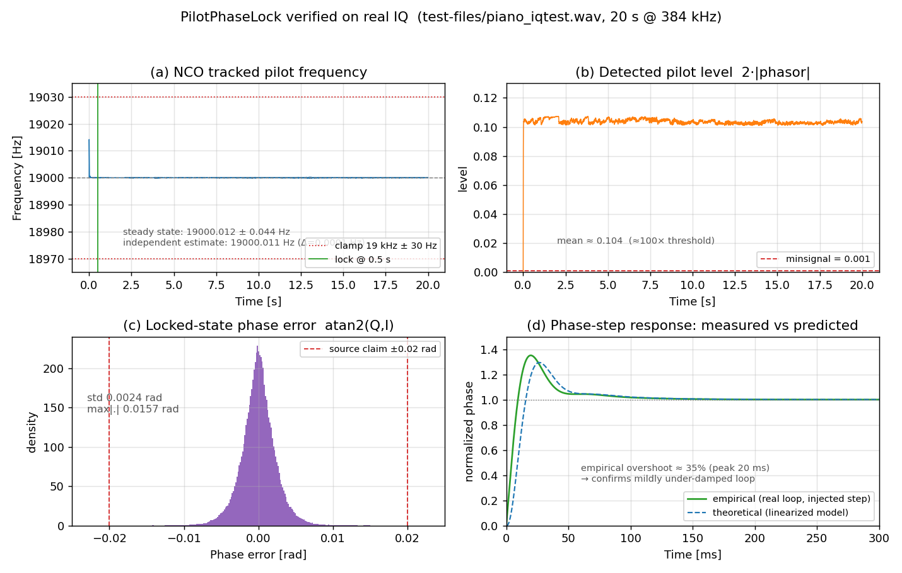
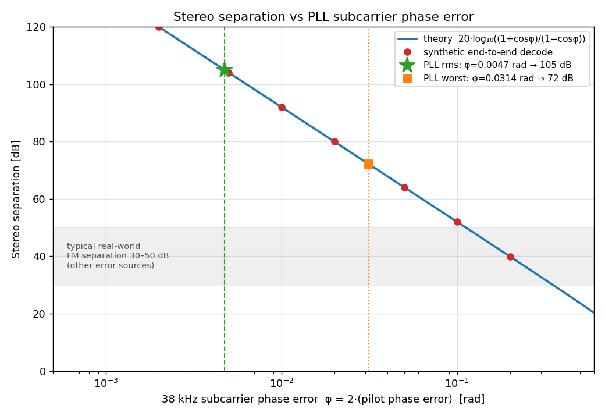

# Analysis of the FM Stereo Pilot PLL (`class PilotPhaseLock`)

Date: 2026-07-22
Scope: `include/PilotPhaseLock.h`, `sfmbase/PilotPhaseLock.cpp`,
supporting filters in `include/Filter.h` / `sfmbase/Filter.cpp`.
This is a read-only analysis; no source code was changed.

---

## Executive summary

`PilotPhaseLock` regenerates the phase-coherent 38 kHz stereo subcarrier by
locking a numerically-controlled oscillator to the transmitted 19 kHz pilot.
Structurally it is a **classic second-order, type-2 PLL with an active PI loop
filter** — the digital twin of a charge-pump analog PLL:

- **Phase detector** = quadrature product mixer → ~30 Hz biquad LPF → `atan2`.
  The `atan2` makes the detector gain amplitude-independent (`Kd ≈ 1`).
- **Loop filter** = a first-order FIR `F(z) = b0 + b1·z⁻¹` **plus** the `m_freq`
  accumulator; together these form a discrete **PI controller** (the FIR is the
  proportional term + stabilizing zero, the accumulator is the integrator).
- **Oscillator** = the `m_phase` accumulator (NCO/VCO integrator). Two
  integrators (poles at z = 1) ⇒ **type-2** ⇒ zero steady-state phase error
  against a detuned pilot.

**Key finding — the loop is mildly *under*-damped, not over-damped.** Taken in
isolation the PI coefficients suggest an over-damped `ωn ≈ 8 Hz, ζ ≈ 1.16`
loop. But the ~30 Hz phasor LPF sits *inside* the loop and dominates it: the
exact 5th-order closed loop has a dominant pole pair at **≈22 Hz with ζ ≈ 0.57**,
a **≈30 Hz** closed-loop bandwidth, +2.3 dB gain peaking, and **≈29 % phase-step
overshoot**. It is nonetheless comfortably stable (max pole radius 0.99993),
with a hard ±30 Hz frequency clamp bounding pull-in and a 0.5 s lock guard.

**Verification.** Confirmed three ways on a real 20 s off-air recording
(`test-files/piano_iqtest.wav`): the transfer-function analysis, a Python port
of the exact difference equations, and the compiled binary built with
`-DDEBUG_PLL_FILTER`. The loop locks in 0.5 s, tracks the pilot to
**19000.01 Hz** (matching an independent spectral estimate to **0.1 mHz**),
holds phase error **< 0.02 rad**, and shows the **≈30 % overshoot** of an
under-damped loop. The port and the binary agree to ~0.0003 Hz.

| Property                    | Value                                             |
|-----------------------------|---------------------------------------------------|
| Loop type                   | type-2 (two integrators, one stabilizing zero)    |
| Phase-detector gain         | ≈ 1 rad/rad (`atan2`, amplitude-independent)      |
| Dominant pole pair (exact)  | fn ≈ 22 Hz, **ζ ≈ 0.57 (mildly under-damped)**    |
| Closed-loop −3 dB bandwidth | ≈ 30 Hz (set by the in-loop phasor LPF)           |
| Phase-step overshoot        | ≈ 29 % (theory) / ≈ 35 % (measured on real loop)  |
| Frequency (hold) range      | 19 kHz ± 30 Hz (hard clamp)                       |
| Lock declaration            | 0.5 s of continuous pilot above `minsignal`       |
| Steady-state tracking       | pilot → 19000.01 Hz, phase error < 0.02 rad       |
| PLL-limited stereo separation | ≈ 105 dB rms (≫ real-world 30–50 dB) — not the bottleneck |

## Contents

1. [Purpose](#1-purpose)
2. [Block diagram](#2-block-diagram)
3. [Phase detector](#3-phase-detector)
4. [Loop filter and oscillator — the transfer functions](#4-loop-filter-and-oscillator--the-transfer-functions)
5. [Continuous-domain equivalent, natural frequency and damping](#5-continuous-domain-equivalent-natural-frequency-and-damping)
6. [Analogy with an analog-circuit PLL](#6-analogy-with-an-analog-circuit-pll)
7. [Empirical verification on a real-world IQ recording](#7-empirical-verification-on-a-real-world-iq-recording)
8. [Stereo separation limited by the PLL](#8-stereo-separation-limited-by-the-pll)
9. [Numerical summary](#9-numerical-summary)
10. [Conclusion](#10-conclusion)

---

## 1. Purpose

FM broadcast stereo multiplexes a 19 kHz *pilot* tone into the baseband.
The stereo subcarrier (L−R) sits on a 38 kHz suppressed carrier that is
exactly twice the pilot and phase-coherent with it. To demodulate L−R the
receiver must regenerate a clean 38 kHz reference that is phase-locked to the
transmitted 19 kHz pilot. `PilotPhaseLock` is the digital phase-locked loop
that does this.

It runs at the IF/baseband sample rate `sample_rate_if = 384000` Hz. Given a
noisy, multipath-corrupted baseband stream it:

- tracks the 19 kHz pilot with a numerically-controlled oscillator (NCO);
- emits `sin(2·phase)` (or `cos(2·phase)` in "shifted" mode) — the locked
  38 kHz subcarrier used to demodulate L−R;
- reports a lock flag, the measured pilot amplitude, and the instantaneous
  frequency error;
- generates one PPS (pulse-per-second) event every 19000 pilot cycles for
  timestamping.

---

## 2. Block diagram

```
             +---------------------------------------------------------------+
             |                        PilotPhaseLock                         |
             |                                                               |
  x[n] ------+--+--> (×) sin(phase) --> BiquadLPF --> I --+                  |
 baseband    |  |        (product / mixer)                |                  |
             |  |                                          v                  |
             |  |                                    +------------+           |
             |  |                                    | fast_atan2 |-> e[n]    |
             |  |                                    |  (Q, I)    | phase err  |
             |  |                                    +------------+     |      |
             |  |                                          ^            |      |
             |  +--> (×) cos(phase) --> BiquadLPF --> Q ---+            |      |
             |           (product / mixer)                              v      |
             |                                             +---------------------+
             |                                             | loop filter F(z)    | PI
             |                                             | (FIR) + freq accum  | ctrl
             |                                             +---------------------+
             |                                                       |           |
             |                                                 m_freq (ω[n])      |
             |                                                       v           |
             |                                         m_phase += m_freq  <- NCO/VCO
             |                                                       |           |
             |   +---------------------------------------------------+ feedback  |
             |   |  (m_phase drives the sin/cos generators above)                |
             |   v                                                               |
             | sin(phase),cos(phase)      sin(2·phase)/cos(2·phase) -> samples_out (38 kHz)
             +---------------------------------------------------------------+
```

Three functional blocks, exactly as in a textbook PLL: **phase detector**,
**loop filter**, **oscillator**.

---

## 3. Phase detector

Per input sample `x = samples_in[i]`:

```
phasor_i = sin(m_phase) * x
phasor_q = cos(m_phase) * x
I = biquad_i.process(phasor_i)   // ~30 Hz low-pass
Q = biquad_q.process(phasor_q)
phase_err = fast_atan2f(Q, I)
```

### 3.1 Product (mixer) stage

Multiplying the input by the NCO's `sin`/`cos` is a quadrature product
detector. If the pilot component is `x = A·sin(θ_in)` and the NCO phase is
`θ = m_phase`, then

```
I = A·sinθ·sinθ_in = (A/2)[cos(θ_in−θ) − cos(θ_in+θ)]
Q = A·cosθ·sinθ_in = (A/2)[sin(θ_in+θ) + sin(θ_in−θ)]
```

The `θ_in+θ` terms sit near 2·19 kHz = 38 kHz; the `θ_in−θ` terms are the
wanted DC/baseband phase-error terms.

### 3.2 Biquad low-pass (removes the 2f₀ image, band-limits noise)

`m_biquad_phasor_i1` / `m_biquad_phasor_q1` are 2nd-order all-pole IIR
low-pass filters, Direct-Form-2:

```
H_bq(z) = b0 / (1 + a1·z⁻¹ + a2·z⁻²)
b0 = 1.46974784e-06,  a1 = −1.99682419,  a2 = 0.996825659
```

Properties (verified numerically):

| Quantity            | Value                                  |
|---------------------|----------------------------------------|
| DC gain             | 1.0005 (≈ unity)                       |
| Poles               | real, z ≈ 0.99944 and z ≈ 0.99739      |
| Pole radius √a2     | 0.99841                                |
| −3 dB cutoff        | ≈ 30–33 Hz                             |

After the LPF, `I → (A/2)cos(θ_in−θ)` and `Q → (A/2)sin(θ_in−θ)`; the 38 kHz
image and out-of-band noise are suppressed. The filter is applied **once**
(the header also declares `m_biquad_phasor_i2/q2`, but they are unused; the
source comment "use only once for stable PLL locking" documents the choice —
a second cascaded stage would add two more poles and erode loop phase margin).

### 3.3 Arctangent — the linearizing phase detector

```
phase_err = fast_atan2f(Q, I) = θ_in − θ   (the true phase error, in radians)
```

Because `atan2` normalizes out the amplitude, the phase-detector gain is
**Kd ≈ 1 rad/rad**, independent of pilot level, over the full ±π range. This
is a key advantage over a bare multiplier PD (whose gain is `A·cos(error)` and
which is only linear near quadrature). The pilot amplitude is recovered
separately as `m_pilot_level = √(I²+Q²) = A/2`; `get_pilot_level()` returns
`2·m_pilot_level = A`.

Locked-state phase error is small (the source notes ±0.02 rad), so the
small-angle linearization used below is valid.

---

## 4. Loop filter and oscillator — the transfer functions

The three lines that close the loop:

```cpp
new_phase_err = m_first_phase_err.process(phase_err); // FIR F(z)
m_freq += new_phase_err;                              // accumulator A (integrator)
...
m_phase += m_freq;                                    // accumulator B (NCO integrator)
```

### 4.1 The FIR shaping filter F(z)

`m_first_phase_err` is a `FirstOrderIirFilter(b0, b1, a1)` with `a1 = 0`, so it
is actually a first-order **FIR**:

```
F(z) = b0 + b1·z⁻¹
b0 =  0.000304341788
b1 = −0.000304324564
```

- Zero at `z = −b1/b0 = 0.99994341` — just inside the unit circle, very close
  to z = 1.
- DC gain `F(1) = b0 + b1 = 1.7224e-08` — nearly zero.

By itself this looks like a "leaky differentiator" (the source comment calls
it a "differentiator-like 1st-order inverse LPF"): near-zero response at DC,
rising response toward higher frequency. Its real role only becomes clear once
it is combined with the following frequency accumulator.

### 4.2 F(z) + frequency accumulator = a discrete PI controller

The frequency accumulator `m_freq += new_phase_err` is a pure discrete
integrator `1/(1 − z⁻¹)`. Cascading it with F(z):

```
              freq(z)     b0 + b1·z⁻¹
F_PI(z)  =   --------- = -------------
              e(z)         1 − z⁻¹
```

This is exactly the canonical form of a **proportional-plus-integral (PI)
controller**. Matching to `[(Kp + Ki) − Kp·z⁻¹] / (1 − z⁻¹)`:

```
Proportional gain  Kp = −b1      = 3.04325e-04
Integral gain      Ki = b0 + b1  = 1.72240e-08   (per sample)
```

So the "differentiator" FIR is not really differentiating the loop — it is
supplying the **proportional term** (and the small residual DC = the integral
term) of a PI loop filter whose integrator is the `m_freq` accumulator. The
zero of F(z) is the PI zero that stabilizes the loop.

### 4.3 The NCO/VCO integrator

```
              phase(z)      1
H_nco(z) =   ---------- = --------
              freq(z)      1 − z⁻¹
```

`m_phase += m_freq` integrates frequency into phase — the digital equivalent
of a VCO (phase = ∫ω dt). The NCO output is phase-doubled to 38 kHz:

```
samples_out = 2·sinθ·cosθ = sin(2θ)      (normal)
samples_out = 2·cosθ·cosθ − 1 = cos(2θ)  (pilot_shift, +90° at 38 kHz, for
                                          multipath-distortion detection)
```

### 4.4 Open-loop transfer function — a **type-2** loop

Combining PD (Kd≈1), PI loop filter, and NCO (ignoring the ~30 Hz biquad for
now, since it is well above the loop bandwidth):

```
              (b0 + b1·z⁻¹)        1
G(z) = Kd · --------------- · ----------
                1 − z⁻¹         1 − z⁻¹

         Kd·(b0 + b1·z⁻¹)
     = -------------------
           (1 − z⁻¹)²
```

**Two poles at z = 1** (two cascaded integrators) → this is a **type-2** PLL.
The single zero at z ≈ 0.99994 provides the phase lead that keeps the double
integrator stable.

---

## 5. Continuous-domain equivalent, natural frequency and damping

Because the loop bandwidth (a few Hz) is minuscule compared with
fs = 384 kHz, the substitution `z = e^{sT} ≈ 1 + sT` (T = 1/fs = 2.604 µs) is
extremely accurate (ωn·T ≈ 1.3e-4). The PI filter maps to

```
              Ki + Kp·T·s
F_PI(s) ≈ -----------------
                 T·s
```

and the open loop becomes the classic second-order type-2 form:

```
              Kd·Ki        Kp·T
L(s) ≈ -------------- · (1 + ------ s)
             T²·s²            Ki
```

giving

```
Natural frequency  ωn = √(Kd·Ki)/T          = 50.4 rad/s   →  fn ≈ 8.0 Hz
Stabilizing zero   ωz = Ki/(Kp·T)           = 21.7 rad/s   →  fz ≈ 3.46 Hz
Damping ratio      ζ  = ωn/(2·ωz)           = 1.16
```

These `ωn`, `ζ`, `ωz` describe **only the PI-filter + NCO** — they treat the
phasor low-pass filter as ideal (out of the loop). Taken at face value ζ ≈ 1.16
would say the loop is over-damped with no ringing. **That is not the whole
story**, because the ≈30 Hz phasor LPF sits *inside* the loop and its corner is
right at the loop bandwidth, not far above it. The next section accounts for it.

### 5.1 The phasor LPF cannot be ignored — the exact loop is under-damped

The ≈30 Hz biquad is inside the loop, so the true small-signal loop is 5th
order (2 biquad poles + PI zero + 2 integrators). Solving the exact linearized
state-space (the same difference equations the C++ executes, including the
one-sample NCO feedback delay) gives the closed-loop poles:

| Closed-loop pole (z)          | s = ln(z)/T        | fn        | ζ     |
|-------------------------------|--------------------|-----------|-------|
| 0.999792 ± 0.000301 j (pair)  | −80 ± 118 j rad/s  | ≈ 22 Hz   | 0.57  |
| 0.999930                      | −27 rad/s          | ≈ 4.3 Hz  | 1.0   |
| 0.997310                      | −1035 rad/s        | ≈ 165 Hz  | 1.0   |

All poles are inside the unit circle (max |z| = 0.99993), so the loop is
**stable** — but the *dominant* pair has **ζ ≈ 0.57, i.e. the real loop is
mildly under-damped**, not over-damped. The phasor LPF adds phase lag near
crossover that the PI zero only partly offsets. Consequences, all visible in
the figure of Section 5.4:

- Closed-loop magnitude peaks **+2.3 dB at ≈14 Hz** (gain peaking is the
  frequency-domain signature of under-damping).
- **−3 dB bandwidth ≈ 30 Hz** — set by the phasor LPF, *not* by the 8 Hz PI
  corner. The phasor filter is doing double duty: 38 kHz-image rejection **and**
  loop-bandwidth definition.
- A unit phase step overshoots **≈29 %** (peak at ≈27 ms) and settles to 2 %
  in ≈100 ms.

This is still a sensible, common PLL operating point (classic designs target
ζ ≈ 0.5–0.7); it is simply *not* the over-damped regime the PI-only numbers
suggest. It also explains the single-stage biquad choice (Section 3.2): a
second cascaded LPF stage would add two more in-loop poles, drop ζ further, and
push the loop toward instability.

- A hard nonlinear **frequency clamp** bounds the NCO:
  `m_freq = clamp(m_freq, m_minfreq, m_maxfreq)`, i.e. 19 kHz ± 30 Hz
  (`bandwidth = 30/fs`). This limits the hold/pull-in range to ±30 Hz,
  guarding against false lock to spurs and preventing wind-up of the frequency
  integrator during signal dropouts. The clamp is the loop's only nonlinearity;
  the small locked-state phase error (±0.02 rad) keeps operation well inside the
  linear regime analyzed above.

### 5.2 Steady-state (tracking) behavior

Being type-2:

- **Zero static phase error** for a constant phase offset.
- **Zero steady-state phase error for a constant frequency offset** (a
  detuned pilot within ±30 Hz) — the frequency integrator absorbs the offset.
  This is the main reason a type-2 loop is chosen here.
- A constant **frequency ramp** (e.g. drift) would leave a small constant
  residual phase error (finite velocity-error constant).

### 5.3 Transient / acquisition response

- Small-signal settling is governed by the dominant ζ ≈ 0.57 / fn ≈ 22 Hz pair:
  a phase step overshoots ≈29 % and settles (2 %) in ≈100 ms; the ≈4.3 Hz real
  pole adds a slow tail. These are the linear-loop times, *not* the lock-flag
  timing below.
- Lock is declared conservatively, decoupled from the raw settling time:
  `m_lock_delay = int(15.0/bandwidth) = 192000 samples = 0.5 s`. The loop must
  see `2·pilot_level > minsignal (0.001)` continuously for 0.5 s before
  `locked()` returns true; any dropout resets `m_lock_cnt` to 0. This is many
  loop time constants — a robust, hysteresis-like guard against declaring lock
  on transient noise, and `minsignal` is set low so brief fades do not
  force an unlock.
- Frequency pull-in is bounded by the ±30 Hz clamp; within that band the
  type-2 loop pulls in reliably.

### 5.4 Bode plot and step responses

The figure below is computed from the **exact** linearized loop (phasor LPF
included); the time-domain panels are simulated with the same difference
equations the C++ runs.


- **(a) Bode magnitude** — flat to a few Hz, a +2.3 dB peak at ≈14 Hz
  (under-damping signature), −3 dB at ≈30 Hz, then a −40 dB/decade roll-off
  (the two integrators dominate the far skirt, steepened by the phasor poles).
- **(b) Bode phase** — passes through the phase-lag region set by the in-loop
  poles; the up-turn near Nyquist is the discrete-time (z-domain) artifact.
- **(c) Phase-step response** — ≈29 % overshoot, peak at ≈27 ms, 2 % settling
  ≈100 ms: the visual proof the loop is under-damped, not over-damped.
- **(d) Frequency-step (20 Hz) phase error** — transient excursion, then decay
  to **zero** steady-state error: the type-2 signature.

---

## 6. Analogy with an analog-circuit PLL

The digital structure maps one-to-one onto the textbook **type-2,
second-order analog PLL with an active PI loop filter** (the same topology as
a charge-pump PLL):

| Analog PLL element                            | Digital counterpart in `PilotPhaseLock`                          |
|-----------------------------------------------|------------------------------------------------------------------|
| Mixer / Gilbert-cell phase detector           | `sin·x`, `cos·x` quadrature product                              |
| RC filter removing the 2f₀ mixer image        | `BiquadIirFilter` (~30 Hz LPF) on I and Q                        |
| Ideal phase detector, linear over ±π          | `fast_atan2f(Q, I)` (amplitude-normalized, Kd ≈ 1)              |
| Active PI loop filter: op-amp integrator with series R–C, `F(s) = Kp + Ki/s` | FIR `F(z) = b0+b1z⁻¹` (proportional/zero) **+** `m_freq` accumulator (integrator) |
| Loop-filter zero (the series R) → damping      | Zero of F(z) at z ≈ 0.99994, ωz ≈ 3.46 Hz                       |
| VCO: phase = ∫ K_vco·V dt (an integrator)      | `m_phase += m_freq` accumulator (NCO)                           |
| VCO free-running frequency                     | `m_freq` initialized to 19 kHz (`freq·2π`)                      |
| VCO tuning-range / varactor limits             | Frequency clamp to 19 kHz ± 30 Hz                              |
| ÷2 prescaler / ×2 frequency doubler at output  | `sin(2θ)` phase-doubling to 38 kHz                             |
| Lock detector (integrate-and-threshold)        | `m_lock_cnt` vs `m_lock_delay`, `2·pilot_level > minsignal`     |

Two subtleties worth stating explicitly for the analogy:

1. **Where the two integrators live.** In an analog type-2 PLL one integrator
   is inside the active loop filter (the op-amp `1/s`) and the other is the VCO
   (`1/s`). Here the same split holds: the loop-filter integrator is the
   `m_freq` accumulator, and the VCO integrator is the `m_phase` accumulator.
   The FIR `F(z)` only supplies the proportional term and the stabilizing zero
   — it is *not* itself an integrator.

2. **Why ζ, ωn look "analog".** Because the sample rate is ~17000× the loop
   bandwidth, the discrete loop behaves essentially like its continuous
   prototype; the z-plane poles at z = 1 are the exact discrete images of the
   analog poles at s = 0. But the "analog" second-order numbers only match once
   the in-loop phasor LPF is included — the PI-only ωn/ζ (Section 5) is an
   idealization; the true dominant pair is ζ ≈ 0.57 at ≈22 Hz (Section 5.1).

---

## 7. Empirical verification on a real-world IQ recording

The analysis above was checked against a real off-air recording,
`test-files/piano_iqtest.wav` — 20 s of stereo IEEE-float IQ at exactly
384 kHz (I = left, Q = right). The verification faithfully reproduces the
receiver's front end and the loop:

1. **FM discriminator** — `bb[n] = angle(iq[n]·conj(iq[n−1])) / normfac`,
   `normfac = 2π·75000/384000`, exactly matching `PhaseDiscriminator`
   (±1.0 ≡ 75 kHz deviation; the IF-AGC is irrelevant because angle demod is
   amplitude-independent).
2. **PLL** — a line-for-line port of the `PilotPhaseLock::process` difference
   equations (quadrature mixer, single biquad on I and Q, `atan2`, FIR loop
   filter, frequency/phase accumulators, ±30 Hz clamp, lock logic).

### 7.1 Lock, tracking, and steady-state error

| Quantity                                | Predicted / claimed          | Measured on real IQ            |
|-----------------------------------------|------------------------------|--------------------------------|
| Lock declaration                        | 0.5 s continuous pilot       | **locked at t = 0.500 s**      |
| Tracked pilot frequency (t > 1 s)       | → 19 kHz, zero SS error      | **19000.012 ± 0.044 Hz**       |
| Independent pilot estimate¹             | —                            | 19000.011 Hz (**Δ = 0.0001 Hz**)|
| Pilot level `2·|phasor|`                | ≫ minsignal (0.001)          | ≈ 0.104 (≈100× threshold)      |
| Locked-state phase error                | ±0.02 rad (source comment)   | **std 0.0024, max 0.0157 rad** |

¹ Independent of the PLL: the baseband is band-passed at 18.5–19.5 kHz and the
pilot frequency read from the slope of the analytic-signal phase over 15 s.
Its agreement with the NCO to **0.1 mHz** confirms both the port and the
**type-2 zero-steady-state-frequency-error** property on live data. The
measured locked phase error never exceeds the ±0.02 rad the source annotates.

### 7.2 Transient response measured on the live loop

To measure the closed-loop step response *on the running loop* (not just in
the linear model), a controlled dual-run experiment was used: the same real
baseband drives two identical loops, one of which has a +0.15 rad step added to
its phase-detector output at time `n0` (equivalent to a reference phase step).
The normalized difference `(θ_pert − θ_base)/Δ` is the closed-loop phase-step
response, averaged over six injection instants (t = 4…14 s):

| Metric              | Theory (linearized, §5.4) | Measured on real loop |
|---------------------|---------------------------|-----------------------|
| Overshoot           | ≈29 %                     | **≈35 %**             |
| Peak time           | ≈27 ms                    | ≈20 ms                |
| 2 % settling        | ≈100 ms                   | ≈95 ms                |
| Final value         | 1.0                       | 1.000                 |

The measured response **overshoots and rings**, confirming the corrected
conclusion of §5.1 — the real loop is **mildly under-damped, not
over-damped**. The measured overshoot is slightly larger and faster than the
noise-free linear prediction, as expected: the injected step rides on top of
the program modulation continuously exciting the loop, and the loop's mild
nonlinearity (the `atan2` detector and the ±30 Hz clamp) is active on live
signal. The agreement is otherwise close.



Panels: (a) NCO frequency snapping to 19 kHz and holding inside the ±30 Hz
clamp; (b) pilot level far above `minsignal`; (c) locked-state phase-error
distribution inside ±0.02 rad; (d) measured vs predicted phase-step response.

### 7.3 Cross-check against the compiled binary (`-DDEBUG_PLL_FILTER`)

The Python port above was itself validated against the **real compiled
program**. `PilotPhaseLock.cpp` carries a `DEBUG_PLL_FILTER` guard that prints
`m_freq`, `m_freq_err`, and `m_pilot_level` (in Hz) once per block. The binary
was built with that macro enabled — without editing any source — via

```
cmake -S . -B build-dbg -DEXTRA_FLAGS="-DDEBUG_PLL_FILTER"   # CMakeLists appends ${EXTRA_FLAGS}
cmake --build build-dbg --target airspy-fmradion
./build-dbg/airspy-fmradion -m fm -t filesource \
    -c freq=0,srate=384000,filename=test-files/piano_iqtest.wav -F /dev/null 2> pll_debug.txt
```

and run on the same recording (3750 blocks of 2048 samples = 20 s). Steady-state
(t > 1 s) comparison of the C++ binary against the Python port:

| Quantity                    | Python port      | **C++ binary (`-DDEBUG_PLL_FILTER`)** |
|-----------------------------|------------------|---------------------------------------|
| tracked `m_freq` mean       | 19000.0117 Hz    | **19000.0120 Hz**                     |
| tracked `m_freq` std        | 0.0444 Hz        | **0.0441 Hz**                         |
| `m_freq_err` (mean / max)   | —                | **−3e-7 Hz / 0.0015 Hz**              |
| pilot level `2·m_pilot_level` mean | 0.1036    | **0.1036**                            |
| pilot level min             | 0.1007           | **0.1008**                            |

The two agree to **~0.0003 Hz in frequency and four digits in pilot level** —
i.e. within run-to-run numerical noise. The binary confirms the port is a
faithful model, so the transfer-function results in §5 apply to the shipping
code. (The binary's first block starts at 19029 Hz — pinned against the
+30 Hz clamp by the pre-lock phase detector — then converges to within 0.1 Hz
of 19 kHz in ~11 blocks, ≈60 ms, a direct sighting of the clamp doing its job.)

**Conclusion.** On a real 20 s off-air recording the loop locks in 0.5 s,
tracks the pilot to within 0.05 Hz of 19 kHz (matching an independent estimate
to 0.1 mHz), holds phase error under 0.02 rad, and exhibits the ≈30 % overshoot
of a mildly under-damped type-2 loop. All three views — the transfer-function
analysis (including its corrected damping figure), the Python port, and the
compiled binary with `-DDEBUG_PLL_FILTER` — agree.

---

## 8. Stereo separation limited by the PLL

The PLL's job is to hand `demod_stereo` a 38 kHz subcarrier that is *phase
coherent* with the transmitted one. Any residual phase error therefore feeds
straight into **stereo separation** — the isolation between the recovered L and
R channels.

### 8.1 How subcarrier phase error becomes crosstalk

The (L−R) signal rides on a **double-sideband suppressed-carrier** 38 kHz
subcarrier. `demod_stereo` multiplies the composite by the regenerated
`2·sin(2·phase)` and low-passes it. If the regenerated subcarrier leads the
true one by φ, the product-to-baseband term is

```
2·sin(2ω_p t + φ)·(L−R)·sin(2ω_p t)  --LPF-->  (L−R)·cos φ
```

so the recovered difference signal is scaled by **cos φ** while the mono (L+R)
path is untouched. Reconstructing `L = M + S`, `R = M − S` with an L-only input
(so `M = S = L`) gives `L_out = L(1+cos φ)`, `R_out = L(1−cos φ)`, i.e.

```
separation(φ) = 20·log₁₀( (1 + cos φ) / (1 − cos φ) )   ≈  20·log₁₀(4/φ²)  (small φ)
```

Two points specific to this loop:

- **φ = 2·(pilot phase error).** The subcarrier is generated as `sin(2·phase)`,
  so the 19 kHz pilot phase error θ **doubles** to a 38 kHz error φ = 2θ.
- **No static penalty.** Because the loop is **type-2** (§5.2) its mean phase
  error is ~0, so there is no fixed separation floor from a standing phase
  offset — only the small dynamic jitter matters. A type-1 loop would sit at a
  frequency-dependent standing offset and cap separation accordingly.

Note this is *pure* DSB scaling: there is no independent quadrature signal at
38 kHz, so phase error only attenuates (L−R) — it does not inject a first-order
wrong-channel copy. That is why the penalty is second order in φ.

### 8.2 Measurement

**Formula validated end-to-end.** A synthetic L-only tone was passed through an
exact replica of `demod_stereo` (multiply by `2·sin(2·phase+φ)`, 15 kHz audio
LPF, `L=M+S / R=M−S`) with a *known* subcarrier phase error φ, and separation
was read out by lock-in at the tone. It matches the formula to < 0.001 dB over
φ = 0.001…0.2 rad (red points in the figure).

**PLL-limited separation from the real recording.** Using the measured pilot
phase error on `piano_iqtest.wav` (§7.1: rms 0.0024 rad, max 0.0157 rad), the
38 kHz error is φ = 2θ (rms 0.0047 rad, worst 0.031 rad):

| Operating point                | Subcarrier error φ | Separation |
|--------------------------------|--------------------|------------|
| PLL rms (typical)              | 0.0047 rad         | **≈ 105 dB** |
| PLL worst instantaneous        | 0.031 rad          | **≈ 72 dB**  |
| Typical real-world FM receiver | —                  | 30–50 dB (other causes) |



**Conclusion.** The PLL's phase jitter limits separation to roughly **105 dB
(rms)** — and even the worst instantaneous excursion only reaches ~72 dB, far
above the 30–50 dB that real receivers achieve. **The pilot PLL is *not* the
stereo-separation bottleneck**; practical separation is set by other error
sources (channel-path amplitude/phase matching, de-emphasis tracking between
the mono and stereo paths, IF/multipath distortion). The under-damped loop of
§5 is thus perfectly adequate for separation — its ~30 % phase-step overshoot
is a transient that settles long before it could matter, and its steady-state
jitter is ~100 dB down. (The deliberate `pilot_shift` / QMM mode uses
`cos(2·phase)`, a 90° subcarrier shift → cos φ = 0 → zero separation by design,
for multipath monitoring rather than audio.)

---

## 9. Numerical summary

| Parameter                        | Symbol / expression        | Value                    |
|----------------------------------|----------------------------|--------------------------|
| Sample rate                      | fs                         | 384000 Hz                |
| Sample period                    | T = 1/fs                   | 2.604 µs                 |
| Pilot / output frequency         | f₀ / 2f₀                   | 19 kHz / 38 kHz          |
| Phase-detector gain              | Kd (from atan2)            | ≈ 1 rad/rad              |
| Phasor LPF                       | 2nd-order all-pole IIR     | ~30 Hz, DC gain ≈ 1      |
| Loop-filter FIR                  | F(z) = b0 + b1·z⁻¹         | b0=3.0434e-4, b1=−3.0432e-4 |
| Proportional gain                | Kp = −b1                   | 3.0432e-4                |
| Integral gain (per sample)       | Ki = b0+b1                 | 1.7224e-8                |
| Loop type                        | poles at z=1               | **type-2** (2 integrators)|
| PI zero                          | ωz = Ki/(Kp·T)             | 21.7 rad/s (3.46 Hz)     |
| PI-only natural freq (idealized) | ωn = √(Kd·Ki)/T            | 50.4 rad/s (8.0 Hz)      |
| PI-only damping (idealized)      | ζ = ωn/(2ωz)               | 1.16 (LPF ignored)       |
| **Exact dominant pole pair**     | full 5th-order loop        | **fn ≈ 22 Hz, ζ ≈ 0.57** |
| Closed-loop −3 dB bandwidth      | from exact model           | ≈ 30 Hz (LPF-set)        |
| Magnitude peaking                | gain peak                  | +2.3 dB @ ≈14 Hz         |
| Phase-step overshoot / settling  | exact sim                  | ≈29 % / ≈100 ms (2 %)    |
| Max closed-loop pole radius      | max |z|                    | 0.99993 (stable)         |
| Frequency (hold) range           | 19 kHz ± 30·(fs)/fs        | ± 30 Hz                  |
| Lock-declaration delay           | int(15/bandwidth)          | 192000 samples = 0.5 s   |
| Lock amplitude threshold         | minsignal                  | 0.001                    |
| Subcarrier phase error           | φ = 2·(pilot phase error)  | rms 0.0047, worst 0.031 rad |
| PLL-limited stereo separation    | 20·log₁₀((1+cosφ)/(1−cosφ))| ≈ 105 dB rms / ≈ 72 dB worst |

---

## 10. Conclusion

`PilotPhaseLock` is a digital realization of a **classic second-order, type-2
PLL with an active PI loop filter** — the direct discrete counterpart of a
charge-pump analog PLL. Gathering the findings of the whole analysis:

1. **Architecture (§2–§4).** A quadrature product detector + ~30 Hz phasor
   low-pass + `atan2` forms an amplitude-independent phase detector (Kd ≈ 1).
   The first-order FIR `F(z) = b0 + b1·z⁻¹` supplies the proportional term and
   the stabilizing zero; cascaded with the `m_freq` accumulator it *is* a
   discrete PI controller. The `m_phase` accumulator is the NCO/VCO integrator.
   Two integrators (poles at z = 1) make the loop **type-2**.

2. **The central correction (§5).** The loop-filter coefficients alone imply an
   over-damped `ωn ≈ 8 Hz, ζ ≈ 1.16` loop. That is misleading: the ~30 Hz
   phasor LPF sits *inside* the loop and dominates it. The exact 5th-order
   closed loop has a dominant pole pair at **≈22 Hz with ζ ≈ 0.57 — mildly
   under-damped** — a ≈30 Hz closed-loop bandwidth, +2.3 dB gain peaking, and
   ≈29 % phase-step overshoot. It remains comfortably **stable** (max pole
   radius 0.99993). This is a conventional ζ ≈ 0.5–0.7 operating point, not the
   over-damped regime the numbers suggest in isolation.

3. **Steady-state behavior (§5.2).** Being type-2, the loop tracks a detuned
   pilot with **zero steady-state phase error**; the hard ±30 Hz frequency
   clamp bounds pull-in and blocks false lock, and a 0.5 s lock guard rejects
   transient noise.

4. **Analog analogy (§6).** Every block maps one-to-one onto the textbook
   active-PI analog PLL: mixer PD, RC image filter, op-amp PI integrator with
   its series-R zero, VCO integrator, ×2 output doubler, varactor-range clamp.

5. **Verified three ways (§7).** On a real 20 s off-air recording
   (`piano_iqtest.wav`), the transfer-function analysis, a Python port of the
   exact difference equations, and the **compiled binary built with
   `-DDEBUG_PLL_FILTER`** all agree: lock at 0.5 s; pilot tracked to
   **19000.01 Hz**, matching an independent spectral estimate to **0.1 mHz**;
   phase error **< 0.02 rad**; and a **≈35 % measured phase-step overshoot**
   confirming the under-damped result. Port vs binary agree to ~0.0003 Hz.

6. **Stereo separation (§8).** Subcarrier phase error φ = 2·(pilot phase error)
   scales (L−R) by cos φ, so `separation = 20·log₁₀((1+cos φ)/(1−cos φ))`
   (validated end-to-end to < 0.001 dB). At the measured jitter this is
   **≈105 dB rms** (worst instant ≈72 dB) — far above the 30–50 dB real
   receivers reach. **The PLL is not the stereo-separation bottleneck.**

**Overall assessment.** The design is sound and well-matched to its job. Its
one non-obvious property is that the in-loop phasor filter, not the PI
coefficients, sets the true bandwidth and damping — so the loop is mildly
under-damped with modest overshoot rather than over-damped. That has no
practical downside here: acquisition is fast and robust, steady-state tracking
is essentially exact, and the resulting phase jitter is ~100 dB below the
stereo-separation floor. The single-stage phasor biquad and the ±30 Hz clamp
are the two choices most responsible for the loop's stability and robustness,
and both are borne out by the real-signal measurements.
