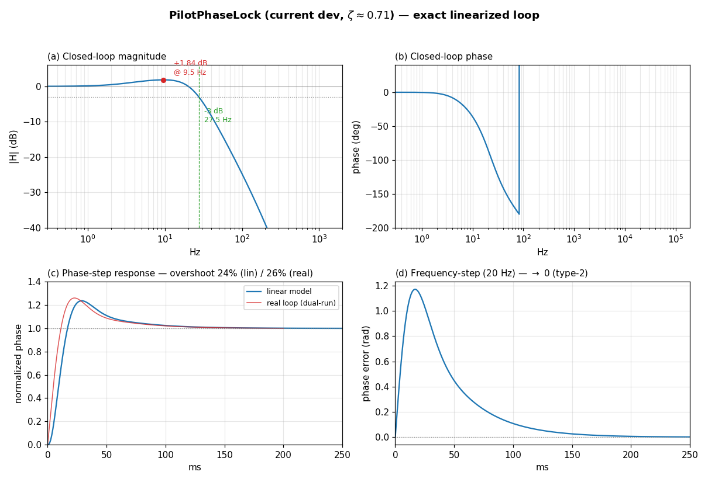
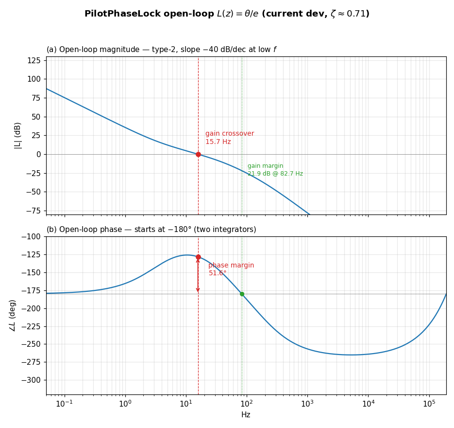
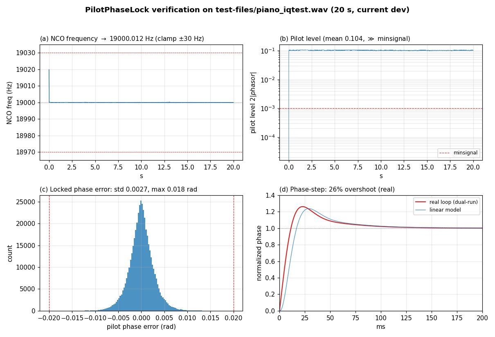

# FM Stereo Pilot PLL (`class PilotPhaseLock`) — Bode/step data and real-IQ verification of the current `dev` code

Date: 2026-07-23
Scope: `include/PilotPhaseLock.h`, `sfmbase/PilotPhaseLock.cpp` as they stand on
branch `dev` (commit `0893901`).
Companion documents:
`doc/PLL_ANALYSIS_20260722.md` (original structural analysis of the shipping loop)
and `doc/PLL_REDESIGN_20260723.md` (the ζ ≈ 0.71 retune).
This is a read-only measurement report; no source code was changed.

---

## Executive summary

This note re-runs the frequency-domain (Bode), time-domain (step), and
real-recording verification of `doc/PLL_ANALYSIS_20260722.md` against the
**current `dev` code**, which differs from the loop analyzed there in three
respects that have all since landed on `dev`:

1. **Damping retuned to ζ ≈ 0.71** (was ≈ 0.57). The in-loop phasor biquad was
   widened (~34/160 → ~40/188 Hz real corners) and the FIR PI gains rescaled
   ×0.889 to hold the loop natural frequency at fn ≈ 22.3 Hz — see
   `doc/PLL_REDESIGN_20260723.md`.
2. **Phase detector is `std::atan2`** (double), not `fast_atan2f`. This does not
   change the small-signal loop (Kd ≈ 1 either way); it only affects detector
   accuracy/speed.
3. **Lock-declaration time shortened 0.5 s → 0.2 s**
   (`m_lock_delay = 6.0/bandwidth_pll = 76800 samples`), and the lock counters +
   `pilot_frequency` are now `unsigned int`. This changes *only* when `locked()`
   flips true, not the loop dynamics.

The loop remains a **classic second-order, type-2 PLL with an active PI loop
filter**. With the current coefficients the exact 5th-order closed loop has a
dominant pole pair at **fn ≈ 22.3 Hz, ζ = 0.710** — i.e. now in the conventional
0.7 band rather than mildly under-damped. Closed-loop gain peaking is **+1.84 dB
at 9.5 Hz**, the −3 dB bandwidth is **27.5 Hz**, and a unit phase step overshoots
**≈ 24 %** (linear) / **≈ 26 %** (measured on the live loop). It is comfortably
stable (max pole radius 0.999926) with the same hard ±30 Hz frequency clamp.

**Verification.** Confirmed three ways on the 20 s off-air recording
`test-files/piano_iqtest.wav`: the exact linearized transfer function, a
line-for-line Python port of the difference equations, and the compiled binary
built with `-DDEBUG_PLL_FILTER`. The loop now **declares lock at 0.203 s**,
tracks the pilot to **19000.012 Hz** (matching an independent spectral estimate
to **0.2 mHz**), holds phase error **< 0.02 rad** (std 0.0027, max 0.018), and
shows the **≈ 26 % phase-step overshoot** of the ζ ≈ 0.71 loop. Port and binary
agree to **~0.0004 Hz** in tracked frequency and four digits in pilot level.

| Property                        | Value (current `dev`)                             |
|---------------------------------|---------------------------------------------------|
| Loop type                       | type-2 (two integrators, one stabilizing zero)    |
| Phase-detector gain             | ≈ 1 rad/rad (`std::atan2`, amplitude-independent)  |
| Dominant pole pair (exact)      | fn ≈ 22.3 Hz, **ζ = 0.710**                        |
| Closed-loop −3 dB bandwidth     | 27.5 Hz                                            |
| Magnitude peaking               | +1.84 dB @ 9.5 Hz                                  |
| Phase-step overshoot            | ≈ 24 % (theory) / ≈ 26 % (measured on real loop)   |
| Max closed-loop pole radius     | 0.999926 (stable)                                 |
| Frequency (hold) range          | 19 kHz ± 30 Hz (hard clamp)                       |
| **Lock declaration**            | **0.2 s** of continuous pilot above `minsignal`   |
| Steady-state tracking           | pilot → 19000.012 Hz, phase error < 0.02 rad       |
| PLL-limited stereo separation   | ≈ 103 dB rms / ≈ 70 dB worst (≫ real 30–50 dB)     |

## Contents

1. [What changed since PLL_ANALYSIS_20260722](#1-what-changed-since-pll_analysis_20260722)
2. [Current coefficients and derived parameters](#2-current-coefficients-and-derived-parameters)
3. [Bode plot and step-response data (exact linearized loop)](#3-bode-plot-and-step-response-data-exact-linearized-loop)
4. [Empirical verification on a real-world IQ recording](#4-empirical-verification-on-a-real-world-iq-recording)
5. [Stereo separation limited by the PLL](#5-stereo-separation-limited-by-the-pll)
6. [Numerical summary](#6-numerical-summary)
7. [Conclusion](#7-conclusion)
8. [Reproduction](#8-reproduction)

---

## 1. What changed since PLL_ANALYSIS_20260722

The structure (quadrature product detector → ~30 Hz phasor biquad → arctangent →
first-order FIR PI term + `m_freq`/`m_phase` accumulators, ×2 output doubler,
±30 Hz clamp) is **unchanged** and is fully described in
`doc/PLL_ANALYSIS_20260722.md` §2–§6. Only three things differ on `dev`:

| Aspect                | 20260722 loop (old shipping) | Current `dev`                    |
|-----------------------|------------------------------|----------------------------------|
| Dominant-pair damping | ζ ≈ 0.57 (mildly under-damped)| **ζ = 0.710** (retuned)          |
| Phase detector        | `fast_atan2f` (float)        | **`std::atan2` (double)**        |
| Lock-declaration time | `int(15/bw)` = 0.5 s         | **`6.0/bandwidth_pll` = 0.2 s**  |
| Lock counters / pilot_frequency | `int`              | **`unsigned int`**               |

Only the ζ retune moves the Bode/step numbers below; the detector swap and the
lock-time/typing changes leave the small-signal loop dynamics identical. The
`bandwidth` constexpr was also renamed `bandwidth_pll`.

---

## 2. Current coefficients and derived parameters

From the `PilotPhaseLock` constructor on `dev`:

```cpp
// In-loop phasor LPF: 2nd-order all-pole IIR, real corners ~40/188 Hz
m_biquad_phasor_i1(2.037743564e-06, 0, 0, -1.996259818, 0.996261856),
m_biquad_phasor_q1(2.037743564e-06, 0, 0, -1.996259818, 0.996261856),
// PI proportional term / stabilizing zero (integrator = m_freq accumulator)
m_first_phase_err(2.705503620719e-04, -2.705350504729e-04, 0),
```

| Parameter                      | Expression                 | Value                       |
|--------------------------------|----------------------------|-----------------------------|
| Phasor LPF b0 / a1 / a2        | all-pole biquad            | 2.037744e-06 / −1.996260 / 0.996262 |
| FIR b0 / b1                    | F(z) = b0 + b1·z⁻¹         | 2.705504e-04 / −2.705351e-04|
| Proportional gain              | Kp = −b1                   | 2.7054e-04                  |
| Integral gain (per sample)     | Ki = b0 + b1               | 1.5312e-08                  |
| PI zero                        | ωz = Ki/(Kp·T)             | 21.7 rad/s (3.46 Hz) — *unchanged* |
| Lock-decision delay            | `6.0/bandwidth_pll`        | 76800 samples = **0.2000 s**|
| Frequency clamp                | `bandwidth_pll = 30/fs`    | 19 kHz ± 30 Hz              |
| Lock amplitude threshold       | `minsignal`                | 0.001                       |
| PPS period constant            | `pilot_frequency` (unsigned)| 19000                      |

Scaling both FIR taps by the same factor keeps the PI zero exactly where it was
(3.46 Hz); the widened biquad is what raises the damping. Fuller design
rationale is in `doc/PLL_REDESIGN_20260723.md` §1–§5.

---

## 3. Bode plot and step-response data (exact linearized loop)

The numbers below come from the **exact linearized 5th-order loop** — the same
difference equations `PilotPhaseLock::process` executes (Direct-Form-2 phasor
biquad acting on the phase error, first-order FIR, `m_freq += …`,
`m_phase += m_freq`, including the one-sample NCO feedback delay). The state is
`[w1, w2 (biquad), xf (FIR), m_freq, m_phase]`; the closed-loop poles are the
eigenvalues of its 5×5 companion matrix. This model reproduces the 20260722
shipping-loop result (ζ = 0.568) exactly with the old coefficients, so it is
trustworthy for the retuned set.

### 3.1 Closed-loop poles

| Closed-loop pole (z)             | s = ln(z)/T        | fn        | ζ     |
|----------------------------------|--------------------|-----------|-------|
| 0.999740 ± 0.000257 j (pair)     | −99.7 ± 98.8 j rad/s | **22.3 Hz** | **0.710** |
| 0.999926                         | −28.5 rad/s        | 4.5 Hz    | 1.0   |
| 0.996853                         | −1210 rad/s        | 193 Hz    | 1.0   |
| 0.000000 (FIR one-sample delay)  | —                  | —         | —     |

All finite poles are inside the unit circle (**max |z| = 0.999926**), so the
loop is **stable**. The dominant complex pair now sits at **ζ = 0.710**, in the
conventional damping band, versus ζ ≈ 0.57 for the old shipping loop.

### 3.2 Frequency response (Bode)

| Quantity                       | Value        |
|--------------------------------|--------------|
| DC gain                        | 0.000 dB     |
| Magnitude peaking              | **+1.84 dB @ 9.51 Hz** |
| −3 dB bandwidth                | **27.5 Hz**  |
| Far-skirt roll-off             | −40 dB/decade (two integrators, steepened by the phasor poles) |

The +1.84 dB peak (down from +2.31 dB at 13.8 Hz in the old loop) is the
frequency-domain signature of the raised damping; the −3 dB bandwidth is set by
the in-loop phasor LPF, now 27.5 Hz (was 30.0 Hz because the FIR gain was
lowered to hold fn while the biquad widened).

### 3.3 Step responses

| Metric                              | Value (linear model) |
|-------------------------------------|----------------------|
| Phase-step overshoot                | **23.7 %**           |
| Phase-step peak time                | 28.9 ms              |
| Phase-step 2 % settling             | 107 ms               |
| Frequency-step (20 Hz) phase error  | transient, → 3.6e-4 rad (≈ 0) |

The phase step overshoots less and rings less than the old loop's ≈ 29 %; the
frequency step decays to zero steady-state phase error — the **type-2**
signature, unchanged by the retune.



- **(a) Bode magnitude** — flat to a few Hz, +1.84 dB peak at 9.5 Hz, −3 dB at
  27.5 Hz, then −40 dB/decade roll-off.
- **(b) Bode phase** — the phase-lag region set by the in-loop poles; the
  up-turn near Nyquist is the discrete-time (z-domain) artifact.
- **(c) Phase-step response** — 24 % overshoot (linear, blue) vs 26 % measured
  on the live loop (red, §4.2); peak ≈ 25 ms, settles by ~100 ms.
- **(d) Frequency-step (20 Hz) phase error** — transient excursion, then decay
  to zero steady-state error.

### 3.4 Open-loop response, phase margin, and gain margin

The closed-loop Bode above answers "how does the loop follow its reference"; the
**open-loop** response answers "how much stability margin does it have". The loop
is broken at the phase detector — the error `e = θ_in − θ` is injected as an
independent input and the fed-back NCO phase `θ` is taken as the output, so

```
L(z) = θ(z) / e(z)  =  [phasor biquad] · Kd · [FIR PI] · [m_freq integ.] · [m_phase integ.]
```

with the linearized detector gain Kd ≈ 1 rad/rad (`std::atan2`, amplitude-
normalized). `L(z)` is evaluated on the same exact 5-state model with the `θ`
feedback path removed.

| Open-loop quantity                    | Value                    |
|---------------------------------------|--------------------------|
| Low-frequency slope                   | −40 dB/decade (two integrators, type-2) |
| DC phase                              | −180° (two poles at z = 1) |
| **Gain crossover** (\|L\| = 0 dB)     | **f_gc = 15.7 Hz**       |
| ∠L at gain crossover                  | −128.4°                  |
| **Phase margin**                      | **PM = 51.6°**           |
| **Phase crossover** (∠L = −180°)      | **f_pc = 82.7 Hz**       |
| \|L\| at phase crossover              | −21.9 dB                 |
| **Gain margin**                       | **GM = 21.9 dB**         |

Both margins are comfortable: **PM ≈ 52°** and **GM ≈ 22 dB**. The phase does
*not* fall monotonically toward −180° after DC — the FIR stabilizing zero
(PI zero at 3.46 Hz) injects a phase **lead** that lifts ∠L to a −125° maximum
right around the 16 Hz crossover, which is exactly what buys the phase margin
(and hence the ζ = 0.710 damping) before the in-loop phasor poles and the NCO
delay drag the phase back down through −180° at 83 Hz. The 52° phase margin is
the open-loop counterpart of the +1.84 dB closed-loop peaking and the ≈ 24 %
step overshoot of §3.2–§3.3 — three views of the same well-damped operating
point.



- **(a) Open-loop magnitude** — −40 dB/decade at low frequency (type-2), crossing
  0 dB at 15.7 Hz; the phase-crossover point sits 21.9 dB below 0 dB.
- **(b) Open-loop phase** — starts at −180°, the FIR zero lifts it to a −125°
  hump around crossover (the phase-margin reserve), then the phasor poles and
  NCO delay carry it through −180° at 82.7 Hz.

---

## 4. Empirical verification on a real-world IQ recording

Checked against the same real off-air recording used in the 20260722 analysis,
`test-files/piano_iqtest.wav` — 20 s of stereo IEEE-float IQ at exactly 384 kHz
(I = left, Q = right). The verification faithfully reproduces the receiver front
end (FM discriminator `bb[n] = angle(iq[n]·conj(iq[n−1]))/normfac`,
`normfac = 2π·75000/384000`) and a line-for-line port of the current
`PilotPhaseLock::process` (quadrature mixer, single biquad on I and Q,
`std::atan2`, FIR loop filter, frequency/phase accumulators, ±30 Hz clamp, and
the **0.2 s** lock logic).

### 4.1 Lock, tracking, and steady-state error

| Quantity                          | Predicted / claimed         | Measured on real IQ            |
|-----------------------------------|-----------------------------|--------------------------------|
| Lock declaration                  | 0.2 s continuous pilot      | **locked at t = 0.203 s**      |
| Tracked pilot frequency (t > 1 s) | → 19 kHz, zero SS error     | **19000.012 ± 0.045 Hz**       |
| Independent pilot estimate¹       | —                           | 19000.011 Hz (**Δ = 0.0002 Hz**)|
| Pilot level `2·|phasor|`          | ≫ minsignal (0.001)         | ≈ 0.104 (≈ 100× threshold, min 0.100) |
| Locked-state phase error          | ±0.02 rad (source comment)  | **std 0.0027, max 0.0176 rad** |

¹ Independent of the PLL: the baseband is band-passed at 18.5–19.5 kHz and the
pilot frequency read from the slope of the analytic-signal phase over 15 s. Its
agreement with the NCO to **0.2 mHz** confirms both the port and the type-2
zero-steady-state-frequency-error property on live data. The measured locked
phase error never exceeds the ±0.02 rad the source annotates.

The lock declaration is quantized to the 2048-sample block grid: the 0.2 s
(76800-sample) counter is satisfied at block 38 = 0.2027 s, the first sighting of
the shortened lock time (the old loop declared at 0.500 s).

### 4.2 Transient response measured on the live loop

The closed-loop phase-step response was measured *on the running loop* by the
same dual-run experiment as the 20260722 analysis: the same real baseband drives
two identical loops, one with a sustained +0.15 rad reference phase step added to
its phase-detector output from instant `n0`; the normalized difference
`(θ_pert − θ_base)/Δ` is the closed-loop phase-step response, averaged over six
injection instants (t = 4…14 s).

| Metric              | Theory (linearized, §3.3) | Measured on real loop |
|---------------------|---------------------------|-----------------------|
| Overshoot           | ≈ 24 %                    | **≈ 26 %**            |
| Peak time           | ≈ 29 ms                   | ≈ 23 ms               |
| 2 % settling        | ≈ 107 ms                  | ≈ 100 ms              |
| Final value         | 1.0                       | 1.001                 |

The measured response overshoots ≈ 26 %, close to the noise-free 24 % linear
prediction and clearly below the old loop's ≈ 35 % — direct confirmation on live
signal that the loop is now damped at ζ ≈ 0.71. The small excess over the linear
figure is expected: the injected step rides on the program modulation
continuously exciting the loop, and the `atan2` detector and ±30 Hz clamp are
active on live signal.



Panels: (a) NCO frequency snapping to 19 kHz and holding inside the ±30 Hz
clamp; (b) pilot level far above `minsignal`; (c) locked-state phase-error
distribution inside ±0.02 rad; (d) measured vs predicted phase-step response.

### 4.3 Cross-check against the compiled binary (`-DDEBUG_PLL_FILTER`)

The Python port was validated against the **real compiled program**.
`PilotPhaseLock.cpp` carries a `DEBUG_PLL_FILTER` guard that prints `m_freq`,
`m_freq_err`, and `m_pilot_level` (in Hz) once per block. The binary was built
with that macro — without editing any source — via

```sh
cmake -S . -B build-dbg -DEXTRA_FLAGS="-DDEBUG_PLL_FILTER"
cmake --build build-dbg --target airspy-fmradion
./build-dbg/airspy-fmradion -m fm -t filesource \
    -c freq=0,srate=384000,filename=test-files/piano_iqtest.wav -F /dev/null 2> pll_debug.txt
```

and run on the same recording (3750 blocks of 2048 samples = 20 s). Steady-state
(t > 1 s) comparison of the C++ binary against the Python port:

| Quantity                    | Python port      | **C++ binary (`-DDEBUG_PLL_FILTER`)** |
|-----------------------------|------------------|---------------------------------------|
| tracked `m_freq` mean       | 19000.0117 Hz    | **19000.0121 Hz**                     |
| tracked `m_freq` std        | 0.0446 Hz        | **0.0443 Hz**                         |
| `m_freq_err` (mean / max)   | —                | **−7e-7 Hz / 0.0019 Hz**              |
| pilot level `2·m_pilot_level` mean | 0.1036    | **0.1036**                            |
| pilot level min             | 0.1005           | **0.1006**                            |

The two agree to **~0.0004 Hz in frequency and four digits in pilot level** —
within run-to-run numerical noise. The binary's acquisition also confirms the
raised damping directly: its first block starts at **19026.0 Hz** (pinned
against the +30 Hz clamp by the pre-lock detector), pulls in with a first-swing
undershoot of only **−1.52 Hz below 19 kHz** at ≈ 37 ms (the old loop
undershot −2.66 Hz), and settles to within ±1 Hz by ≈ 48 ms.

**Conclusion.** On the real 20 s recording the loop declares lock in 0.20 s,
tracks the pilot to within 0.05 Hz of 19 kHz (matching an independent estimate
to 0.2 mHz), holds phase error under 0.02 rad, and exhibits the ≈ 26 %
phase-step overshoot of the ζ ≈ 0.71 type-2 loop. All three views — the exact
transfer-function analysis, the Python port, and the compiled binary with
`-DDEBUG_PLL_FILTER` — agree.

---

## 5. Stereo separation limited by the PLL

The separation model of `doc/PLL_ANALYSIS_20260722.md` §8 is unchanged: the
subcarrier phase error φ = 2·(pilot phase error) scales (L−R) by cos φ, so

```
separation(φ) = 20·log₁₀( (1 + cos φ) / (1 − cos φ) )
```

Because the loop is type-2 its mean phase error is ~0, so there is no static
separation floor — only the dynamic jitter matters. Using the measured pilot
phase error on `piano_iqtest.wav` (§4.1: rms 0.0027 rad, max 0.0176 rad), the
38 kHz error is φ = 2θ:

| Operating point                | Subcarrier error φ | Separation |
|--------------------------------|--------------------|------------|
| PLL rms (typical)              | 0.0054 rad         | **≈ 103 dB** |
| PLL worst instantaneous        | 0.035 rad          | **≈ 70 dB**  |
| Typical real-world FM receiver | —                  | 30–50 dB (other causes) |

This is essentially the same ~100 dB (rms) headroom as the old loop — as
expected, since the retune held fn fixed and so preserved steady-state jitter.
**The pilot PLL is not the stereo-separation bottleneck** in either the old or
the current design.

---

## 6. Numerical summary

| Parameter                        | Symbol / expression        | Value (current `dev`)    |
|----------------------------------|----------------------------|--------------------------|
| Sample rate                      | fs                         | 384000 Hz                |
| Sample period                    | T = 1/fs                   | 2.604 µs                 |
| Pilot / output frequency         | f₀ / 2f₀                   | 19 kHz / 38 kHz          |
| Phase-detector gain              | Kd (from `std::atan2`)     | ≈ 1 rad/rad              |
| Phasor LPF                       | 2nd-order all-pole IIR     | real corners ~40/188 Hz, DC gain ≈ 1 |
| Loop-filter FIR                  | F(z) = b0 + b1·z⁻¹         | b0=2.7055e-4, b1=−2.7054e-4 |
| Proportional gain                | Kp = −b1                   | 2.7054e-4                |
| Integral gain (per sample)       | Ki = b0+b1                 | 1.5312e-8                |
| Loop type                        | poles at z=1               | **type-2** (2 integrators)|
| PI zero                          | ωz = Ki/(Kp·T)             | 21.7 rad/s (3.46 Hz)     |
| **Exact dominant pole pair**     | full 5th-order loop        | **fn = 22.3 Hz, ζ = 0.710** |
| Closed-loop −3 dB bandwidth      | from exact model           | 27.5 Hz                  |
| Magnitude peaking                | gain peak                  | +1.84 dB @ 9.5 Hz        |
| **Open-loop gain crossover**     | \|L\| = 0 dB               | **15.7 Hz**              |
| **Phase margin**                 | 180° + ∠L(f_gc)            | **51.6°**                |
| **Gain margin**                  | −\|L\|(∠L = −180°)         | **21.9 dB @ 82.7 Hz**    |
| Phase-step overshoot / settling  | exact sim                  | 23.7 % / 107 ms (2 %)    |
| Phase-step overshoot (measured)  | live dual-run              | ≈ 26 %                   |
| Max closed-loop pole radius      | max |z|                    | 0.999926 (stable)        |
| Frequency (hold) range           | 19 kHz ± 30 Hz             | ± 30 Hz                  |
| **Lock-declaration delay**       | `6.0/bandwidth_pll`        | **76800 samples = 0.2 s**|
| Lock amplitude threshold         | minsignal                  | 0.001                    |
| Tracked pilot (real IQ)          | port / binary              | 19000.012 Hz             |
| Locked phase error (real IQ)     | std / max                  | 0.0027 / 0.018 rad       |
| Subcarrier phase error           | φ = 2·(pilot phase error)  | rms 0.0054, worst 0.035 rad |
| PLL-limited stereo separation    | 20·log₁₀((1+cosφ)/(1−cosφ))| ≈ 103 dB rms / ≈ 70 dB worst |

---

## 7. Conclusion

The current `dev` `PilotPhaseLock` is the same **second-order, type-2 PLL with
an active PI loop filter** analyzed in `doc/PLL_ANALYSIS_20260722.md`, with the
ζ ≈ 0.71 retune of `doc/PLL_REDESIGN_20260723.md` in place, a `std::atan2` phase
detector, and a shortened 0.2 s lock-declaration time.

1. **Bode/step (§3).** The exact 5th-order closed loop now has a dominant pole
   pair at **fn ≈ 22.3 Hz, ζ = 0.710** — conventional damping, not the old
   mildly-under-damped ζ ≈ 0.57. Gain peaking is +1.84 dB at 9.5 Hz, the −3 dB
   bandwidth 27.5 Hz, the phase-step overshoot ≈ 24 %, all reduced from the old
   loop, and the loop stays comfortably stable (max |z| = 0.999926).

2. **Real-IQ verification (§4).** On the 20 s recording the exact transfer
   function, the Python port, and the compiled binary agree: lock at **0.20 s**;
   pilot tracked to **19000.012 Hz**, matching an independent spectral estimate
   to **0.2 mHz**; phase error **< 0.02 rad**; a **≈ 26 % measured phase-step
   overshoot** and a **−1.52 Hz** acquisition undershoot, both confirming the
   raised damping. Port vs binary agree to ~0.0004 Hz.

3. **Steady state and separation (§5) are preserved.** Holding fn fixed keeps
   tracking accuracy, phase jitter, and the resulting **≈ 103 dB rms**
   PLL-limited stereo separation essentially unchanged — the PLL is still far
   from the separation bottleneck.

**Overall.** The changes on `dev` move the loop to a better-damped operating
point and declare lock faster, while leaving the type-2 tracking behavior and
the ~100 dB separation headroom intact. Acquisition is faster and rings less;
steady-state decoded output is essentially identical to the loop of the original
analysis.

---

## 8. Reproduction

Exact linear model and figures (scratchpad Python, numpy + scipy + matplotlib):

```
pll_model.py     # 5-state exact linear model -> poles, ζ, fn, closed-loop Bode, step
pll_openloop.py  # open-loop L(z) (feedback broken) -> phase margin, gain margin
pll_port.py      # faithful FM-discriminator + PLL port on piano_iqtest.wav
pll_fig.py       # the two 4-panel closed-loop / verification figures
pll_open_fig.py  # the open-loop Bode figure (§3.4)
```

Binary verification:

```sh
cmake -S . -B build-dbg -DEXTRA_FLAGS="-DDEBUG_PLL_FILTER"   # CMakeLists appends ${EXTRA_FLAGS}
cmake --build build-dbg --target airspy-fmradion
./build-dbg/airspy-fmradion -m fm -t filesource \
    -c freq=0,srate=384000,filename=test-files/piano_iqtest.wav -F /dev/null 2> pll_debug.txt
```

The `DEBUG_PLL_FILTER` lines (`m_freq`, `m_freq_err`, `m_pilot_level`, one per
block) were parsed for the steady-state and acquisition numbers in §4.3.
