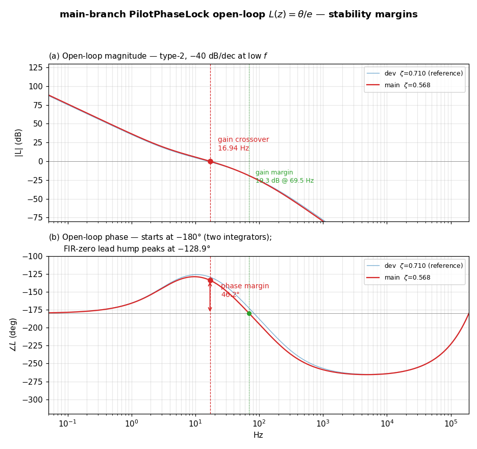

# FM Stereo Pilot PLL — open-loop response and stability margins of the `main` branch code

Date: 2026-07-24
Scope: `sfmbase/PilotPhaseLock.cpp` as it stands on branch **`main`**
(commit `dbca134`) — the currently *released* loop.
Companion documents: `doc/PLL_ANALYSIS_20260722.md` (structural analysis of this
same shipping loop), `doc/PLL_ANALYSIS_2_20260723.md` §3.4 (the identical
open-loop treatment applied to `dev`), `doc/PLL_REDESIGN_20260723.md`
(the ζ 0.57 → 0.71 retune that `dev` carries and `main` does not).
This is a read-only measurement report; no source code was changed.

---

## Executive summary

`doc/PLL_ANALYSIS_2_20260723.md` §3.4 reported open-loop margins for the `dev`
loop. This note reports the same data for the loop **as released on `main`**,
which is still the original ζ ≈ 0.57 design.

| Open-loop quantity                    | **`main` (released)** | `dev` (for reference) |
|---------------------------------------|-----------------------|-----------------------|
| Loop type                             | type-2 (two integrators, one zero) | type-2   |
| Low-frequency slope                   | −40 dB/decade         | −40 dB/decade         |
| DC phase                              | −180°                 | −180°                 |
| **Gain crossover** (\|L\| = 0 dB)     | **16.94 Hz**          | 15.72 Hz              |
| ∠L at gain crossover                  | **−133.8°**           | −128.4°               |
| **Phase margin**                      | **46.2°**             | 51.6°                 |
| Peak of the FIR-zero lead hump        | **−128.9° @ 9.6 Hz**  | −126.0° @ 10.5 Hz     |
| **Phase crossover** (∠L = −180°)      | **69.5 Hz**           | 82.7 Hz               |
| \|L\| at phase crossover              | **−19.3 dB**          | −21.9 dB              |
| **Gain margin**                       | **19.3 dB**           | 21.9 dB               |

The released loop is **stable with adequate but noticeably thinner margins than
`dev`**: **PM = 46.2°** and **GM = 19.3 dB**, versus 51.6° / 21.9 dB after the
retune. 46° is below the 45–60° band usually considered comfortable only at its
very bottom edge — it is not marginal, but it is the least damped of the four
loops analyzed in this document series, and it is the open-loop face of the same
mildly-under-damped operating point that shows up as ζ = 0.568, +2.31 dB gain
peaking and ≈ 29 % phase-step overshoot.

---

## Contents

1. [The loop being analyzed](#1-the-loop-being-analyzed)
2. [Method](#2-method)
3. [Open-loop data and margins](#3-open-loop-data-and-margins)
4. [Comparison across the loops analyzed to date](#4-comparison-across-the-loops-analyzed-to-date)
5. [Conclusion](#5-conclusion)
6. [Reproduction](#6-reproduction)

---

## 1. The loop being analyzed

From the `PilotPhaseLock` constructor on `main` (`dbca134`):

```cpp
// approx 30Hz LPF by 2nd-order biquad IIR Butterworth filter
// Caution: use only once for stable PLL locking
m_biquad_phasor_i1(1.46974784e-06, 0, 0, -1.99682419, 0.996825659),
m_biquad_phasor_q1(1.46974784e-06, 0, 0, -1.99682419, 0.996825659),
// differentiator-like 1st-order inverse LPF (not really an HPF)
m_first_phase_err(0.000304341788, -0.000304324564, 0), m_freq_err(0) {
```

| Parameter                      | Expression                 | Value (`main`)              |
|--------------------------------|----------------------------|-----------------------------|
| Phasor LPF b0 / a1 / a2        | 2nd-order all-pole IIR     | 1.469748e-06 / −1.996824 / 0.996826 |
| Phasor LPF real poles          | z1, z2                     | 0.999438, 0.997386          |
| Phasor LPF real corners        | −ln(z)/(2πT)               | **34.36 Hz, 159.95 Hz**     |
| Phasor LPF DC gain             | b0/(1+a1+a2)               | 1.000509                    |
| Phasor LPF gain @ 38 kHz       | \|H(38 kHz)\|              | −108.1 dB                   |
| FIR b0 / b1                    | F(z) = b0 + b1·z⁻¹         | 3.043418e-04 / −3.043246e-04|
| Proportional gain              | Kp = −b1                   | 3.0432e-04                  |
| Integral gain (per sample)     | Ki = b0 + b1               | 1.7224e-08                  |
| PI zero                        | ωz = Ki/(Kp·T)             | 21.73 rad/s (3.459 Hz)      |
| Phase detector                 | —                          | `fast_atan2f` (float), Kd ≈ 1 rad/rad |
| Lock-decision delay            | `int(15.0/bandwidth)`      | 192000 samples = 0.5000 s   |
| Frequency clamp                | `bandwidth = 30/fs`        | 19 kHz ± 30 Hz              |

Differences from `dev` that matter here: **only the five filter constants**. The
`std::atan2` swap changes the detector's accuracy, not its small-signal gain
(Kd ≈ 1 either way), and the 0.5 s → 0.2 s lock time changes only when
`locked()` flips, not the loop dynamics. So the margins below differ from `dev`'s
purely because of the ζ 0.57 → 0.71 retune.

---

## 2. Method

Identical to `doc/PLL_ANALYSIS_2_20260723.md` §3.4. The loop is broken at the
phase detector: the error `e = θ_in − θ` is injected as an independent input and
the fed-back NCO phase `θ` is taken as the output, so

```
L(z) = θ(z) / e(z)  =  [phasor biquad] · Kd · [FIR PI] · [m_freq integ.] · [m_phase integ.]
```

with the linearized detector gain Kd ≈ 1 rad/rad (amplitude-normalized
arctangent). `L(z)` is evaluated on the **exact linearized 5-state model** — the
same difference equations `PilotPhaseLock::process` executes (Direct-Form-2
phasor biquad on the phase error, first-order FIR, `m_freq += …`,
`m_phase += m_freq`, one-sample NCO feedback delay), state
`[w1, w2, xf, m_freq, m_phase]` — with the `θ` feedback path removed.

**Model validation.** Run closed-loop on these same `main` coefficients the model
returns a dominant pole pair at **fn = 22.335 Hz, ζ = 0.5683**, max |z| =
0.999930, +2.31 dB peaking at 13.78 Hz, −3 dB bandwidth 30.00 Hz and 29.4 %
phase-step overshoot — reproducing every published figure of
`doc/PLL_ANALYSIS_20260722.md` for the shipping loop. The open-loop numbers below
come from the same validated matrices.

---

## 3. Open-loop data and margins

| Open-loop quantity                    | Value (`main`)           |
|---------------------------------------|--------------------------|
| Low-frequency slope                   | −40 dB/decade (two integrators, type-2) |
| DC phase                              | −179.85° (two poles at z = 1) |
| **Gain crossover** (\|L\| = 0 dB)     | **f_gc = 16.94 Hz**      |
| ∠L at gain crossover                  | **−133.82°**             |
| **Phase margin**                      | **PM = 46.18°**          |
| Maximum of ∠L (FIR-zero lead hump)    | −128.86° @ 9.61 Hz       |
| **Phase crossover** (∠L = −180°)      | **f_pc = 69.51 Hz**      |
| \|L\| at phase crossover              | **−19.26 dB**            |
| **Gain margin**                       | **GM = 19.26 dB**        |

**Shape.** `L` starts at −180° — the type-2 signature of two poles at z = 1 —
and falls at −40 dB/decade. The FIR stabilizing zero (the PI zero at 3.46 Hz)
injects phase **lead** that lifts ∠L to a maximum of −128.9° at 9.6 Hz; that
hump is the entire phase-margin reserve. The gain crossover at 16.94 Hz sits
*past* the top of the hump, on its falling side, where ∠L has already dropped
back to −133.8° — which is precisely why the margin is only 46°. Beyond
crossover the in-loop phasor poles (34.4 / 160.0 Hz) and the NCO one-sample delay
drag the phase through −180° at 69.5 Hz, where |L| is already 19.3 dB below unity.

**Why `dev` does better.** The retune widened the phasor LPF (34/160 → 40/188 Hz)
and lowered the loop gain to compensate. Both help here: less in-loop lag raises
the hump (−128.9° → −126.0°), and the lower gain moves crossover down
(16.94 → 15.72 Hz) toward the top of the hump instead of past it. Together they
buy 5.4° of phase margin and push the phase crossover from 69.5 to 82.7 Hz,
adding 2.6 dB of gain margin.



- **(a) Open-loop magnitude** — −40 dB/decade at low frequency (type-2), crossing
  0 dB at 16.94 Hz; the phase-crossover point sits 19.3 dB below 0 dB. The `dev`
  curve is overlaid for reference.
- **(b) Open-loop phase** — starts at −180°, the FIR zero lifts it to a −128.9°
  hump at 9.6 Hz, and crossover falls on the hump's *descending* side at −133.8°,
  leaving PM = 46.2°. The phasor poles and NCO delay then carry ∠L through −180°
  at 69.5 Hz.

---

## 4. Comparison across the loops analyzed to date

All four loops analyzed in this document series, on the same model and method:

| Loop | ζ | f_gc | **PM** | f_pc | **GM** | Peaking | Step overshoot |
|------|---|------|--------|------|--------|---------|----------------|
| **`main`** (released, this doc) | 0.568 | 16.94 Hz | **46.2°** | 69.5 Hz | **19.3 dB** | +2.31 dB | 29.4 % |
| `dev` (ζ retune) | 0.710 | 15.72 Hz | 51.6° | 82.7 Hz | 21.9 dB | +1.84 dB | 23.7 % |
| ζ≈1.00 experiment¹ | 1.000 | 13.94 Hz | 58.2° | 110.8 Hz | 26.0 dB | +1.68 dB | 18.9 % |
| PI-zero experiment² | 0.711 | 15.48 Hz | 58.0° | 85.1 Hz | 22.4 dB | +0.91 dB | 14.5 % |

¹ `doc/PLL_EXPERIMENT_20260724.md` — doc-only, not in any branch's code.
² `doc/PLL_EXPERIMENT_2_20260724.md` — doc-only, not in any branch's code.

`main` sits at the bottom of every margin column. The ordering of phase margin
(46.2 → 51.6 → 58.0/58.2°) tracks the ordering of ζ and inversely tracks gain
peaking and overshoot exactly as expected — except for the PI-zero experiment,
which reaches the best overshoot of all *without* moving ζ, the point that
document makes at length.

---

## 5. Conclusion

1. The released `main` loop is **stable** with **phase margin 46.2° at a
   16.94 Hz gain crossover** and **gain margin 19.3 dB at 69.5 Hz**. No stability
   concern: 19 dB of gain margin means the loop gain would have to rise by a
   factor of 9 before instability, and nothing in the signal path varies that
   way (the arctangent detector is amplitude-normalized).

2. **It is the thinnest-margin loop of the series.** PM 46.2° is at the very
   bottom of the conventional 45–60° band, and it is the open-loop expression of
   the same mildly-under-damped point already documented as ζ = 0.568,
   +2.31 dB peaking and ≈ 29 % phase-step overshoot in
   `doc/PLL_ANALYSIS_20260722.md`.

3. **`dev` already improves it** to PM 51.6° / GM 21.9 dB, at the same loop
   natural frequency, via the retune of `doc/PLL_REDESIGN_20260723.md`. That
   change is on `dev` awaiting field evaluation; merging it to `main` would carry
   these better margins into the release.

4. As established throughout this series, none of this is audible — the PLL's
   phase jitter sits ~100 dB below the stereo-separation floor in every one of
   these loops. The margins matter for transient behavior (acquisition ringing),
   not for steady-state quality.

---

## 6. Reproduction

Exact linear model and figure (scratchpad Python, numpy + matplotlib):

```
pll_model_main.py  # 5-state exact model, main + dev side by side:
                   #   closed-loop poles/zeta/fn, closed-loop Bode, steps,
                   #   open-loop L(z) -> gain crossover, PM, phase crossover, GM
pll_fig_main.py    # the open-loop Bode figure of §3
```

The `main` coefficients were read straight from the branch without checking it
out:

```sh
git show main:sfmbase/PilotPhaseLock.cpp
```

No build or recording run is needed for this report: the open-loop transfer
function is a property of the coefficients alone, and the model that produces it
is validated by reproducing the published closed-loop ζ = 0.568 / fn = 22.3 Hz /
+2.31 dB / 29.4 % figures of `doc/PLL_ANALYSIS_20260722.md` exactly (§2).
