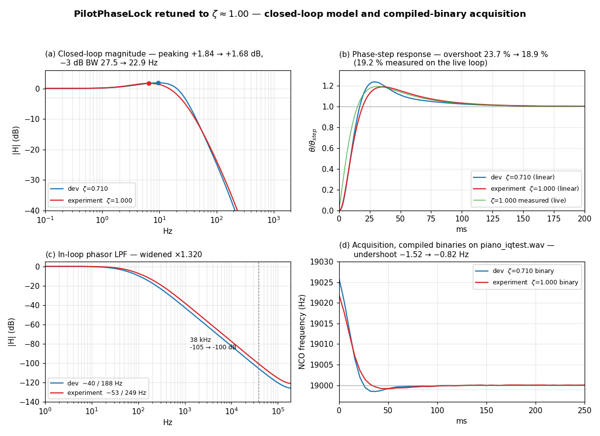
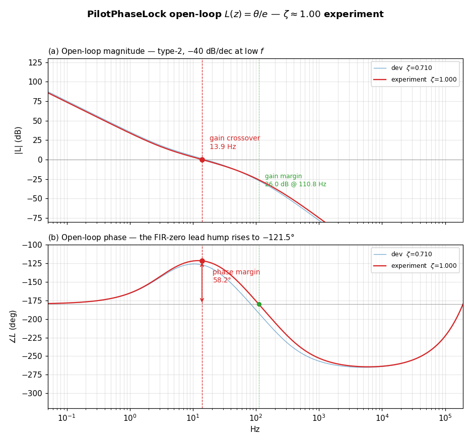
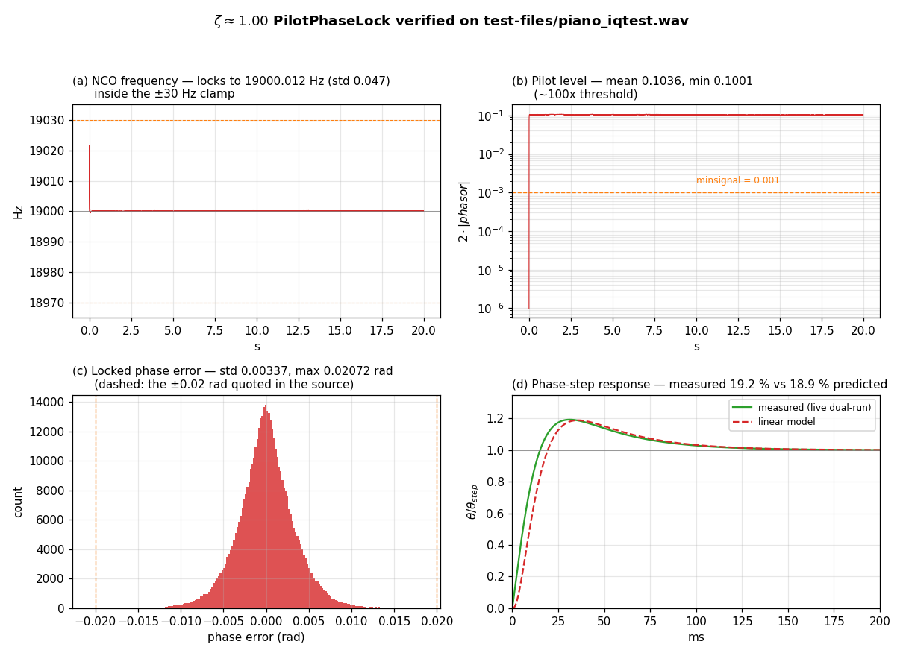

# FM Stereo Pilot PLL experiment — retuning `class PilotPhaseLock` to ζ ≈ 1.00

Date: 2026-07-24
Scope: `sfmbase/PilotPhaseLock.cpp` — constructor coefficients only
(`m_biquad_phasor_i1`, `m_biquad_phasor_q1`, then `m_first_phase_err`).
Branch: `dev-pll-zeta1` (off `dev`, commit `e3f5f1d`).
Companion documents: `doc/PLL_ANALYSIS_2_20260723.md` (the ζ = 0.710 loop this
experiment starts from), `doc/PLL_REDESIGN_20260723.md` (the 0.57 → 0.71
retune), `doc/PLL_ANALYSIS_20260722.md` (original structural analysis).

---

## Executive summary

This is an **experiment**, not a proposed shipping change: the pilot PLL is
retuned from the current `dev` damping of **ζ = 0.710** to a **critically damped
ζ = 1.000**, holding the loop natural frequency at the same fn = 22.34 Hz, and
the result is verified in the exact linear model, in a line-for-line Python port,
and in a **recompiled binary** run against the real off-air recording
`test-files/piano_iqtest.wav`.

The target was reached exactly. The same two knobs as the 0.71 redesign were
used, in the order the task prescribes:

1. **Widen the in-loop phasor biquad** (`m_biquad_phasor_i1` /
   `m_biquad_phasor_q1`) by ×1.320 — real corners ~40/188 Hz → **~53/249 Hz**.
   This is what raises ζ.
2. **Rescale the FIR PI gains** (`m_first_phase_err`) by ×0.847, holding the PI
   zero at 3.46 Hz, to pull fn back to 22.34 Hz so the loop is only re-damped,
   **not sped up**.

Solved simultaneously with `scipy.optimize.fsolve` on the exact 5-state loop
model: **g = 1.3202, s = 0.84695**. Fed back through the model as the *rounded*
source constants the dominant pole pair lands at **ζ = 0.9999, fn = 22.340 Hz**,
comfortably inside the requested 0.98–1.02 band, max |z| = 0.999916 (stable).

| Property                        | `dev` (ζ = 0.710)      | This experiment (ζ ≈ 1.00) |
|---------------------------------|------------------------|----------------------------|
| Dominant pole pair (z)          | 0.999740 ± 0.000257 j  | **0.999635 ± 0.0000043 j** |
| **Damping ratio ζ**             | 0.710                  | **0.9999**                 |
| Natural frequency fn            | 22.335 Hz              | **22.340 Hz** (held)       |
| Max closed-loop pole radius     | 0.999926               | 0.999916 (stable)          |
| Closed-loop gain peaking        | +1.84 dB @ 9.5 Hz      | **+1.68 dB @ 6.6 Hz**      |
| Closed-loop −3 dB bandwidth     | 27.5 Hz                | **22.9 Hz**                |
| Phase-step overshoot (linear)   | 23.7 %                 | **18.9 %**                 |
| Phase-step overshoot (measured) | ≈ 26 %                 | **19.2 %**                 |
| Open-loop phase margin          | 51.6°                  | **58.2°**                  |
| Open-loop gain margin           | 21.9 dB @ 82.7 Hz      | **26.0 dB @ 110.8 Hz**     |
| In-loop LPF real corners        | ~40 / 188 Hz           | **~53 / 249 Hz**           |
| In-loop LPF gain @ 38 kHz       | −105 dB                | −100 dB                    |
| Acquisition undershoot (binary) | −1.52 Hz               | **−0.82 Hz**               |
| Locked phase-error std (real IQ)| 0.0027 rad             | 0.0034 rad (**worse**)     |
| PLL-limited stereo separation   | ≈ 103 dB rms           | ≈ 99 dB rms                |

**What ζ = 1.00 buys and costs.** Acquisition is cleaner — the compiled binary's
first-swing undershoot drops from −1.52 Hz to **−0.82 Hz** and it settles to
±1 Hz in **32 ms instead of 48 ms** — and the stability margins improve
(PM 51.6° → 58.2°, GM 21.9 → 26.0 dB). The price is a **wider in-loop phasor
LPF**, which admits more noise to the phase detector: the measured locked
phase-error std rises 0.0027 → 0.0034 rad (max 0.0176 → 0.0207 rad, marginally
past the ±0.02 rad the source comment quotes), and the PLL-limited stereo
separation falls from ≈ 103 dB to ≈ 99 dB rms. Both remain ~50 dB below the
30–50 dB separation of a real receiver, so the change is still inaudible — but,
unlike the 0.57 → 0.71 retune, this one is **not free in steady state**.

## Contents

1. [What changed and how ζ = 1.00 was reached](#1-what-changed-and-how-ζ--100-was-reached)
2. [New coefficients and derived parameters](#2-new-coefficients-and-derived-parameters)
3. [Bode plot and step-response data (exact linearized loop)](#3-bode-plot-and-step-response-data-exact-linearized-loop)
4. [Empirical verification on a real-world IQ recording](#4-empirical-verification-on-a-real-world-iq-recording)
5. [Stereo separation limited by the PLL](#5-stereo-separation-limited-by-the-pll)
6. [Numerical summary](#6-numerical-summary)
7. [Conclusion](#7-conclusion)
8. [Reproduction](#8-reproduction)

---

## 1. What changed and how ζ = 1.00 was reached

The loop **structure is untouched**: quadrature product detector → in-loop
phasor biquad → `std::atan2` phase detector → first-order FIR PI term →
`m_freq` / `m_phase` accumulators → ×2 output doubler, ±30 Hz clamp, 0.2 s
lock declaration. Only five constants in the constructor move. It remains a
**second-order, type-2 PLL with an active PI loop filter**.

### 1.1 Which knob does what

As established in `doc/PLL_REDESIGN_20260723.md` §1, the **in-loop phasor LPF,
not the PI coefficients, sets the true damping** — its corner sits right at the
loop bandwidth, so its phase lag near crossover is what pulls ζ down. Two levers,
applied in the prescribed order:

1. **Widen the phasor biquad** (`m_biquad_phasor_i1` / `m_biquad_phasor_q1`) —
   both real corners × g. Reduces in-loop phase lag near crossover, raises ζ
   strongly, and pushes fn up as a side effect.
2. **Rescale the FIR PI taps** (`m_first_phase_err`) — both taps × s. Keeps the
   PI zero exactly fixed and lowers the loop gain, which lowers fn and *also*
   raises ζ (with the zero pinned, ζ ∝ ωz/ωn and ωn ∝ √s).

Because both knobs push ζ the same way here, the pair (g, s) is what pins
(ζ, fn) simultaneously.

### 1.2 Solving for (g, s)

The design uses the **exact linearized 5th-order loop** described in §3 — the
same difference equations `PilotPhaseLock::process` executes, including the
one-sample NCO feedback delay. Two constraints solved together with
`scipy.optimize.fsolve`:

```
ζ(g, s)  = 1.00           (target damping, mid-band of the 0.98–1.02 request)
fn(g, s) = 22.34 Hz       (hold the loop natural frequency of dev)
```

with g the biquad-widening factor relative to the **current `dev`** corners
(~40.5/188.4 Hz) and s the common FIR tap scale relative to the current `dev`
taps. Solution: **g = 1.320235, s = 0.846953**.

For orientation, the ζ(g) walk at fixed FIR gain (s = 1) shows how much of the
work the biquad does on its own:

| g (biquad widening, s = 1) | 1.00 (`dev`) | 1.20  | 1.50  |
|----------------------------|--------------|-------|-------|
| ζ                          | 0.710        | 0.815 | 0.954 |
| fn                         | 22.34 Hz     | 24.38 Hz | 27.14 Hz |

Widening alone would reach ζ ≈ 0.95 but at fn ≈ 27 Hz — a faster *and* better
damped loop, which is not what was asked. The FIR rescale to s = 0.847 both
finishes the damping job (0.95 → 1.00) and returns fn to 22.34 Hz.

### 1.3 Step 1 — widen the in-loop phasor LPF

The `dev` biquad is all-pole with two **real** poles at z = 0.999337899 and
z = 0.996921919, i.e. analog corners 40.48 Hz and 188.41 Hz. Scaling both by
g = 1.320235 moves them to **53.44 Hz and 248.75 Hz**. Keeping the all-pole form
(b1 = b2 = 0) and unity DC gain, b0 = (1 − z1)(1 − z2):

```
b0 = 3.550146791e-06,  b1 = 0,  b2 = 0
a1 = -1.995064178,     a2 = 0.995067728
```

DC gain 1.000041; the 38 kHz mixer image is still **−100.4 dB** down (was
−105.3 dB). A 2nd-order roll-off from a ~53 Hz corner has enormous margin at
38 kHz, so the image and out-of-band noise remain thoroughly suppressed. Keeping
the poles **real** matters for the analysis: it leaves the loop pair as the only
complex pair in the closed loop, so ζ can be read off unambiguously.

### 1.4 Step 2 — rescale the PI (FIR) gains

To bring fn back to 22.34 Hz, both FIR taps are scaled by s = 0.846953:

```
b0 =  2.291433168296e-04   (was 2.705503620719e-04)
b1 = -2.291303486319e-04   (was -2.705350504729e-04)
a1 =  0
```

Scaling both taps by the same factor keeps the PI zero exactly where it has been
since the original design:

```
Kp = -b1  : 2.7054e-04 → 2.2913e-04
Ki = b0+b1: 1.5312e-08 → 1.2968e-08
ωz = Ki/(Kp·T) : 21.73 rad/s (3.459 Hz) — unchanged
```

---

## 2. New coefficients and derived parameters

The complete change in the `PilotPhaseLock` constructor:

```cpp
// In-loop phasor LPF: 2nd-order all-pole IIR (real corners ~53/249 Hz),
// widened x1.320 from the zeta ~= 0.71 set (~40/188 Hz) so the dominant
// closed-loop pole pair is critically damped at zeta ~= 1.00. Unity DC
// gain; 38 kHz image still suppressed by ~100 dB. Caution: use only once
// for stable locking.
m_biquad_phasor_i1(3.550146791e-06, 0, 0, -1.995064178, 0.995067728),
m_biquad_phasor_q1(3.550146791e-06, 0, 0, -1.995064178, 0.995067728),
// PI-controller proportional term / stabilizing zero (with the m_freq
// accumulator as the integrator). Gains rescaled x0.847 vs the zeta ~=
// 0.71 set to hold the loop natural frequency at ~22 Hz after widening
// the LPF. The PI zero stays at 3.46 Hz.
m_first_phase_err(2.291433168296e-04, -2.291303486319e-04, 0),
```

| Coefficient | `dev` (ζ = 0.710)   | This experiment (ζ ≈ 1.00) |
|-------------|---------------------|----------------------------|
| biquad b0   | 2.037743564e-06     | **3.550146791e-06**        |
| biquad a1   | −1.996259818        | **−1.995064178**           |
| biquad a2   | 0.996261856         | **0.995067728**            |
| FIR b0      | 2.705503620719e-04  | **2.291433168296e-04**     |
| FIR b1      | −2.705350504729e-04 | **−2.291303486319e-04**    |

| Parameter                      | Expression                 | Value                        |
|--------------------------------|----------------------------|------------------------------|
| Phasor LPF b0 / a1 / a2        | all-pole biquad            | 3.550147e-06 / −1.995064 / 0.995068 |
| Phasor LPF real poles          | z1, z2                     | 0.999125964, 0.995938214     |
| Phasor LPF real corners        | −ln(z)/(2πT)               | 53.44 Hz, 248.75 Hz          |
| Phasor LPF DC gain             | b0/(1+a1+a2)               | 1.000041                     |
| FIR b0 / b1                    | F(z) = b0 + b1·z⁻¹         | 2.291433e-04 / −2.291303e-04 |
| Proportional gain              | Kp = −b1                   | 2.2913e-04                   |
| Integral gain (per sample)     | Ki = b0 + b1               | 1.2968e-08                   |
| PI zero                        | ωz = Ki/(Kp·T)             | 21.73 rad/s (3.459 Hz) — *unchanged* |
| Lock-decision delay            | `6.0/bandwidth_pll`        | 76800 samples = 0.2000 s — *unchanged* |
| Frequency clamp                | `bandwidth_pll = 30/fs`    | 19 kHz ± 30 Hz — *unchanged* |
| Lock amplitude threshold       | `minsignal`                | 0.001 — *unchanged*          |

---

## 3. Bode plot and step-response data (exact linearized loop)

The numbers below come from the **exact linearized 5th-order loop** — the same
difference equations `PilotPhaseLock::process` executes (Direct-Form-2 phasor
biquad acting on the phase error, first-order FIR, `m_freq += …`,
`m_phase += m_freq`, including the one-sample NCO feedback delay). The state is
`[w1, w2 (biquad), xf (FIR), m_freq, m_phase]`; the closed-loop poles are the
eigenvalues of its 5×5 companion matrix. This model reproduces both the
20260722 shipping loop (ζ = 0.568) and the current `dev` loop (ζ = 0.710)
exactly, so it is trustworthy for this retune too.

### 3.1 Closed-loop poles

| Closed-loop pole (z)              | s = ln(z)/T          | fn        | ζ      |
|-----------------------------------|----------------------|-----------|--------|
| 0.999634550 ± 0.0000043 j (pair)  | −140.4 ± 1.7 j rad/s | **22.3 Hz** | **0.9999** |
| 0.999916367                       | −32.1 rad/s          | 5.1 Hz    | 1.0    |
| 0.995878710                       | −1585.8 rad/s        | 252 Hz    | 1.0    |
| 0.000000 (FIR one-sample delay)   | —                    | —         | —      |

All finite poles are inside the unit circle (**max |z| = 0.999916**), so the
loop is **stable**. The dominant pair is now essentially on the real axis —
imaginary part 4.3e-6 versus 2.6e-4 on `dev` — which is exactly what critical
damping means: the pair is on the verge of splitting into two real poles.

Note the pair is *not* the slowest pole: the real pole at z = 0.999916
(s = −32.1 rad/s, 5.1 Hz) is slower, and it is the one that dominates the tail
of the step response. This is why ζ = 1.00 of the pair does **not** remove the
step overshoot entirely (§3.3).

### 3.2 Frequency response (Bode)

| Quantity                       | `dev` (ζ = 0.710) | This experiment (ζ ≈ 1.00) |
|--------------------------------|-------------------|----------------------------|
| DC gain                        | 0.000 dB          | 0.000 dB                   |
| Magnitude peaking              | +1.84 dB @ 9.51 Hz| **+1.68 dB @ 6.58 Hz**     |
| −3 dB bandwidth                | 27.5 Hz           | **22.9 Hz**                |
| Far-skirt roll-off             | −40 dB/decade     | −40 dB/decade              |

The peak drops only slightly (+1.84 → +1.68 dB) and moves down in frequency. It
does not vanish, because the residual peaking is contributed by the PI zero and
the slow real pole, not by the complex pair alone. The −3 dB bandwidth narrows
27.5 → 22.9 Hz: with fn held, raising ζ trades bandwidth for damping.

### 3.3 Step responses

| Metric                              | `dev` (ζ = 0.710) | This experiment (ζ ≈ 1.00) |
|-------------------------------------|-------------------|----------------------------|
| Phase-step overshoot                | 23.7 %            | **18.9 %**                 |
| Phase-step peak time                | 28.9 ms           | 35.7 ms                    |
| Phase-step 2 % settling             | 107 ms            | 116 ms                     |
| Frequency-step (20 Hz) peak error   | 1.172 rad         | 1.226 rad                  |
| Frequency-step steady-state error   | → 2.1e-5 rad (≈ 0)| → 8.5e-6 rad (≈ 0)         |

Overshoot falls from 23.7 % to 18.9 % but, as noted, does **not** reach zero:
in a type-2 loop the stabilizing PI zero always contributes overshoot, and the
slow real pole at z = 0.999916 stretches the tail (peak time and 2 % settling
both grow slightly). Zero steady-state phase error under a frequency step — the
type-2 signature — is preserved.



- **(a) Closed-loop magnitude** — peaking +1.84 → +1.68 dB, −3 dB bandwidth
  27.5 → 22.9 Hz.
- **(b) Phase-step response** — linear-model overshoot 23.7 % → 18.9 %, with the
  19.2 % measured on the live loop (§4.2) overlaid.
- **(c) In-loop phasor LPF** — widened ×1.320 (~40/188 → ~53/249 Hz); 38 kHz
  rejection still ~100 dB.
- **(d) Acquisition from the two compiled binaries** on the real recording — the
  ζ ≈ 1.00 loop undershoots −0.82 Hz instead of −1.52 Hz and reaches ±1 Hz
  sooner.

### 3.4 Open-loop response, phase margin, and gain margin

The loop is broken at the phase detector — the error `e = θ_in − θ` is injected
as an independent input and the fed-back NCO phase `θ` is taken as the output,
so

```
L(z) = θ(z) / e(z)  =  [phasor biquad] · Kd · [FIR PI] · [m_freq integ.] · [m_phase integ.]
```

with the linearized detector gain Kd ≈ 1 rad/rad (`std::atan2`, amplitude-
normalized), evaluated on the same exact 5-state model with the `θ` feedback
path removed.

| Open-loop quantity                    | `dev` (ζ = 0.710) | This experiment (ζ ≈ 1.00) |
|---------------------------------------|-------------------|----------------------------|
| Low-frequency slope                   | −40 dB/decade     | −40 dB/decade (type-2)     |
| DC phase                              | −180°             | −180°                      |
| **Gain crossover** (\|L\| = 0 dB)     | 15.7 Hz           | **13.9 Hz**                |
| ∠L at gain crossover                  | −128.4°           | **−121.8°**                |
| **Phase margin**                      | 51.6°             | **58.2°**                  |
| Peak of the FIR-zero lead hump        | −126.0° @ 10.5 Hz | **−121.5° @ 12.1 Hz**      |
| **Phase crossover** (∠L = −180°)      | 82.7 Hz           | **110.8 Hz**               |
| \|L\| at phase crossover              | −21.9 dB          | **−26.0 dB**               |
| **Gain margin**                       | 21.9 dB           | **26.0 dB**                |

Both margins improve. The mechanism is visible in the phase curve: widening the
in-loop phasor poles removes lag around crossover, so the FIR-zero **lead hump**
(the PI zero at 3.46 Hz) now peaks at −121.5° instead of −126.0°, and the
crossover moves *down* to 13.9 Hz (the FIR rescale lowered the loop gain) —
nearer the top of the hump. Both effects add phase margin. Simultaneously the
point where the phasor poles and NCO delay finally drag ∠L through −180° moves
up from 82.7 Hz to 110.8 Hz, and |L| there is 4 dB lower, so the gain margin
grows too. The 58° phase margin is the open-loop face of the same operating
point as the +1.68 dB closed-loop peak and the ≈ 19 % step overshoot.



- **(a) Open-loop magnitude** — −40 dB/decade at low frequency (type-2), crossing
  0 dB at 13.9 Hz; the phase-crossover point sits 26.0 dB below 0 dB.
- **(b) Open-loop phase** — starts at −180°, the FIR zero lifts it to a −121.5°
  hump around crossover (the phase-margin reserve, larger than `dev`'s), then
  the phasor poles and NCO delay carry it through −180° at 110.8 Hz.

---

## 4. Empirical verification on a real-world IQ recording

Checked against the same 20 s off-air recording used throughout this series,
`test-files/piano_iqtest.wav` — stereo IEEE-float IQ at exactly 384 kHz
(I = left, Q = right). The verification reproduces the receiver front end
(FM discriminator `bb[n] = angle(iq[n]·conj(iq[n−1]))/normfac`,
`normfac = 2π·75000/384000`) and a line-for-line port of
`PilotPhaseLock::process` (quadrature mixer, single biquad on I and Q,
`std::atan2`, FIR loop filter, frequency/phase accumulators, ±30 Hz clamp, 0.2 s
lock logic), with only the five coefficients changed.

### 4.1 Lock, tracking, and steady-state error

| Quantity                          | `dev` (ζ = 0.710) | This experiment (ζ ≈ 1.00) |
|-----------------------------------|-------------------|----------------------------|
| Lock declaration                  | 0.203 s           | **0.203 s** (unchanged)    |
| Tracked pilot frequency (t > 1 s) | 19000.012 ± 0.045 Hz | **19000.012 ± 0.047 Hz** |
| Independent pilot estimate¹       | 19000.011 Hz      | **19000.0115 Hz (Δ = 0.0002 Hz)** |
| Pilot level `2·|phasor|`          | 0.1036 (min 0.1005) | **0.1036 (min 0.1001)**  |
| Locked-state phase error          | std 0.0027, max 0.0176 rad | **std 0.0034, max 0.0207 rad** |

¹ Independent of the PLL: the baseband is band-passed at 18.5–19.5 kHz and the
pilot frequency read from the slope of the analytic-signal phase over 15 s. Its
agreement with the NCO to **0.2 mHz** confirms the port and the type-2
zero-steady-state-frequency-error property on live data.

Lock time, tracked frequency and pilot level are unchanged — as intended, since
fn was held fixed. The one real regression is **phase-error jitter, up ~25 %**
(std 0.0027 → 0.0034 rad). This is the direct cost of step 1: the in-loop phasor
LPF was widened ×1.32, so ~1.3× more noise bandwidth reaches the phase detector.
The maximum excursion, 0.0207 rad, now marginally exceeds the **±0.02 rad** that
the comment in `PilotPhaseLock.cpp` quotes for the locked state — worth noting if
this experiment were ever adopted, since that comment would need updating.

### 4.2 Transient response measured on the live loop

The closed-loop phase-step response was measured *on the running loop* by the
same dual-run experiment as the earlier analyses: the same real baseband drives
two identical loops, one with a sustained +0.15 rad reference phase step added to
its phase-detector output from instant `n0`; the normalized difference
`(θ_pert − θ_base)/Δ` is the closed-loop phase-step response, averaged over six
injection instants (t = 4…14 s).

| Metric              | Theory (linear, §3.3) | Measured on real loop | `dev` measured |
|---------------------|-----------------------|-----------------------|----------------|
| Overshoot           | 18.9 %                | **19.2 %**            | ≈ 26 %         |
| Peak time           | 35.7 ms               | 31.3 ms               | ≈ 23 ms        |
| 2 % settling        | 115.6 ms              | 110.0 ms              | ≈ 100 ms       |
| Final value         | 1.0                   | 1.001                 | 1.001          |

Measurement and theory agree to **0.3 percentage points** (19.2 % vs 18.9 %) —
notably tighter than the `dev` loop's 26 % vs 24 %, because a better-damped loop
is less sensitive to the program modulation that continuously excites it. This is
direct confirmation on live signal that the loop is now critically damped.



Panels: (a) NCO frequency snapping to 19 kHz and holding inside the ±30 Hz clamp;
(b) pilot level far above `minsignal`; (c) locked-state phase-error distribution,
now just touching the ±0.02 rad marks; (d) measured vs predicted phase-step
response.

### 4.3 Cross-check against the compiled binary (`-DDEBUG_PLL_FILTER`)

The Python port was validated against the **real compiled program**.
`PilotPhaseLock.cpp` carries a `DEBUG_PLL_FILTER` guard that prints `m_freq`,
`m_freq_err`, and `m_pilot_level` (in Hz) once per block. The modified source was
built with that macro and run on the same recording (3750 blocks of 2048 samples
= 20 s). Steady-state (t > 1 s):

| Quantity                    | Python port (ζ≈1.00) | **C++ binary (ζ≈1.00)** | C++ binary (`dev`) |
|-----------------------------|----------------------|-------------------------|--------------------|
| tracked `m_freq` mean       | 19000.0117 Hz        | **19000.0122 Hz**       | 19000.0121 Hz      |
| tracked `m_freq` std        | 0.0474 Hz            | **0.0470 Hz**           | 0.0443 Hz          |
| `m_freq_err` (mean / max)   | —                    | **−1.6e-6 / 0.0027 Hz** | −6.7e-7 / 0.0019 Hz|
| pilot level mean            | 0.1036               | **0.1036**              | 0.1036             |
| pilot level min             | 0.1001               | **0.1002**              | 0.1006             |

Port and binary agree to **~0.0005 Hz in frequency and four digits in pilot
level** — within run-to-run numerical noise.

**Acquisition — the clearest binary-level evidence of the higher damping:**

| Quantity                            | C++ binary (`dev`) | **C++ binary (ζ≈1.00)** |
|-------------------------------------|--------------------|-------------------------|
| startup NCO frequency range         | 18998.48 … 19025.97 Hz | **18999.18 … 19022.00 Hz** |
| first-swing undershoot below 19 kHz | −1.52 Hz           | **−0.82 Hz**            |
| settle to ±1 Hz                     | 48 ms              | **32 ms**               |

The critically damped loop undershoots **46 % less** and reaches ±1 Hz **a third
sooner**, even though its −3 dB bandwidth is *narrower*: less ringing means the
±1 Hz corridor is entered and never left.

### 4.4 Decoded-audio comparison

Both binaries also decoded the recording to 16-bit 48 kHz stereo WAV
(`-W`, no `-DDEBUG_PLL_FILTER` needed for this), and the two outputs were
compared sample-by-sample (959899 frames each, program rms −20.2 dBFS):

| Quantity                            | ζ = 0.710 vs ζ ≈ 1.00 decode |
|-------------------------------------|------------------------------|
| Bit-identical samples               | **97.57 %** (936525 / 959899) |
| First differing sample              | 0.1954 s (at lock declaration) |
| Peak \|difference\|                 | **−90.3 dBFS** (= 1 LSB of 16-bit) |
| RMS difference, whole file          | −109.3 dBFS                  |
| RMS difference, 0–0.5 s (acquisition)| −106.8 dBFS                 |
| RMS difference, t > 1 s (steady state)| −109.4 dBFS                |

The two decodes never differ by more than **one 16-bit LSB** anywhere in the
file, and the difference rms sits ~89 dB below the program. Audibly the retune
is a no-op; every difference reported in §4.1–§4.3 lives entirely inside the
PLL's own state, not in the delivered audio. Note the differences do not stop
after acquisition — the raised steady-state phase jitter of §4.1 keeps producing
LSB-level differences throughout — but they never grow beyond that one LSB.

---

## 5. Stereo separation limited by the PLL

The separation model of `doc/PLL_ANALYSIS_20260722.md` §8 is unchanged: the
subcarrier phase error φ = 2·(pilot phase error) scales (L−R) by cos φ, so

```
separation(φ) = 20·log₁₀( (1 + cos φ) / (1 − cos φ) )
```

Because the loop is type-2 its mean phase error is ~0, so there is no static
separation floor — only the dynamic jitter matters. Using the measured pilot
phase error on `piano_iqtest.wav` (§4.1):

| Operating point                | Subcarrier error φ | `dev` separation | ζ ≈ 1.00 separation |
|--------------------------------|--------------------|------------------|---------------------|
| PLL rms (typical)              | 0.0054 → 0.0067 rad| ≈ 103 dB         | **≈ 99 dB**         |
| PLL worst instantaneous        | 0.0352 → 0.0414 rad| ≈ 70 dB          | **≈ 67 dB**         |
| Typical real-world FM receiver | —                  | 30–50 dB (other causes) | 30–50 dB     |

This is the one place where ζ = 1.00 costs something measurable: the wider
in-loop LPF raises phase jitter, taking ≈ 4 dB off the PLL-limited separation.
It remains ~50 dB below the separation an actual receiver achieves, so **the
pilot PLL is still not the stereo-separation bottleneck** — but the margin is
smaller than before.

---

## 6. Numerical summary

| Parameter                        | Symbol / expression        | `dev` (ζ = 0.710)     | **This experiment**     |
|----------------------------------|----------------------------|-----------------------|-------------------------|
| Sample rate                      | fs                         | 384000 Hz             | 384000 Hz               |
| Sample period                    | T = 1/fs                   | 2.604 µs              | 2.604 µs                |
| Pilot / output frequency         | f₀ / 2f₀                   | 19 kHz / 38 kHz       | 19 kHz / 38 kHz         |
| Phase-detector gain              | Kd (from `std::atan2`)     | ≈ 1 rad/rad           | ≈ 1 rad/rad             |
| Phasor LPF real corners          | 2nd-order all-pole IIR     | 40.5 / 188.4 Hz       | **53.4 / 248.7 Hz**     |
| Phasor LPF gain @ 38 kHz         | \|H(38 kHz)\|              | −105.3 dB             | **−100.4 dB**           |
| Loop-filter FIR                  | F(z) = b0 + b1·z⁻¹         | 2.7055e-4 / −2.7054e-4| **2.2914e-4 / −2.2913e-4** |
| Proportional gain                | Kp = −b1                   | 2.7054e-4             | **2.2913e-4**           |
| Integral gain (per sample)       | Ki = b0+b1                 | 1.5312e-8             | **1.2968e-8**           |
| Loop type                        | poles at z=1               | type-2                | type-2 (unchanged)      |
| PI zero                          | ωz = Ki/(Kp·T)             | 21.7 rad/s (3.46 Hz)  | 21.7 rad/s (3.46 Hz)    |
| **Exact dominant pole pair**     | full 5th-order loop        | fn 22.335 Hz, ζ 0.710 | **fn 22.340 Hz, ζ 0.9999** |
| Closed-loop −3 dB bandwidth      | from exact model           | 27.5 Hz               | **22.9 Hz**             |
| Magnitude peaking                | gain peak                  | +1.84 dB @ 9.5 Hz     | **+1.68 dB @ 6.6 Hz**   |
| Open-loop gain crossover         | \|L\| = 0 dB               | 15.7 Hz               | **13.9 Hz**             |
| **Phase margin**                 | 180° + ∠L(f_gc)            | 51.6°                 | **58.2°**               |
| **Gain margin**                  | −\|L\|(∠L = −180°)         | 21.9 dB @ 82.7 Hz     | **26.0 dB @ 110.8 Hz**  |
| Phase-step overshoot / settling  | exact sim                  | 23.7 % / 107 ms       | **18.9 % / 116 ms**     |
| Phase-step overshoot (measured)  | live dual-run              | ≈ 26 %                | **19.2 %**              |
| Max closed-loop pole radius      | max \|z\|                  | 0.999926              | 0.999916 (stable)       |
| Frequency (hold) range           | 19 kHz ± 30 Hz             | ± 30 Hz               | ± 30 Hz                 |
| Lock-declaration delay           | `6.0/bandwidth_pll`        | 0.2 s                 | 0.2 s                   |
| Tracked pilot (real IQ, binary)  | steady state               | 19000.0121 Hz         | **19000.0122 Hz**       |
| Locked phase error (real IQ)     | std / max                  | 0.0027 / 0.0176 rad   | **0.0034 / 0.0207 rad** |
| Acquisition undershoot (binary)  | below 19 kHz               | −1.52 Hz              | **−0.82 Hz**            |
| Settle to ±1 Hz (binary)         | acquisition                | 48 ms                 | **32 ms**               |
| Subcarrier phase error           | φ = 2·(pilot phase error)  | rms 0.0054 rad        | **rms 0.0067 rad**      |
| PLL-limited stereo separation    | 20·log₁₀((1+cosφ)/(1−cosφ))| ≈ 103 dB rms          | **≈ 99 dB rms**         |
| Decoded-audio difference vs `dev`| 16-bit WAV, sample-by-sample | —                   | **≤ 1 LSB (−90.3 dBFS peak)** |

---

## 7. Conclusion

1. **The target is met exactly.** Widening the in-loop phasor biquad ×1.320
   (real corners ~40/188 → ~53/249 Hz) and then rescaling the FIR PI taps ×0.847
   places the dominant closed-loop pole pair at **ζ = 0.9999, fn = 22.34 Hz** —
   inside the requested 0.98–1.02 band, at the same loop natural frequency, with
   the PI zero and every other loop constant untouched. The loop stays stable
   (max |z| = 0.999916).

2. **Transients and margins improve.** Linear phase-step overshoot 23.7 % →
   18.9 % (measured on the live loop: 26 % → **19.2 %**, matching theory to
   0.3 pp); phase margin 51.6° → **58.2°**; gain margin 21.9 → **26.0 dB**. On
   the compiled binary the acquisition first swing shrinks −1.52 → **−0.82 Hz**
   and the ±1 Hz corridor is reached in 32 ms instead of 48 ms.

3. **Steady-state tracking is preserved but jitter is not.** Lock time (0.203 s),
   tracked frequency (19000.012 Hz, matching an independent estimate to 0.2 mHz)
   and pilot level are unchanged. But the ×1.32-wider in-loop LPF admits more
   noise: locked phase-error std rises **0.0027 → 0.0034 rad** (max 0.0207 rad,
   just past the ±0.02 rad the source comment claims), and PLL-limited stereo
   separation drops **≈ 103 → ≈ 99 dB rms**. None of this is audible: the two
   binaries' decoded 16-bit WAVs are identical in 97.6 % of samples and never
   differ by more than **one LSB** (peak −90.3 dBFS, §4.4).

4. **Overshoot does not go to zero at ζ = 1.** The type-2 loop's stabilizing PI
   zero and the slow real pole at z = 0.999916 (5.1 Hz) shape the step
   independently of the pair's damping, so 18.9 % remains. Removing the rest
   would require moving the PI zero, i.e. a different loop design, not a
   re-damping.

**Recommendation.** This is a genuine experiment with a genuine trade-off, not a
strict improvement. ζ = 1.00 buys cleaner acquisition and ~6° more phase margin;
it costs ~25 % more phase jitter and ~4 dB of PLL-limited separation headroom,
and it widens the in-loop LPF's noise bandwidth by 32 %. Since the analyses have
repeatedly shown the PLL is nowhere near the separation bottleneck, either
operating point is defensible — but if acquisition speed is not a problem in the
field, the `dev` ζ = 0.710 loop remains the better-balanced choice. **This branch
(`dev-pll-zeta1`) is offered for evaluation, not for merging.**

---

## 8. Reproduction

Design, exact linear model and figures (scratchpad Python, numpy + scipy +
matplotlib + soundfile):

```
pll_solve_z1.py  # fsolve for (g, s) at zeta=1.00, fn=22.34 Hz -> the 5 constants
pll_model_z1.py  # 5-state exact model: poles, zeta/fn, closed+open loop Bode, steps
pll_port_z1.py   # faithful FM-discriminator + PLL port on piano_iqtest.wav
pll_dbg_z1.py    # parses the -DDEBUG_PLL_FILTER stderr of both binaries
pll_fig_z1.py    # the three figures of this document
```

Binary verification:

```sh
cmake -S . -B build-z1 -DEXTRA_FLAGS="-DDEBUG_PLL_FILTER"   # CMakeLists appends ${EXTRA_FLAGS}
cmake --build build-z1 --target airspy-fmradion
./build-z1/airspy-fmradion -m fm -t filesource \
    -c freq=0,srate=384000,filename=test-files/piano_iqtest.wav \
    -F /dev/null 2> pll_debug_z1.txt
```

The reference `dev` binary was built the same way from a `git worktree` of `dev`
(remember `git submodule update --init --recursive` inside the worktree — the
r8brain submodule is not populated automatically). Both were run on the same
recording in the same session. The `DEBUG_PLL_FILTER` lines (`m_freq`,
`m_freq_err`, `m_pilot_level`, one per block) were parsed for the steady-state
and acquisition numbers in §4.3.

Decoded-audio comparison (§4.4):

```sh
./build-z1/airspy-fmradion       -m fm -t filesource -c ...piano_iqtest.wav -W aud_z1.wav
<dev-worktree>/build/airspy-fmradion -m fm -t filesource -c ...piano_iqtest.wav -W aud_dev.wav
# then diff the two WAVs sample-by-sample with soundfile/numpy
```
