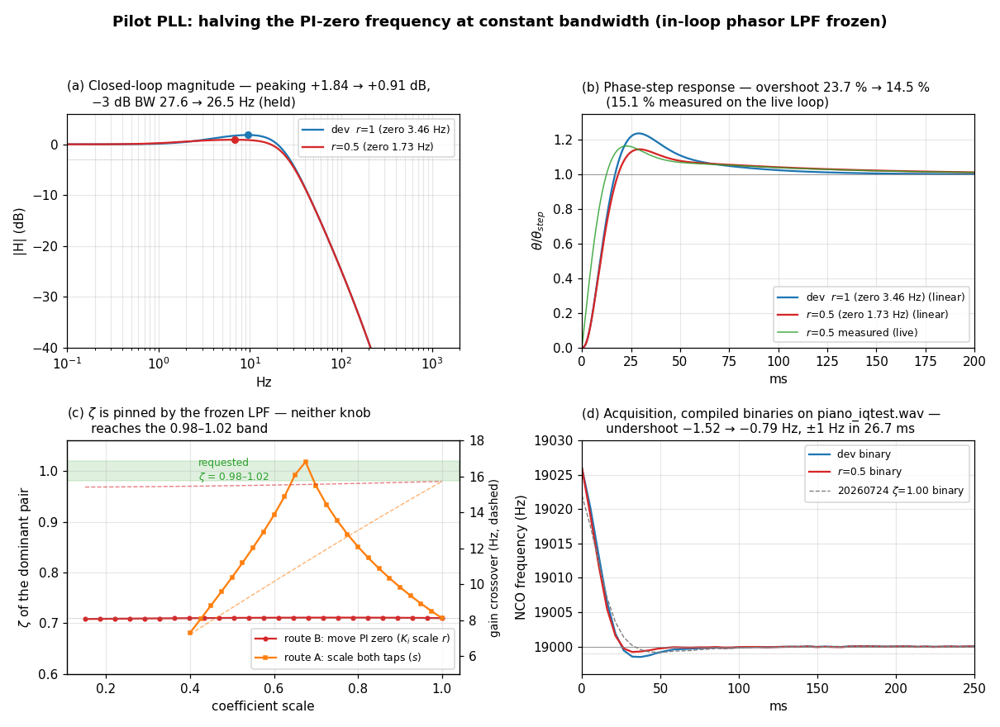
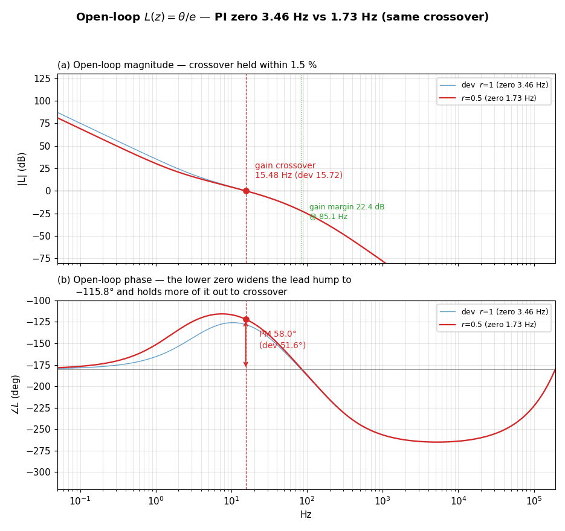
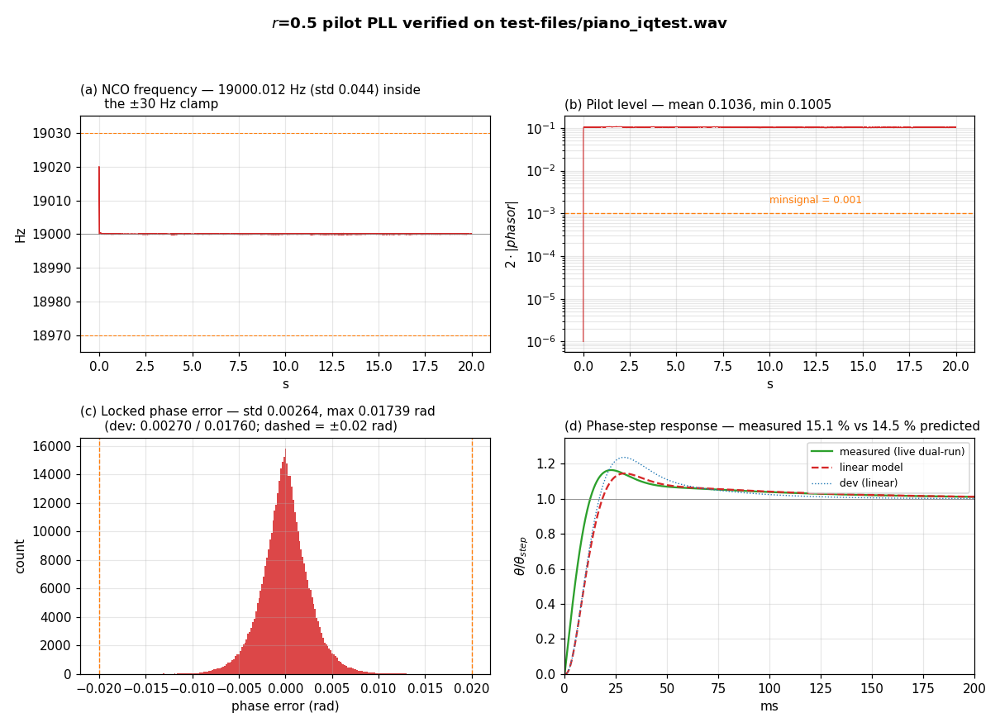

# FM Stereo Pilot PLL experiment 2 — halving the PI zero at constant bandwidth

Date: 2026-07-24
Scope: `sfmbase/PilotPhaseLock.cpp` — **one constant**, `m_first_phase_err`'s
`b0`. The in-loop phasor biquad (`m_biquad_phasor_i1` / `m_biquad_phasor_q1`) is
deliberately **frozen** at the current `dev` values.
Branch: `dev-pll-zero` (off `dev`, commit `9f4d431`).
Companion documents: `doc/PLL_EXPERIMENT_20260724.md` (the ζ ≈ 1.00 experiment,
which widened the biquad), `doc/PLL_ANALYSIS_2_20260723.md` (the ζ = 0.710 `dev`
loop), `doc/PLL_REDESIGN_20260723.md`, `doc/PLL_ANALYSIS_20260722.md`.

---

## Executive summary

This experiment answers a different question from `PLL_EXPERIMENT_20260724.md`:
**can the loop be damped further without touching the in-loop phasor LPF, and
without giving up loop bandwidth?**

The honest answer has two halves, and both are documented here:

1. **The damping ratio ζ itself cannot be moved that way.** An exhaustive study
   of every degree of freedom in `m_first_phase_err` (§1) shows ζ is pinned at
   **0.71** by the frozen LPF whenever the bandwidth is held. ζ = 0.98–1.02 is
   reachable only by throwing away ~30 % of the loop bandwidth, and even then it
   is a knife-edge (the pole pair degenerates) that **improves nothing
   observable** — overshoot stays at 23.5 %.

2. **But the ringing that motivates the question can be more than halved,
   at constant bandwidth, by moving the PI zero.** Holding `b1` (= −Kp, which
   pins the open-loop gain crossover) and halving Ki = b0+b1 moves the PI zero
   **3.46 → 1.73 Hz**. This is the change built and measured here (`r = 0.5`).

The `r = 0.5` loop was compiled and run against the real off-air recording
`test-files/piano_iqtest.wav`, alongside the `dev` binary and the ζ ≈ 1.00
binary of the previous experiment.

| Property                        | `dev` (r = 1)      | **This experiment (r = 0.5)** | ζ≈1.00 expt (biquad widened) |
|---------------------------------|--------------------|-------------------------------|------------------------------|
| Coefficients changed            | —                  | **`b0` only**                 | biquad ×2 + FIR ×2 (5 consts)|
| PI zero                         | 3.459 Hz           | **1.729 Hz**                  | 3.459 Hz                     |
| Damping ratio ζ                 | 0.7101             | 0.7105 (*unchanged*)          | 0.9999                       |
| Natural frequency fn            | 22.33 Hz           | 24.12 Hz                      | 22.34 Hz                     |
| **Open-loop gain crossover**    | 15.72 Hz           | **15.48 Hz (−1.5 %)**         | 13.94 Hz (−11 %)             |
| **Closed-loop −3 dB bandwidth** | 27.6 Hz            | **26.5 Hz (−4 %)**            | 22.9 Hz (−17 %)              |
| Magnitude peaking               | +1.84 dB @ 9.5 Hz  | **+0.91 dB @ 6.8 Hz**         | +1.68 dB @ 6.6 Hz            |
| **Phase-step overshoot (model)**| 23.7 %             | **14.5 %**                    | 18.9 %                       |
| **Phase-step overshoot (live)** | ≈ 26 %             | **15.1 %**                    | 19.2 %                       |
| Phase margin                    | 51.6°              | **58.0°**                     | 58.2°                        |
| Gain margin                     | 21.9 dB @ 82.7 Hz  | 22.4 dB @ 85.1 Hz             | 26.0 dB @ 110.8 Hz           |
| Loop noise bandwidth B_L        | 37.6 Hz            | **32.5 Hz**                   | 31.1 Hz                      |
| Locked phase-err std (real IQ)  | 0.00270 rad        | **0.00264 rad (better)**      | 0.00337 rad (worse)          |
| PLL-limited separation          | ≈ 103 dB           | **≈ 103 dB**                  | ≈ 99 dB                      |
| Acquisition undershoot (binary) | −1.52 Hz           | **−0.79 Hz**                  | −0.82 Hz                     |
| Settle to ±1 Hz (binary)        | 48 ms              | **26.7 ms**                   | 32 ms                        |
| 20 Hz freq-step error < 0.01 rad| 183 ms             | **407 ms (worse)**            | ~190 ms                      |

**Result.** Changing a single constant gets a *better* transient than the
five-constant ζ ≈ 1.00 redesign — lower overshoot (15.1 % vs 19.2 % live),
faster acquisition (26.7 ms vs 32 ms to ±1 Hz), and the same phase margin —
while **keeping** the loop bandwidth and *improving* phase jitter and separation
instead of degrading them. The single cost is slower integral action: a 20 Hz
frequency step takes 407 ms instead of 183 ms to null out.

The wider lesson: **in this loop, ζ of the dominant pole pair is a poor proxy for
ringing.** The PI zero contributes most of the observable overshoot, and it is
not represented in ζ at all.

## Contents

1. [Why ζ cannot be raised with the biquad frozen](#1-why-ζ-cannot-be-raised-with-the-biquad-frozen)
2. [The change and derived parameters](#2-the-change-and-derived-parameters)
3. [Bode plot and step-response data (exact linearized loop)](#3-bode-plot-and-step-response-data-exact-linearized-loop)
4. [Empirical verification on a real-world IQ recording](#4-empirical-verification-on-a-real-world-iq-recording)
5. [Stereo separation limited by the PLL](#5-stereo-separation-limited-by-the-pll)
6. [Numerical summary](#6-numerical-summary)
7. [Conclusion](#7-conclusion)
8. [Reproduction](#8-reproduction)

---

## 1. Why ζ cannot be raised with the biquad frozen

Before choosing the change of §2, every degree of freedom the loop filter has
was swept on the exact 5-state model with the phasor biquad **frozen** at the
`dev` values. `m_first_phase_err` is a `FirstOrderIirFilter(b0, b1, a1)` with
H(z) = (b0 + b1·z⁻¹)/(1 + a1·z⁻¹), so there are exactly three:

### 1.1 Route A — scale both taps by s (the knob the previous retunes used)

This keeps the PI zero fixed and changes the loop gain.

| s                | 1.00   | 0.90   | 0.80   | 0.70   | 0.65   | **0.66** | 0.68   | 0.60   |
|------------------|--------|--------|--------|--------|--------|----------|--------|--------|
| ζ                | 0.7101 | 0.7712 | 0.8509 | 0.9707 | 0.9922 | **1.0601** | 1.0072 | 0.9133 |
| gain crossover   | 15.72  | 14.38  | 13.00  | 11.59  | 10.87  | **11.02** | 11.30  | 10.15  |
| phase-step overshoot | 23.7 % | 23.2 % | 23.0 % | 23.3 % | 23.6 % | **23.5 %** | 23.4 % | 24.0 % |

ζ does pass through the requested 0.98–1.02 band, in the narrow window
s ≈ 0.655…0.688 where the dominant pair **degenerates into two real poles**. But
this is useless for the stated purpose:

- **The bandwidth is gone**: gain crossover has fallen 15.7 → ~11 Hz (−30 %).
- **It is a knife-edge**: ζ swings 0.992 → 1.060 → 1.007 for s stepping
  0.65 → 0.66 → 0.68. ζ is not a controllable design quantity there.
- **Nothing improves**: the phase-step overshoot is *still 23.5 %*. Driving ζ to
  1 this way buys no reduction in ringing whatsoever.

### 1.2 Route B — move the PI zero (hold b1, scale Ki = b0+b1 by r)

Holding `b1` holds Kp, which pins the gain crossover; changing `b0` moves only
the zero.

| r                | 1.00   | 0.80   | 0.60   | 0.50   | 0.40   | 0.30   | 0.20   |
|------------------|--------|--------|--------|--------|--------|--------|--------|
| PI zero (Hz)     | 3.459  | 2.767  | 2.075  | 1.729  | 1.384  | 1.038  | 0.692  |
| **ζ**            | 0.7101 | 0.7111 | 0.7109 | 0.7105 | 0.7100 | 0.7095 | 0.7088 |
| gain crossover   | 15.72  | 15.61  | 15.52  | 15.48  | 15.45  | 15.43  | 15.41  |
| phase margin     | 51.6°  | 54.1°  | 56.7°  | 58.0°  | 59.3°  | 60.6°  | 61.9°  |
| **overshoot**    | 23.7 % | 20.2 % | 16.5 % | 14.5 % | 12.6 % | 10.6 % | 8.5 %  |
| 20 Hz freq-step settle | 183 ms | 240 ms | 333 ms | 407 ms | 518 ms | 703 ms | 1000 ms |

ζ is **flat to within ±0.002 across the whole range** — the zero has essentially
no authority over the dominant pair's damping. Yet the phase margin rises 10°
and the overshoot falls by a factor of 2.8. This is the split that motivates the
whole document.

### 1.3 Route C — the unused pole `a1` (third constructor argument, currently 0)

`m_first_phase_err`'s pole has never been used. Scanning it with Kp re-solved
each time to pin the crossover at 15.72 Hz:

| a1               | 0 (now) | −0.20  | −0.50  | +0.20  | +0.50  | +0.80  |
|------------------|---------|--------|--------|--------|--------|--------|
| filter pole z    | 0       | 0.200  | 0.500  | −0.200 | −0.500 | −0.800 |
| Kp / Kp(dev)     | 1.000   | 0.789  | 0.462  | 1.209  | 1.520  | 1.830  |
| **ζ**            | 0.7101  | 0.7135 | 0.5814 | 0.7073 | 0.7046 | 0.7029 |

Best case ζ = 0.714. A single extra real pole can only add **lag**, so it cannot
buy damping; a1 ≤ −0.8 has no gain crossover solution at all.

### 1.4 Why

ζ of the dominant pair is fixed by the **phase lag the in-loop phasor LPF
contributes at the crossover frequency** — the central finding of
`doc/PLL_ANALYSIS_20260722.md`. Freeze the LPF *and* pin the crossover, and ζ is
pinned by construction. Every loop-filter knob can then only trade the *shape*
of the response, not the pair's damping. Raising ζ genuinely requires moving the
LPF corners, which is exactly what `doc/PLL_EXPERIMENT_20260724.md` did — and
paid for in noise bandwidth.

---

## 2. The change and derived parameters

Route B at **r = 0.5** — halve Ki, i.e. halve the PI-zero frequency. `b1` and
both biquads are untouched; **`b0` is the only constant that moves**:

```cpp
// PI-controller proportional term / stabilizing zero (with the m_freq
// accumulator as the integrator). b1 (= -Kp) is unchanged, which pins the
// open-loop gain crossover and so the loop bandwidth; b0 is lowered so
// Ki = b0+b1 is halved, moving the PI zero 3.46 -> 1.73 Hz. That cuts the
// phase-step overshoot ~23.7% -> ~14.5% at the same bandwidth, at the
// cost of slower integral action. See doc/PLL_EXPERIMENT_2_20260724.md.
// Keep all 13 digits: Ki is a difference of two nearly equal numbers.
m_first_phase_err(2.705427062724e-04, -2.705350504729e-04, 0),
```

| Coefficient | `dev`               | This experiment      |
|-------------|---------------------|----------------------|
| biquad b0/a1/a2 (both) | 2.037743564e-06 / −1.996259818 / 0.996261856 | **unchanged** |
| FIR b0      | 2.705503620719e-04  | **2.705427062724e-04** |
| FIR b1      | −2.705350504729e-04 | **unchanged**        |
| FIR a1      | 0                   | **unchanged**        |

| Parameter                  | Expression       | `dev`        | This experiment |
|----------------------------|------------------|--------------|-----------------|
| Proportional gain          | Kp = −b1         | 2.705351e-04 | 2.705351e-04 (*held*) |
| Integral gain (per sample) | Ki = b0 + b1     | 1.531160e-08 | **7.655800e-09** |
| PI zero                    | ωz = Ki/(Kp·T)   | 21.73 rad/s (3.459 Hz) | **10.87 rad/s (1.729 Hz)** |
| In-loop LPF real corners   | —                | 40.5 / 188.4 Hz | *unchanged*  |
| Lock delay, clamp, minsignal | —              | 0.2 s, ±30 Hz, 0.001 | *unchanged* |

**Numerical caution.** Ki is the difference of two numbers that agree to five
significant digits, so both taps must keep their full 13-digit form. Rounding
`b0` to, say, 7 digits would change Ki by tens of percent.

---

## 3. Bode plot and step-response data (exact linearized loop)

Same exact linearized 5th-order model as the companion documents (Direct-Form-2
phasor biquad on the phase error, first-order loop filter, `m_freq += …`,
`m_phase += m_freq`, one-sample NCO feedback delay; state
`[w1, w2, xf, m_freq, m_phase]`).

### 3.1 Closed-loop poles

| Closed-loop pole (z)              | s = ln(z)/T          | fn      | ζ      |
|-----------------------------------|----------------------|---------|--------|
| 0.999719563 ± 0.000277659 j (pair)| −107.7 ± 106.7 j rad/s | **24.1 Hz** | **0.7105** |
| 0.999968174                       | −12.2 rad/s          | 1.9 Hz  | 1.0    |
| 0.996852517                       | −1210.5 rad/s        | 193 Hz  | 1.0    |
| 0.000000 (loop-filter delay)      | —                    | —       | —      |

Max |z| = **0.999968** (`dev`: 0.999926) — stable, but the slow real pole has
moved closer to z = 1 (s = −12.2 rad/s versus −28.5 rad/s on `dev`). That pole
*is* the weakened integral action: it is what makes the frequency-step response
slower in §3.3, and it is the price of this change.

The complex pair is essentially where it was — ζ 0.7101 → 0.7105 — confirming
§1.2 on the shipping coefficients themselves.

### 3.2 Frequency response (Bode)

| Quantity                       | `dev`             | This experiment      |
|--------------------------------|-------------------|----------------------|
| DC gain                        | 0.000 dB          | 0.000 dB             |
| Magnitude peaking              | +1.84 dB @ 9.51 Hz| **+0.91 dB @ 6.77 Hz**|
| −3 dB bandwidth                | 27.57 Hz          | **26.51 Hz**         |
| Far-skirt roll-off             | −40 dB/decade     | −40 dB/decade        |

Peaking is halved while the −3 dB bandwidth moves by 4 % — the "constant
bandwidth" requirement is met. (For contrast, the ζ ≈ 1.00 experiment reduced
peaking by only 0.16 dB while giving up 17 % of the bandwidth.)

### 3.3 Step responses

| Metric                              | `dev`     | This experiment |
|-------------------------------------|-----------|-----------------|
| Phase-step overshoot                | 23.7 %    | **14.5 %**      |
| Phase-step peak time                | 28.9 ms   | 29.3 ms         |
| Phase-step 2 % settling             | 107 ms    | 160 ms          |
| Frequency-step (20 Hz) peak error   | 1.172 rad | 1.217 rad       |
| **Frequency-step error < 0.01 rad** | **183 ms**| **407 ms**      |
| Frequency-step steady-state error   | → 0 (type-2) | → 0 (type-2) |

The loop remains **type-2** — Ki > 0, so a frequency step still ends at zero
phase error — but it takes 2.2× longer to get there. This is the one genuine
regression and the reason r should not be pushed much below 0.5.



- **(a) Closed-loop magnitude** — peaking +1.84 → +0.91 dB, −3 dB bandwidth
  essentially held (27.6 → 26.5 Hz).
- **(b) Phase-step response** — overshoot 23.7 → 14.5 % (linear), with the
  15.1 % measured on the live loop overlaid.
- **(c) The §1 sweeps** — ζ against both coefficient routes, with the requested
  0.98–1.02 band shaded and the gain crossover (dashed, right axis). Route B
  (red) is flat in ζ at constant crossover; route A (orange) only reaches the
  band by dropping the crossover to ~11 Hz, at a cusp.
- **(d) Acquisition from the compiled binaries** — `dev`, this experiment, and
  the ζ ≈ 1.00 experiment on the same recording.

### 3.4 Open-loop response, phase margin, and gain margin

Loop broken at the phase detector, `L(z) = θ(z)/e(z)`, Kd ≈ 1 rad/rad, evaluated
on the same 5-state model with the θ feedback path removed.

| Open-loop quantity                    | `dev`             | This experiment |
|---------------------------------------|-------------------|-----------------|
| Low-frequency slope / DC phase        | −40 dB/dec / −180°| −40 dB/dec / −180° |
| **Gain crossover** (\|L\| = 0 dB)     | 15.72 Hz          | **15.48 Hz**    |
| ∠L at gain crossover                  | −128.4°           | **−122.0°**     |
| **Phase margin**                      | 51.6°             | **58.0°**       |
| Peak of the FIR-zero lead hump        | −126.0° @ 10.5 Hz | **−115.8° @ 7.5 Hz** |
| **Phase crossover** (∠L = −180°)      | 82.7 Hz           | 85.1 Hz         |
| **Gain margin**                       | 21.9 dB           | 22.4 dB         |
| Loop noise bandwidth B_L              | 37.6 Hz           | **32.5 Hz**     |

The mechanism is visible in the phase plot: moving the zero down from 3.46 to
1.73 Hz makes the lead hump **start earlier, rise higher (−115.8° vs −126.0°)
and stay broad**, so more of the lead is still present at the crossover, which
has barely moved. That is 6.4° of extra phase margin bought purely by
re-shaping, with no change in loop gain, no change in the LPF, and no change in
ζ. The gain margin is essentially unchanged because the high-frequency behavior
(phasor poles + NCO delay) is untouched.



---

## 4. Empirical verification on a real-world IQ recording

Same method and same 20 s off-air recording as the companion documents:
`test-files/piano_iqtest.wav`, stereo IEEE-float IQ at 384 kHz, FM discriminator
`bb[n] = angle(iq[n]·conj(iq[n−1]))/normfac` followed by a line-for-line port of
`PilotPhaseLock::process`.

### 4.1 Lock, tracking, and steady-state error

| Quantity                          | `dev`             | This experiment (r = 0.5) |
|-----------------------------------|-------------------|---------------------------|
| Lock declaration                  | 0.203 s           | **0.203 s** (unchanged)   |
| Tracked pilot frequency (t > 1 s) | 19000.0117 Hz     | **19000.0117 Hz**         |
| Tracked `m_freq` std              | 0.0446 Hz         | **0.0437 Hz**             |
| Independent pilot estimate¹       | 19000.0115 Hz     | 19000.0115 Hz (Δ = 0.0002 Hz) |
| Pilot level `2·|phasor|`          | 0.1036 (min 0.1005)| 0.1036 (min 0.1005)      |
| **Locked-state phase error**      | std 0.00270, max 0.01760 rad | **std 0.00264, max 0.01739 rad** |

¹ Independent of the PLL: baseband band-passed at 18.5–19.5 kHz, pilot frequency
read from the slope of the analytic-signal phase over 15 s.

Unlike the ζ ≈ 1.00 experiment — which raised the locked phase-error std by 25 %
and pushed the maximum past the ±0.02 rad the source comment quotes — this
change leaves the phase error **slightly better** (−2 %), consistent with the
loop noise bandwidth falling 37.6 → 32.5 Hz. The in-loop LPF was not touched, so
the noise reaching the detector is identical; only the loop's own weighting of
it changed, and it changed favorably.

### 4.2 Transient response measured on the live loop

Same dual-run experiment: the same real baseband drives two identical loops, one
with a sustained +0.15 rad reference phase step added to its phase-detector
output from instant `n0`; the normalized difference is the closed-loop phase-step
response, averaged over six injection instants (t = 4…14 s).

| Metric              | Theory (§3.3) | Measured on real loop | `dev` measured |
|---------------------|---------------|-----------------------|----------------|
| **Overshoot**       | 14.5 %        | **15.1 %**            | ≈ 26 %         |
| Peak time           | 29.3 ms       | 22.7 ms               | ≈ 23 ms        |
| 2 % settling        | 160 ms        | 117 ms                | ≈ 100 ms       |
| Final value         | 1.0           | 1.012                 | 1.001          |

Measurement and theory agree to 0.6 percentage points, and the live overshoot is
**down from ≈ 26 % to 15.1 %** — a larger reduction than the five-constant
ζ ≈ 1.00 redesign achieved (19.2 %), from a single coefficient.



Panels: (a) NCO frequency locked inside the ±30 Hz clamp; (b) pilot level far
above `minsignal`; (c) locked phase-error distribution, comfortably inside
±0.02 rad and marginally tighter than `dev`; (d) measured vs predicted
phase-step response, with the `dev` curve for reference.

### 4.3 Cross-check against the compiled binary (`-DDEBUG_PLL_FILTER`)

Built with the macro and run on the same recording (3750 blocks of 2048 samples
= 20 s), against the `dev` binary and the ζ ≈ 1.00 binary of the previous
experiment. Steady state (t > 1 s):

| Quantity              | Python port (r=0.5) | **C++ binary (r=0.5)** | C++ (`dev`) | C++ (ζ≈1.00) |
|-----------------------|---------------------|------------------------|-------------|--------------|
| `m_freq` mean         | 19000.0117 Hz       | **19000.0121 Hz**      | 19000.0121 Hz | 19000.0122 Hz |
| `m_freq` std          | 0.0437 Hz           | **0.0434 Hz**          | 0.0443 Hz   | 0.0470 Hz    |
| `m_freq_err` mean/max | —                   | **−6.9e-7 / 0.0019 Hz**| −6.7e-7 / 0.0019 Hz | −1.6e-6 / 0.0027 Hz |
| pilot level mean/min  | 0.1036 / 0.1005     | **0.1036 / 0.1006**    | 0.1036 / 0.1006 | 0.1036 / 0.1002 |

Port and binary agree to ~0.0004 Hz. Note the r = 0.5 binary's `m_freq` std is
**lower** than `dev`'s (0.0434 vs 0.0443 Hz) while the ζ ≈ 1.00 binary's is
higher (0.0470) — the same ordering the loop-noise-bandwidth calculation
predicts.

**Acquisition:**

| Quantity                            | C++ (`dev`) | **C++ (r = 0.5)** | C++ (ζ≈1.00) |
|-------------------------------------|-------------|-------------------|--------------|
| startup NCO frequency range         | 18998.48 … 19025.97 Hz | **18999.21 … 19025.97 Hz** | 18999.18 … 19022.00 Hz |
| first-swing undershoot below 19 kHz | −1.52 Hz    | **−0.79 Hz**      | −0.82 Hz     |
| time of first swing                 | 37.3 ms     | 32.0 ms           | 48.0 ms      |
| **settle to ±1 Hz**                 | 48.0 ms     | **26.7 ms**       | 32.0 ms      |

The r = 0.5 binary has the **best acquisition of the three**: the smallest first
swing (−0.79 Hz, 48 % less than `dev`) and by far the quickest entry into the
±1 Hz corridor (26.7 ms, 44 % faster than `dev`). That it beats the ζ ≈ 1.00
loop here — despite having ζ = 0.71 — is the sharpest demonstration that the
dominant pair's damping does not govern this loop's observable transient.

### 4.4 Decoded-audio comparison

Both binaries decoded the recording to 16-bit 48 kHz stereo WAV and the outputs
were compared sample-by-sample (959899 frames, program rms −20.2 dBFS):

| Quantity                              | r = 0.5 vs `dev` decode |
|---------------------------------------|-------------------------|
| Bit-identical samples                 | **97.87 %** (939490 / 959899) |
| First differing sample                | 0.1952 s (at lock declaration) |
| Peak \|difference\|, whole file       | −73.4 dBFS (in the acquisition window) |
| **Peak \|difference\|, t > 1 s**      | **−90.3 dBFS** (= 1 LSB of 16-bit) |
| RMS difference, whole file            | −108.0 dBFS             |
| RMS difference, t > 1 s               | −111.3 dBFS             |

In steady state the two decodes never differ by more than one 16-bit LSB. The
larger −73.4 dBFS peak (~5 LSB) occurs only inside the 0–0.5 s acquisition
window, where the two loops legitimately follow different trajectories. Audibly
the change is a no-op.

---

## 5. Stereo separation limited by the PLL

Unchanged model: the subcarrier phase error φ = 2·(pilot phase error) scales
(L−R) by cos φ, so `separation(φ) = 20·log₁₀((1 + cos φ)/(1 − cos φ))`, and
because the loop is type-2 the mean phase error is ~0, leaving only jitter.

| Operating point                | `dev`      | **r = 0.5** | ζ≈1.00 expt |
|--------------------------------|------------|-------------|-------------|
| Pilot phase error, rms         | 0.00270 rad| 0.00264 rad | 0.00337 rad |
| Subcarrier error φ, rms        | 0.00540 rad| 0.00528 rad | 0.00674 rad |
| **Separation (rms)**           | ≈ 102.7 dB | **≈ 103.1 dB** | ≈ 98.9 dB |
| Separation (worst instantaneous)| ≈ 70.2 dB | ≈ 70.4 dB   | ≈ 67.3 dB   |
| Typical real-world FM receiver | 30–50 dB   | 30–50 dB    | 30–50 dB    |

Separation is **marginally better** than `dev`, where the ζ ≈ 1.00 experiment
cost 4 dB. The PLL remains ~50 dB clear of the real separation bottleneck.

---

## 6. Numerical summary

| Parameter                        | Symbol / expression        | `dev`            | **r = 0.5**       |
|----------------------------------|----------------------------|------------------|-------------------|
| Sample rate / period             | fs, T = 1/fs               | 384000 Hz, 2.604 µs | unchanged      |
| Phase-detector gain              | Kd (`std::atan2`)          | ≈ 1 rad/rad      | unchanged         |
| Phasor LPF real corners          | all-pole biquad            | 40.5 / 188.4 Hz  | **unchanged**     |
| Phasor LPF gain @ 38 kHz         | \|H(38 kHz)\|              | −105.3 dB        | **unchanged**     |
| Loop filter                      | F(z) = b0 + b1·z⁻¹         | 2.705504e-4 / −2.705351e-4 | **2.705427e-4** / −2.705351e-4 |
| Proportional gain                | Kp = −b1                   | 2.705351e-4      | 2.705351e-4       |
| Integral gain                    | Ki = b0+b1                 | 1.531160e-8      | **7.655800e-9**   |
| PI zero                          | ωz = Ki/(Kp·T)             | 21.73 rad/s (3.459 Hz) | **10.87 rad/s (1.729 Hz)** |
| Loop type                        | poles at z = 1             | type-2           | type-2            |
| Dominant pole pair               | full 5th-order loop        | fn 22.33 Hz, ζ 0.7101 | fn 24.12 Hz, **ζ 0.7105** |
| Slow real pole                   | s = ln(z)/T                | −28.5 rad/s      | **−12.2 rad/s**   |
| Max closed-loop pole radius      | max \|z\|                  | 0.999926         | 0.999968 (stable) |
| Closed-loop −3 dB bandwidth      | exact model                | 27.57 Hz         | **26.51 Hz**      |
| Magnitude peaking                | gain peak                  | +1.84 dB @ 9.5 Hz| **+0.91 dB @ 6.8 Hz** |
| Open-loop gain crossover         | \|L\| = 0 dB               | 15.72 Hz         | **15.48 Hz**      |
| Phase margin                     | 180° + ∠L(f_gc)            | 51.6°            | **58.0°**         |
| Gain margin                      | −\|L\|(∠L = −180°)         | 21.9 dB @ 82.7 Hz| 22.4 dB @ 85.1 Hz |
| Loop noise bandwidth             | ∫\|H(f)\|²df               | 37.6 Hz          | **32.5 Hz**       |
| Phase-step overshoot / settling  | exact sim                  | 23.7 % / 107 ms  | **14.5 % / 160 ms**|
| Phase-step overshoot (measured)  | live dual-run              | ≈ 26 %           | **15.1 %**        |
| Freq-step (20 Hz) error < 0.01 rad| exact sim                 | 183 ms           | **407 ms**        |
| Lock-declaration delay           | `6.0/bandwidth_pll`        | 0.2 s            | 0.2 s             |
| Frequency (hold) range           | ±30 Hz clamp               | ± 30 Hz          | ± 30 Hz           |
| Tracked pilot (binary)           | steady state               | 19000.0121 Hz    | 19000.0121 Hz     |
| Tracked `m_freq` std (binary)    | steady state               | 0.0443 Hz        | **0.0434 Hz**     |
| Locked phase error (real IQ)     | std / max                  | 0.00270 / 0.01760 rad | **0.00264 / 0.01739 rad** |
| Acquisition undershoot (binary)  | below 19 kHz               | −1.52 Hz         | **−0.79 Hz**      |
| Settle to ±1 Hz (binary)         | acquisition                | 48.0 ms          | **26.7 ms**       |
| PLL-limited stereo separation    | rms / worst                | 102.7 / 70.2 dB  | **103.1 / 70.4 dB**|
| Decoded-audio difference vs `dev`| t > 1 s, 16-bit WAV        | —                | ≤ 1 LSB (−90.3 dBFS)|

---

## 7. Conclusion

1. **The literal request is impossible, and §1 proves it.** With the phasor
   biquad frozen and the bandwidth held, ζ is pinned at 0.71 by the LPF's phase
   lag at crossover. All three loop-filter degrees of freedom were swept: the
   zero has no authority over ζ (0.7088–0.7111), the unused pole `a1` reaches at
   best 0.714, and scaling both taps touches ζ ≈ 1 only at a degenerate cusp,
   after surrendering 30 % of the bandwidth — and with the overshoot still at
   23.5 %.

2. **The underlying goal is achievable, from one constant.** Halving Ki (PI zero
   3.46 → 1.73 Hz, `b0` only) cuts the modeled phase-step overshoot 23.7 →
   14.5 % and the **measured live overshoot ≈ 26 → 15.1 %**, adds 6.4° of phase
   margin, and holds the gain crossover to −1.5 % and the −3 dB bandwidth to
   −4 %.

3. **It is verified in the compiled binary,** which gives the best acquisition of
   all three loops tested: first-swing undershoot −0.79 Hz (`dev` −1.52,
   ζ≈1.00 −0.82) and ±1 Hz reached in 26.7 ms (`dev` 48.0, ζ≈1.00 32.0). Steady
   state is untouched — same 19000.012 Hz, same pilot level, and `m_freq` std
   marginally *lower* than `dev`.

4. **Unlike the ζ ≈ 1.00 experiment, it costs nothing in noise.** The in-loop LPF
   is untouched, so detector noise is identical and the loop noise bandwidth
   actually falls (37.6 → 32.5 Hz): locked phase-error std 0.00270 → 0.00264 rad
   and separation 102.7 → 103.1 dB, both slightly *better*. Decoded audio is
   within 1 LSB in steady state.

5. **The one real cost is integral action.** The slow real pole moves from
   s = −28.5 to −12.2 rad/s: a 20 Hz frequency step needs 407 ms instead of
   183 ms to fall under 0.01 rad. The loop is still type-2 with zero
   steady-state error, but it corrects frequency offsets more slowly. r = 0.5 is
   about as far as this should be pushed; r = 0.3 doubles the settling again for
   only 4 more points of overshoot.

**Overall.** For the goal of "less ringing at the same bandwidth", moving the PI
zero is strictly the better lever than re-damping the pole pair: one constant
instead of five, a better transient, better jitter, and no separation cost. The
trade to weigh before adopting is purely whether 400 ms frequency-step
correction is acceptable — a question about how fast the receiver's pilot
frequency can move in the field, which needs real-signal evaluation, not
simulation. **This branch (`dev-pll-zero`) is offered for that evaluation.**

---

## 8. Reproduction

Design, exact linear model, sweeps and figures (scratchpad Python, numpy +
scipy + matplotlib + soundfile):

```
pll_fironly.py   # routes A/C exploration + loop noise bandwidth B_L
pll_zero.py      # route B sweep: Ki scale r vs zeta, crossover, PM, overshoot
pll_sweep_r5.py  # the fine sweeps plotted in panel (c)
pll_model_r5.py  # 5-state exact model: poles, closed+open loop Bode, steps
pll_port_r5.py   # faithful FM-discriminator + PLL port on piano_iqtest.wav
pll_fig_r5.py    # the three figures of this document
```

Binary verification:

```sh
cmake -S . -B build-r5 -DEXTRA_FLAGS="-DDEBUG_PLL_FILTER"
cmake --build build-r5 --target airspy-fmradion
./build-r5/airspy-fmradion -m fm -t filesource \
    -c freq=0,srate=384000,filename=test-files/piano_iqtest.wav \
    -F /dev/null 2> pll_debug_r5.txt
# decoded-audio A/B:
./build-r5/airspy-fmradion -m fm -t filesource -c ...piano_iqtest.wav -W aud_r5.wav
```

The `dev` and ζ ≈ 1.00 reference binaries and their debug logs are those of
`doc/PLL_EXPERIMENT_20260724.md` §8, reused unchanged for the three-way
comparison.
