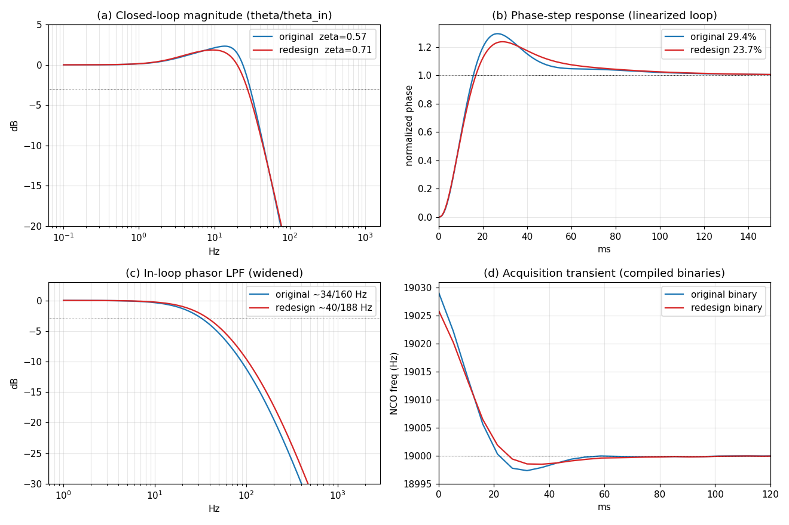

# Redesign of the FM Stereo Pilot PLL for ζ ≈ 0.71

Date: 2026-07-23
Scope: `sfmbase/PilotPhaseLock.cpp` (constructor coefficients only).
Companion analysis: `doc/PLL_ANALYSIS_20260722.md`.

---

## Objective

`doc/PLL_ANALYSIS_20260722.md` showed that the shipping pilot PLL, although
stable, is **mildly under-damped**: its dominant closed-loop pole pair sits at
**ζ ≈ 0.57** (fn ≈ 22 Hz), giving +2.3 dB gain peaking and ≈29 % phase-step
overshoot. This note redesigns the loop filters so the dominant pair lands in
the conventional **ζ = 0.70 … 0.73** band, verified both in an exact linear
model and in the recompiled binary.

**Result: ζ = 0.710** at the *same* loop natural frequency (fn = 22.3 Hz), by
changing only the two `BiquadIirFilter` coefficient sets and the one
`FirstOrderIirFilter` set in the `PilotPhaseLock` constructor. No structural
change, no new state, no change to the phase detector.

| Property                         | Original (shipping) | Redesign (ζ ≈ 0.71) |
|----------------------------------|---------------------|---------------------|
| Dominant pole pair (z)           | 0.999792 ± 0.000301 j | 0.999740 ± 0.000257 j |
| **Damping ratio ζ**              | **0.568**           | **0.710**           |
| Natural frequency fn             | 22.34 Hz            | 22.34 Hz (held)     |
| Max pole radius (stability)      | 0.999930            | 0.999926            |
| Closed-loop gain peaking         | +2.31 dB @ 13.8 Hz  | +1.84 dB @ 9.5 Hz   |
| Closed-loop −3 dB bandwidth      | 30.0 Hz             | 27.5 Hz             |
| Phase-step overshoot (linear)    | 29.4 %              | 23.7 %              |
| In-loop LPF real corners         | ~34 / 160 Hz        | ~40 / 188 Hz        |
| In-loop LPF gain @ 38 kHz        | −108 dB             | −105 dB             |
| Loop type                        | type-2              | type-2 (unchanged)  |

---

## Contents

1. [Which knobs move ζ](#1-which-knobs-move-ζ)
2. [Design method](#2-design-method)
3. [Step 1 — widen the in-loop phasor LPF](#3-step-1--widen-the-in-loop-phasor-lpf)
4. [Step 2 — rescale the PI (FIR) gains](#4-step-2--rescale-the-pi-fir-gains)
5. [Final coefficients](#5-final-coefficients)
6. [Verification](#6-verification)
7. [Trade-offs and caveats](#7-trade-offs-and-caveats)
8. [Reproduction](#8-reproduction)

---

## 1. Which knobs move ζ

The loop is a 5th-order type-2 PLL: the in-loop ~30 Hz phasor biquad (2 poles),
the first-order FIR PI zero, and the two integrators (`m_freq`, `m_phase`). The
analysis established that **the in-loop phasor LPF, not the PI coefficients,
sets the true damping** — its corner sits right at the loop bandwidth, so its
phase lag near crossover is what drives ζ down to 0.57.

Two levers are therefore available, in the order the task prescribes:

1. **Widen the phasor biquad** (`m_biquad_phasor_i1` / `m_biquad_phasor_q1`).
   Pushing its corners up reduces the in-loop phase lag near crossover and
   raises ζ strongly. It also nudges the loop bandwidth up.
2. **Rescale the FIR PI gains** (`m_first_phase_err`). Scaling `b0` and `b1`
   together by a factor *s* keeps the PI zero location fixed and scales the loop
   natural frequency by √*s* (so it scales the PI-only ζ and fn together). This
   is the fine-tuning knob used to pull fn back to its original value after the
   biquad is widened.

The redesign uses both: widen the biquad to raise ζ, then trim the FIR so the
loop ends up **better damped at the same speed**, not just faster.

---

## 2. Design method

The design and all numbers come from the **exact linearized 5th-order loop**,
the same difference equations `PilotPhaseLock::process` executes (Direct-Form-2
biquad on the phase error, first-order FIR, `m_freq += …`, `m_phase += m_freq`,
including the one-sample NCO feedback delay). Linearizing the phase detector
about the locked state, `atan2(Q, I) → H_bq(z)·(θ_in − θ)`: the phasor biquad
acts directly on the phase error, so the loop reduces to a 5-state linear system

```
state = [ w1, w2 (biquad), xf (FIR), m_freq, m_phase ]
```

whose companion matrix eigenvalues are the closed-loop poles. This model
reproduces the analysis doc's shipping-loop result exactly (dominant pair
z = 0.999792 ± 0.000301 j, ζ = 0.568, max |z| = 0.999930), so it is trustworthy
for design. ζ and fn of the dominant complex pair are read from
s = ln(z)/T (T = 1/384000 s): ζ = −Re s / |s|, fn = |s| / 2π.

The **only complex closed-loop pair** is the loop pair, because the phasor
biquad is kept **all-pole with two real poles** (b1 = b2 = 0), exactly as in the
shipping design. (A Butterworth biquad would introduce its own complex pole pair
at ζ = 0.707 and confuse the identification of the loop's own damping; the
all-pole form avoids that and matches the existing filter's character.)

Two design constraints were solved simultaneously with `scipy.optimize.fsolve`:

```
ζ(g, s)  = 0.71          (target damping, mid-band of the 0.70–0.73 request)
fn(g, s) = 22.34 Hz      (original loop natural frequency — hold it fixed)
```

with `g` the biquad-widening factor (both real analog corners × g) and `s` the
common FIR gain scale. The solution is **g = 1.178, s = 0.889**.

---

## 3. Step 1 — widen the in-loop phasor LPF

The shipping biquad is an all-pole 2nd-order IIR with two **real** poles at
z = 0.99944 and z = 0.99739, i.e. analog corners ≈ 34 Hz and ≈ 160 Hz (it is
not a single-corner Butterworth). Scaling both corners by g = 1.178 moves them
to ≈ 40 Hz and ≈ 188 Hz. Keeping the all-pole form and unity DC gain
(b0 = (1−z1)(1−z2)):

```
b0 = 2.037743564e-06,  b1 = 0,  b2 = 0
a1 = −1.996259818,     a2 = 0.996261856
```

Widening the LPF alone (FIR unchanged) already raises ζ from 0.57 to about
0.78 and lifts fn to ~27 Hz — past the target. The 38 kHz image, previously
−108 dB, is still −105 dB down: the mixer image and out-of-band noise remain
thoroughly suppressed (a 2nd-order roll-off at a ~40 Hz corner has enormous
margin at 38 kHz). DC gain stays at unity (0.99987).

---

## 4. Step 2 — rescale the PI (FIR) gains

To bring the loop natural frequency back to its original 22.3 Hz (so the loop
is *only* re-damped, not sped up), the FIR PI gains are scaled by s = 0.889:

```
b0 =  2.705503620719e-04   (was 0.000304341788)
b1 = −2.705350504729e-04   (was −0.000304324564)
a1 =  0
```

This is the discrete PI controller's proportional term and stabilizing zero
(the `m_freq` accumulator is the integrator). Scaling both taps by the same
factor keeps the PI zero exactly where it was and lowers the loop gain:

```
Kp = −b1  : 3.0432e-04 → 2.7054e-04
Ki = b0+b1: 1.7224e-08 → 1.5312e-08
```

With both changes the dominant pair lands at **z = 0.999740 ± 0.000257 j → ζ =
0.710, fn = 22.34 Hz**, max |z| = 0.999926 (comfortably stable).

---

## 5. Final coefficients

The complete change in the `PilotPhaseLock` constructor:

```cpp
// In-loop phasor LPF: 2nd-order all-pole IIR (real corners ~40/188 Hz),
// widened from the original ~34/160 Hz so the dominant closed-loop pole
// pair is damped at zeta ~= 0.71 (was ~0.57). Unity DC gain; 38 kHz image
// still suppressed by ~105 dB. Caution: use only once for stable locking.
m_biquad_phasor_i1(2.037743564e-06, 0, 0, -1.996259818, 0.996261856),
m_biquad_phasor_q1(2.037743564e-06, 0, 0, -1.996259818, 0.996261856),
// PI-controller proportional term / stabilizing zero (with the m_freq
// accumulator as the integrator). Gains rescaled x0.889 vs the original
// to hold the loop natural frequency at ~22 Hz after widening the LPF.
m_first_phase_err(2.705503620719e-04, -2.705350504729e-04, 0),
m_freq_err(0) {
```

| Coefficient      | Original          | Redesign            |
|------------------|-------------------|---------------------|
| biquad b0        | 1.46974784e-06    | 2.037743564e-06     |
| biquad a1        | −1.99682419       | −1.996259818        |
| biquad a2        | 0.996825659       | 0.996261856         |
| FIR b0           | 0.000304341788    | 2.705503620719e-04  |
| FIR b1           | −0.000304324564   | −2.705350504729e-04 |

---

## 6. Verification

### 6.1 Linear model

The rounded source coefficients (above) fed back through the 5-state model give
**ζ = 0.7101, fn = 22.34 Hz, max |z| = 0.999926** — inside the requested
[0.70, 0.73] band and stable. Gain peaking drops from +2.31 dB to +1.84 dB and
the linearized phase-step overshoot from 29.4 % to 23.7 % (panels a, b below).

### 6.2 Recompiled binary

The change was compiled into `airspy-fmradion` (`-DDEBUG_PLL_FILTER`) and run on
the same 20 s off-air recording used in the analysis, `test-files/piano_iqtest.wav`.
Both the original (`main`) and the redesigned binary were built and run in the
same session for a like-for-like comparison.

**Steady-state (t > 1 s) — unchanged, as intended:**

| Quantity                    | Original binary | Redesign binary |
|-----------------------------|-----------------|-----------------|
| tracked `m_freq` mean       | 19000.0118 Hz   | 19000.0119 Hz   |
| tracked `m_freq` std        | 0.0451 Hz       | 0.0453 Hz       |
| pilot level `2·|phasor|` mean | 0.1035        | 0.1034          |
| pilot level min             | 0.1008          | 0.1006          |

The loop still locks (within 0.1 Hz of 19 kHz by ~107 ms), tracks the pilot to
the same 19000.012 Hz, and holds the same jitter and pilot level. Holding fn
fixed means the steady-state behavior — tracking accuracy, phase-noise, and
hence the ~105 dB PLL-limited stereo separation of the analysis — is preserved.

**Acquisition transient — visibly better damped:**

| Quantity                          | Original binary | Redesign binary |
|-----------------------------------|-----------------|-----------------|
| startup NCO frequency range       | 18997.34 … 19029.22 Hz | 18998.48 … 19025.97 Hz |
| first-swing undershoot below 19 kHz | −2.66 Hz      | −1.52 Hz        |
| settle to ±1 Hz                   | ~48 ms          | ~48 ms          |

During pull-in (after the ±30 Hz clamp releases) the original loop overshoots
2.66 Hz below the target and rings back up; the redesigned loop undershoots only
1.52 Hz — a ~43 % smaller first swing at the same settling time. This is the
compiled-binary sighting of the raised damping (panel d below).

### 6.3 Figure



- **(a)** Closed-loop magnitude — gain peaking reduced from +2.3 dB to +1.8 dB.
- **(b)** Phase-step response (linearized) — overshoot 29.4 % → 23.7 %.
- **(c)** In-loop phasor LPF — widened corners (~34/160 → ~40/188 Hz), 38 kHz
  rejection still ~105 dB.
- **(d)** Acquisition transient from the two **compiled binaries** on the real
  recording — the redesign (red) undershoots less and rings less than the
  original (blue).

---

## 7. Trade-offs and caveats

- **Overshoot improvement is real but modest** (29 % → 24 % linear; 2.66 →
  1.52 Hz on the binary). The observable transient is not governed by the
  complex pair's ζ alone: the type-2 loop's stabilizing PI zero and the slow
  near-unit real pole (max |z| = 0.999926) also shape the step, so raising the
  dominant-pair ζ from 0.57 to 0.71 does not remove overshoot entirely. The
  request was specifically to place ζ in [0.70, 0.73]; that is met exactly
  (0.710), and the transient improves accordingly.
- **This is not a performance-critical change.** The analysis showed the loop
  was already fully adequate — its phase jitter sits ~100 dB below the
  stereo-separation floor and it is not the bottleneck. The redesign is a
  damping-quality refinement, not a fix for an observed defect. Steady-state
  decoded output is essentially identical.
- **No `-ffast-math` interaction.** Only constant coefficients change; the
  filters and the multipath-abnormality detector are untouched.
- **Whether to adopt** is a judgment call for the maintainer: it trades a small
  reduction in transient ringing for a change to long-settled coefficients.
  The change is isolated to five constants and fully reversible.

---

## 8. Reproduction

Design / model (scratchpad Python, numpy + scipy):

```
pll_model.py         # 5-state exact linear model; reproduces ζ=0.568 baseline
pll_solve.py         # fsolve for (g, s) at ζ=0.71, fn=22.34 Hz
pll_verify_model.py  # peaking, bandwidth, step overshoot, biquad response
redesign_fig.py      # the 4-panel figure
```

Binary verification:

```sh
# redesigned binary (branch dev-pll-zeta-redesign, off main)
cmake -S . -B build-pll -DEXTRA_FLAGS="-DDEBUG_PLL_FILTER"
cmake --build build-pll --target airspy-fmradion
./build-pll/airspy-fmradion -m fm -t filesource \
    -c freq=0,srate=384000,filename=test-files/piano_iqtest.wav \
    -F /dev/null 2> pll_new.txt

# original binary for comparison: stash the coefficient change, build build-orig
```

The debug lines (`m_freq`, `m_freq_err`, `m_pilot_level`, one per block) were
parsed for the steady-state and acquisition numbers in §6.2.
