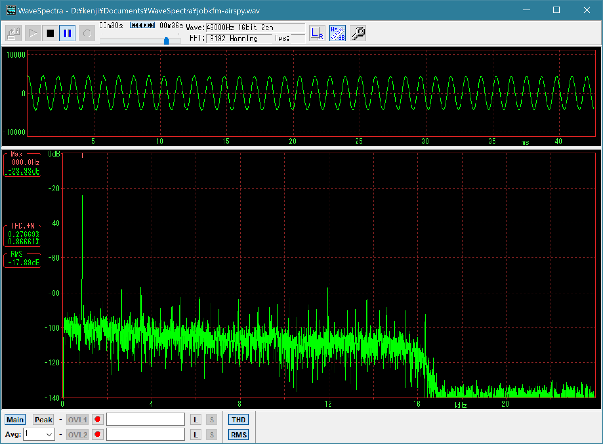
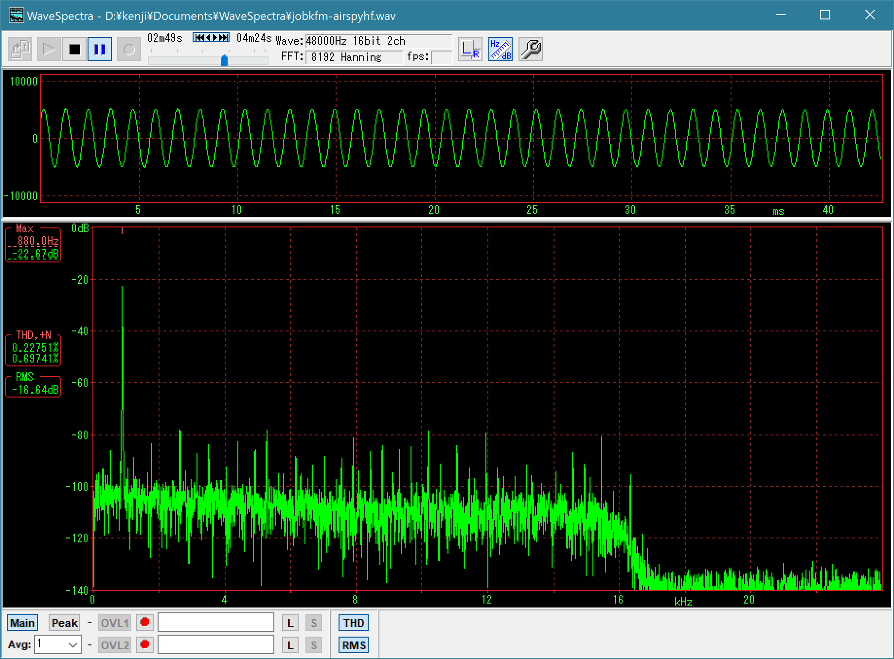
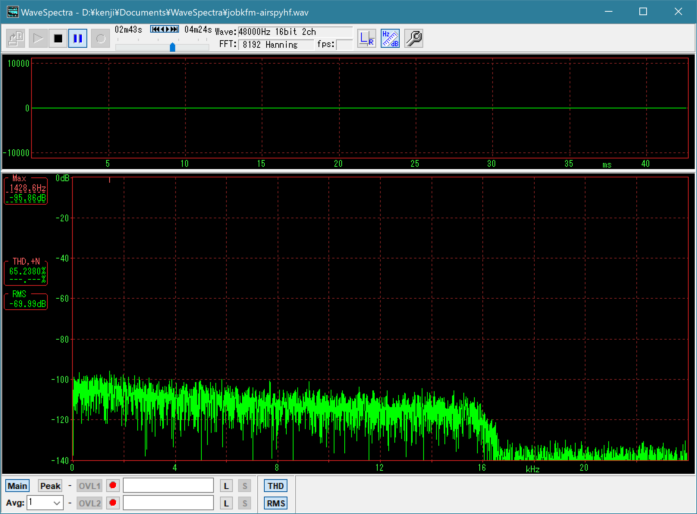
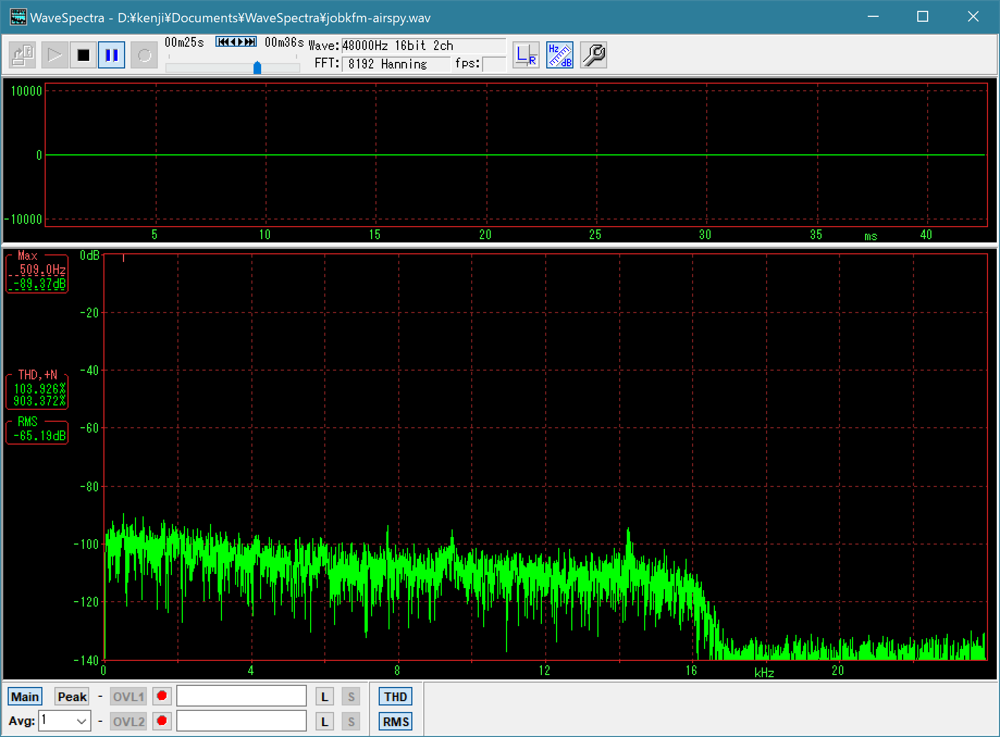

# airspy-fmradion noise and distortion test

## Results

* ~4.8dB less RMS of no-sound noise by Airspy HF+ (-70dB) than by Airspy R2 (-65.2dB)
* Distortion ((THD+N)/N) of the 880Hz sine wave tone: Airspy R2: 0.867%, Airspy HF+: 0.697%

## Result figures

### 880Hz time signal tone ((THD+N)/N)




### No-signal sound (RMS level)




## Test conditions

* [airspy-fmradion v0.5.2](https://github.com/jj1bdx/airspy-fmradion/tree/v0.5.2) running on Mac mini 2018
* Recorded station: JOBK-FM 88.1MHz (NHK-FM Osaka, transmission site: Iimori yama, Daito City, Osaka, Japan)
* Recorded 880Hz hourly time signal tones and the no-sound time periods to 48kHz WAV files
* Antenna: 144MHz 1/2-wavelength vertical on the balcony (ground height: ~15m)
* Distance from JOBK-FM transmission site: ~21km 
* Hourly signal for Airspy R2: 2300JST (UTC+9 hrs) 15-MAR-2019
* Hourly signal for Airspy HF+: 0100JST (UTC+9 hrs) 16-MAR-2019
* Distortion and noise RMS level measured by [WaveSpectra](http://efu.jp.net/soft/ws/ws.html) by efu

## Commands and terminal messages

```
# for Airspy
airspy-fmradion -t airspyhf -c freq=88100000,lgain=6,mgain=1,vgain=10 -b 1.0 -W jobkfm-airspyhf.wav

airspy-fmradion v0.5.2
Software FM radio for Airspy R2, Airspy HF+, and RTL-SDR
output buffer: 1.0 seconds
writing audio samples to 'jobkfm-airspy.wav'
using device 0: Serial 91d064dc273373cf
tuned for 88.1 MHz
IF sample rate: 10000000 Hz, IF 1st rate: 1250000 Hz (divided by 8)
IF 2nd rate: 312500 Hz (divided by 4)
FM demod rate: 312500 Hz, audio decimated from FM demod by: 6.51041667
LNA/Mix/VGA gain: 6, 1, 10 dB
Antenna bias: off / LNA AGC: off / Mixer AGC: off
audio sample rate: 48000 Hz, audio bandwidth: 15000 Hz
audio totally decimated from IF by: 208.333333
deemphasis: 50 microseconds
blk=   5648:ppm= -0.47:IF=-33.0dB:AF=-10.8dB:buf=0.7s

# for Airspy HF+
airspy-fmradion -t airspyhf -c freq=88100000,lgain=6,mgain=1,vgain=10 -b 1.0 -W jobkfm-airspyhf.wav
airspy-fmradion v0.5.2
Software FM radio for Airspy R2, Airspy HF+, and RTL-SDR
output buffer: 1.0 seconds
writing audio samples to 'jobkfm-airspyhf.wav'
using device 0: Serial c852a98094393ffc
tuned for 88.1 MHz, device tuned for 87.908 MHz
IF sample rate: 768000 Hz, IF 1st rate: 384000 Hz (divided by 2)
FM demod rate: 384000 Hz, audio decimated from FM demod by: 8
audio sample rate: 48000 Hz, audio bandwidth: 15000 Hz
audio totally decimated from IF by: 16
deemphasis: 50 microseconds
blk=  12445:ppm= +0.19:IF=-29.8dB:AF=-15.9dB:buf=0.6s
```

[End of memorandum]
