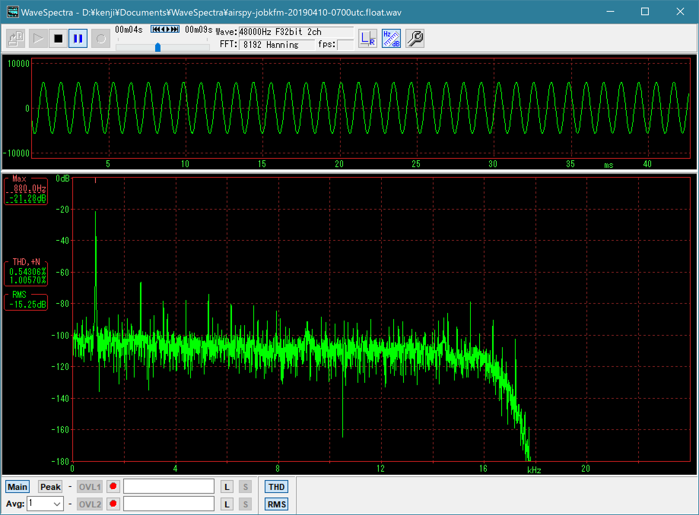
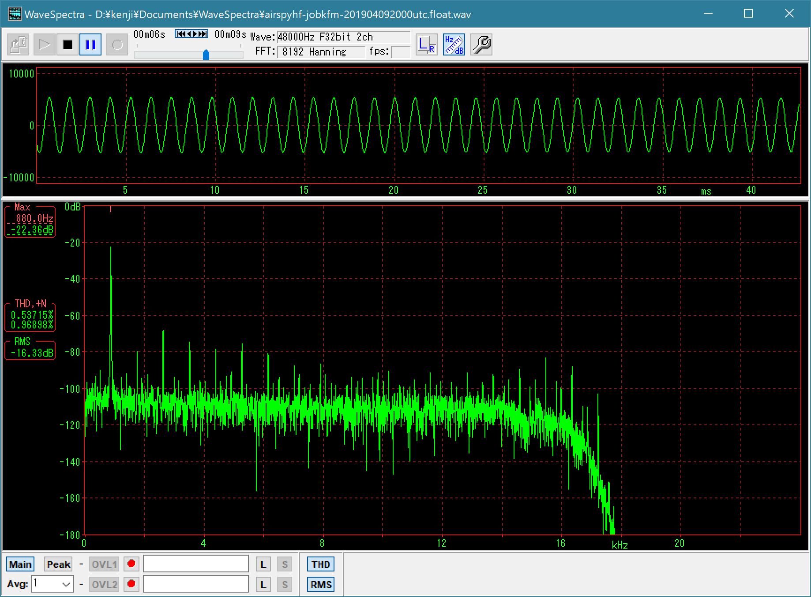
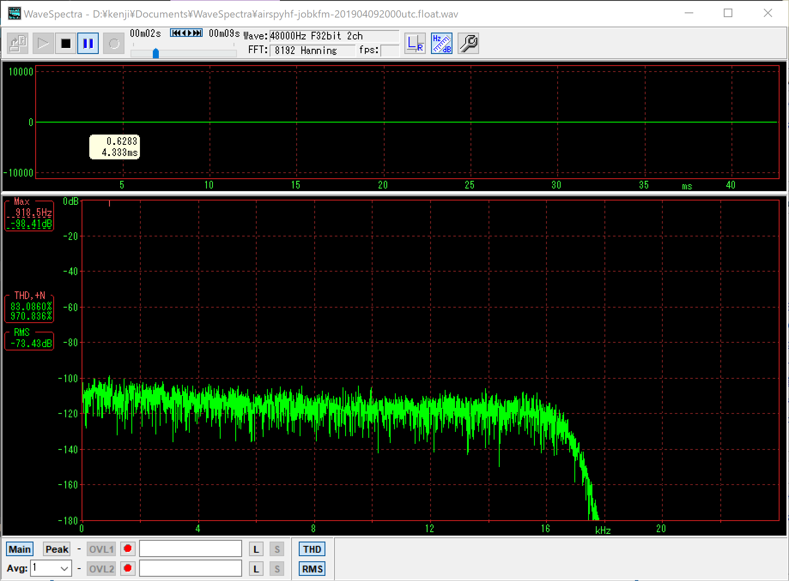
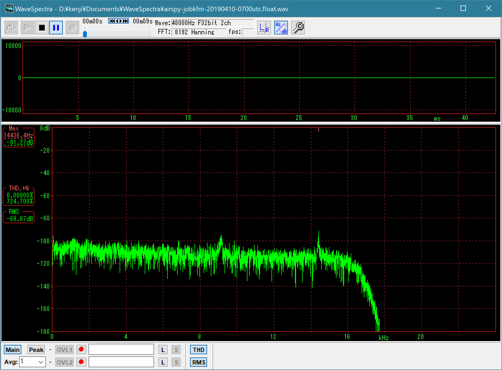

# airspy-fmradion noise and distortion test

For airspy-fmradion v0.6.4-dev.

You can see the old result in [OLD-README-v0.5.2.md](OLD-README-v0.5.2.md).

## Results

* ~3.7dB less RMS of no-sound noise by Airspy HF+ (-73.4dB) than by Airspy R2 (-69.7dB)
* Distortion ((THD+N)/N) of the 880Hz sine wave tone: Airspy R2: 1.006%, Airspy HF+: 0.969%
* SINAD (inverse of (THD+N)/N) of the 880Hz sine wave tone: Airspy R2: 39.95dB, Airspy HF+: 40.27dB

## Result figures

### 880Hz time signal tone ((THD+N)/N)




### No-signal sound (RMS level)




## Test conditions

* [airspy-fmradion v0.6.4-dev](https://github.com/jj1bdx/airspy-fmradion/tree/v0.6.4-dev) running on Mac mini 2018
* Recorded station: JOBK-FM 88.1MHz (NHK-FM Osaka, transmission site: Iimori yama, Daito City, Osaka, Japan)
* Recorded 880Hz hourly time signal tones and the no-sound time periods to 48kHz WAV files
* Antenna: FM dipole on the balcony (ground height: ~15m)
* Distance from JOBK-FM transmission site: ~21km
* Hourly signal for Airspy R2: 1600JST (UTC+9 hrs) 10-APR-2019
* Hourly signal for Airspy HF+: 0500JST (UTC+9 hrs) 10-APR-2019
* Distortion and noise RMS level measured by [WaveSpectra](http://efu.jp.net/soft/ws/ws.html) by efu

## Commands and terminal messages

```
# for Airspy R2
airspy-fmradion -t airspyhf -q -c freq=88100000 -F test0.bin

airspy-fmradion v0.6.4-dev
Software FM/AM radio for Airspy R2, Airspy HF+, and RTL-SDR
output buffer length: 0 [s]
writing raw 32-bit float little-endian audio samples to 'test0.bin'
using device 0: Serial c852a98094393ffc
tuned for 88.1 [MHz], device tuned for 87.908 [MHz]
IF sample rate: 768000 [Hz], IF decimation: / 2
Demodulator rate: 384000 [Hz], audio decimation: / 8
audio sample rate: 48000 [Hz], audio bandwidth: 15000 [Hz]
audio totally decimated from IF by: 16
FM demodulator deemphasis: 50 [µs]

got stereo signal, pilot level = 0.1017244
blk=     160:ppm= +0.39:IF= -15.5dB:AF= -21.1dB:buf=0.00s^C

# for Airspy HF+
airspy-fmradion -t airspyhf -q -c freq=88100000 -F test1.bin

airspy-fmradion -t airspy -c freq=88100000,lgain=3,mgain=0,lgain=10 -F jobkfm801.float.bin
airspy-fmradion v0.6.4-dev
Software FM/AM radio for Airspy R2, Airspy HF+, and RTL-SDR
output buffer length: 0 [s]
writing raw 32-bit float little-endian audio samples to 'test1.bin'
using device 0: Serial 91d064dc273373cf
tuned for 88.1 [MHz]
IF sample rate: 10000000 [Hz], IF decimation: / 32
Demodulator rate: 312500 [Hz], audio decimation: / 6.51041667
LNA/Mix/VGA gain: 3, 0, 10 dB
Antenna bias: off / LNA AGC: off / Mixer AGC: off
audio sample rate: 48000 [Hz], audio bandwidth: 15000 [Hz]
audio totally decimated from IF by: 208.333333
FM demodulator deemphasis: 50 [µs]

got stereo signal, pilot level = 0.0989350
blk=   23408:ppm= -0.08:IF= -27.4dB:AF= -12.8dB:buf=0.00s
```

[End of memorandum]
