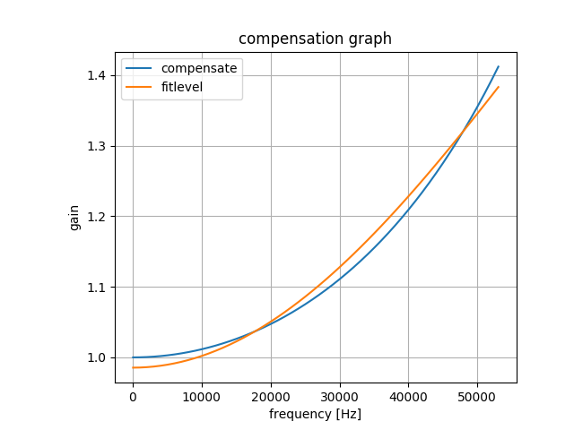
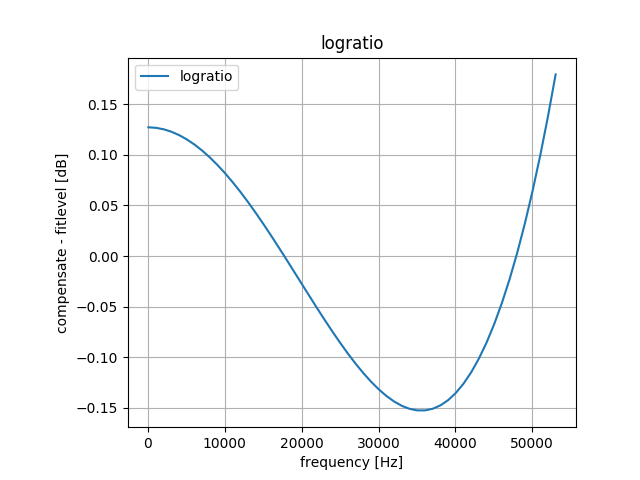

# Miscellaneous Notes

by @jj1bdx

## Signal comparison with other receivers

### 17-NOV-2018

Virtually no big difference between softfm-jj1bdx, SDR-Radio Console,
and a standalone receiver (ONKYO R-801A) connected to the same antenna system
(Nippon Antenna AF-1-SP dipole) at the balcony, ~20km direct view from the
FM transmission sites of Osaka region (Iimori Yama / Ikoma San).

Measured result of no-sound period and 880Hz time report tone of NHK-FM Osaka (88.1MHz):

* Noise level of the no-sound period: ~ -70dBFS +- 1dBFS
* THD+N level of the 880Hz tone: ~ 0.9% (multipath distortion possible) +- 0.1%

The antenna system seems to be the main factor.

### 3-JAN-2019

For softfm-jj1bdx, the following modification was made:

* LNA Gain: 8.7dB -> 12.5dB
* [Removal of RF spurious beat signal](https://github.com/jj1bdx/softfm-jj1bdx/issues/5)
* Increasing FIR downsampling filter stages by 25%

Revised measured result of no-sound period and 880Hz time report tone of NHK-FM Osaka (88.1MHz):

* Noise level of the no-sound period: ~ -74dBFS +- 1dBFS
* THD+N level of the 880Hz tone: ~ 0.82% (multipath distortion possible) +- 0.1%

### 7-JAN-2019

For 240kHz sampling frequency:

Measured result of no-sound period and 880Hz time report tone of NHK-FM Osaka (88.1MHz):

* Noise level of the no-sound period: ~ -57dBFS (Two beat signals at ~9kHz and ~10kHz, reason unknown)
* THD+N level of the 880Hz tone: ~ 1.07% (multipath distortion possible) +- 0.3%

### 16-JAN-2019

Listening to softfm-jj1bdx and ngsoftfm-jj1bdx showed ngsoftfm-jj1bdx had much better stereo separation and phase alignment. Reason: softfm-jj1bdx pre-0.2.3 bug missing stereo *interleaving* deemphasis. Fixed in softfm-jj1bdx 0.2.3 (final).

### 2-FEB-2019

For RTL-SDR v3, 1MHz sampling rate, and *300kHz* (+- 150kHz) IF sampling rate:

* THD+N level of the 880Hz tone: Lch: ~ 0.69%, Rch: ~ 0.92%

I'm not sure widening the IF sampling rate from 200kHz to 300kHz is worth trying for yet.

## Quadratic Multipath Monitor (QMM)

### 16-DEC-2018

Brian Beezley, K6STI, describes his idea of [Quadratic Multipath Monitor (QMM)](http://ham-radio.com/k6sti/qmm.htm) by *simply demodulating the subcarrier region with a quadrature oscillator of 90-degree shifted pilot signal*, called *QMM*.

The QMM output has the following characteristics: (quote from the Brian's page)

> For a perfectly transmitted and received signal, you'll get no output. For a real signal you may hear L+R harmonics, phase-rotated L-R intermodulation products, or crossmodulation between L+R, L-R, SCA, RDS, or HD Radio sidebands. Multipath propagation can cause any of these artifacts. You may also hear co-channel interference, adjacent-channel interference, HD Radio self-noise, or background noise.

I've implemented the QMM function as `-X` option, and with the variable `pilot_shift`. This option shifts the phase of regenerated subcarrier for decoding the L-R DSB signal from the original `sin(2*x)` (where x represents the 19kHz pilot frequency) to `cos(2*x)`.

### 28-JAN-2019

Generating in-phase (L-R) and shifted-phase (QMM) signals are possible and experimentally implemented in the branch `phase-distortion-removal`, though this method seems practically of no value. Not really worth trying for.

## Phase error of 19kHz PLL

### 1-JAN-2019

Measurements of the local FM stations in Osaka suggest the maximum phase error of 19kHz PLL is +- 0.01~0.02 radian at maximum.

## Decimation by DownsampleFilter

### 2-JAN-2019

Over-optimizing assumption of integer ration on `m_resample_mono()` and `m_resample_stereo()` leads into an assertion error such as:

```
softfm: /home/kenji/src/softfm-jj1bdx/sfmbase/Filter.cpp:204: void DownsampleFilter::process(const SampleVector&, SampleVector&): Assertion `i == samples_out.size()' failed.
```

Dealing the assertion error with the compiler optimization option change is a wrong way.

## Aperture effect on Phase Discriminator output

### 3-JAN-2019

The output of phase discriminator is affected by [the aperture effect of zero-order hold signals](https://www.maximintegrated.com/en/app-notes/index.mvp/id/3853), and the higher-frequency portion of the signal should be compensated.

For 60kHz, the signal level decreases as:

* Nyquist frequency = 480kHz (ifrate = 960kHz): 0.9745, -0.224dB
* Nyquist frequency = 120kHz (ifrate = 240kHz): 0.6366, -3.922dB (!)

### 7-JAN-2019

Added experimental filter class DiscriminatorEqualizer for 960kHz and 240kHz sample rates.

#### The filter model

Amplifier setting the maximum static gain + 1st-order moving average filter (an LPF) with a constant gain to *deduce* the signal, so that the result filter emphasizes the higher frequency with the maximum gain set.

The two gain parameters are computed by the least-square-maximum method so that the logarithmic ratio value of the compensation values and the filter outputs for each frequency for 51, 1050, 2050, ..., 57050Hz is minimized and closest to zero.

Note: static gain minus moving filter gain must not be less than 10^(-0.05) (-0.1dB).

#### Computed results by SciPy scipy.optimize.minimize with the Nelder-Mead method

* Sample rate 960kHz: static gain: 1.47112063, moving filter gain (fitfactor): 0.48567701
* Sample rate 240kHz: static gain: 1.3412962, moving filter gain (fitfactor): 0.34135089

Here are the results for 960kHz Sample rate:


Here are the results for 240kHz Sample rate:





The results show the differences between the required compensation curve and the fitted filter models are below <0.0006dB for 960kHz; and for 240kHz the maximum difference is far wider (~0.18dB on 53kHz).

### 16-JAN-2019

Extended DiscriminatorEqualizer by EqParameters class, using Boost Cubic B-Spline Interpolation.

### 17-JAN-2019

Tried to implement FIR adaptive multipath filter for the sampled input before the phase discriminator, but failed. See the branch `failed-multipathfilter`. I will put this for the record only. Computational burden: x2 or x3, not really worth trying for. The coefficients were not stable and did not converge. TODO: learn the basics again.

### 20-JAN-2019

Tried another algorithm to reduce multipath distortion. This algorighm does not diverge by nature (no feedback), but unable to decide the optimal point. See the branch `distortion-reduction`. I will put this for the record only. Computational burden: x2, not really worth trying for.

### 21-JAN-2019

<del>Envelope limiter, which aligns the envelope level of the IF signal to a constant, is introduced. This will affect very little on the strong signals. See the branch `envelope-limiter` for the code (merged to `dev`).</del>

### 22-JAN-2019

Envelope limiter disabled due to unexpected distortion when the modulation level of L-R signal was high.

## Profiling the calculation functions

### 20-JAN-2019

Profiled the function execution time. ~80% of the calculation time were spent by the calculations of FIR and IIR filters. <del>I put back the libm atan2() to PhaseDiscriminator, though this may increase the overall execution time to +5% or so, for the accuracy of the discriminator output. fastatan2() in PilotPhaseLock will not affect much.</del> <- Reverted back to use fastatan2() for PhaseDiscriminator in 0.1.10.

### 23-JAN-2019

* Reverted back to fastatan2() for PhaseDiscriminator.
* Reverted back to simpler linear arctan approximation for PilotPhaseLock. See git commit 90d7685911b75644b7de6df5eda62187b441f88b for the details.
* CPU load on Intel NUC DN2820FYKH Celeron N2830 / Ubuntu 18.04 using Airspy R2 with 2.5MHz sample rate was reduced from ~98% to ~82%.

### 27-JAN-2019

* Eliminated fastatan2() and replaced it by a quadratic discriminator without atan2() function written by András Retzler, HA7ILM, as described in https://github.com/simonyiszk/csdr/blob/master/libcsdr.c as the function `fmdemod_quadri_cf()`. Also loop optimized for vectorization.

## Airspy R2

### 23-JAN-2019

Initial test results for Airspy R2:

* Sampling rates: 2.5MHz and 10MHz only. 10MHz looks overkill.
* Default gain values of lgain and mgain (both 8dB) looks OK. Control IF level by vgain.
* Stability and quality: at least as good as RTL-SDR V3 for 76 ~ 95MHz.

### 30-JAN-2019

* Use `doc/airspy-linearity-gain.py` for calculating optimal Airspy gain parameters for maintaining the linearity.

## D/U radio estimation deprecated

### 30-JAN-2019

Estimation code of D/U ratio is removed, since it no longer works on higher sampling rates (for 2.5MHz/10MHz).
See [my repository on the multipath estimation](https://github.com/jj1bdx/rtl_power-fm-multipath) for the further details.

## References

(Including Japanese books here with Japanese titles)

* Brian Beezley, K6STI, [88-108MHz](http://ham-radio.com/k6sti/)
* 林 輝彦, FPGA FMチューナ: 第2章 フィルタとFMステレオ復調のメカニズム, [トラ技エレキ工房 No.1](http://www.cqpub.co.jp/hanbai/books/46/46511.htm), CQ出版, 2013, ISBN-13: 9784789846516, pp. 89-119
* 三上 直樹, [はじめて学ぶディジタル・フィルタと高速フーリエ変換](http://www.cqpub.co.jp/hanbai/books/30/30881.htm), CQ出版, 2005, ISBN-13: 9784789830881

[More to go]
